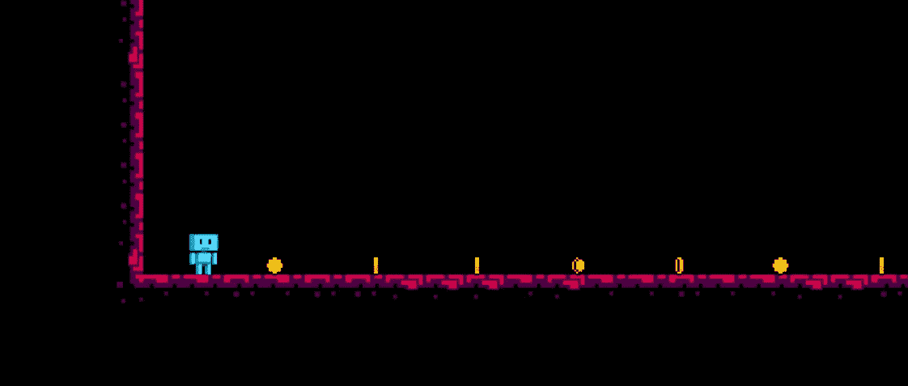

# 通过玩游戏学习 JavaScript

> 原文：<https://medium.com/geekculture/learn-javascript-by-playing-games-9c4a867d5e28?source=collection_archive---------13----------------------->

## 帮助你学习 JavaScript 的 7 个游戏

Screenshot from [JSRobot](https://lab.reaal.me/jsrobot/)

JavaScript 是一种非常流行的基于 web 的脚本语言。几乎每个网站都使用 JavaScript。如果你能通过玩游戏来帮助年轻人学习编码，那不是很棒吗？此外，对于任何学习者来说，仅仅通过玩游戏来学习都是有趣和具有挑战性的。