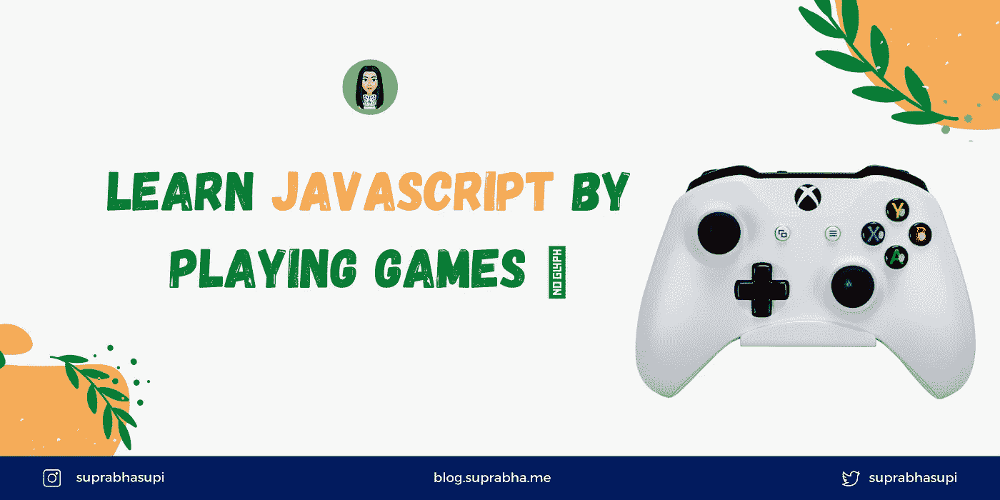
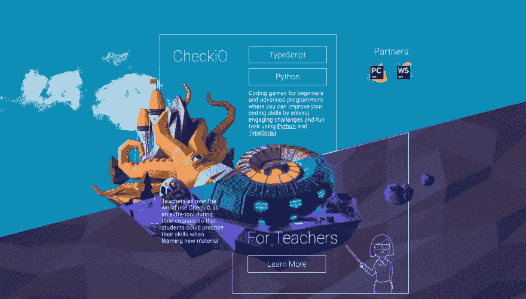
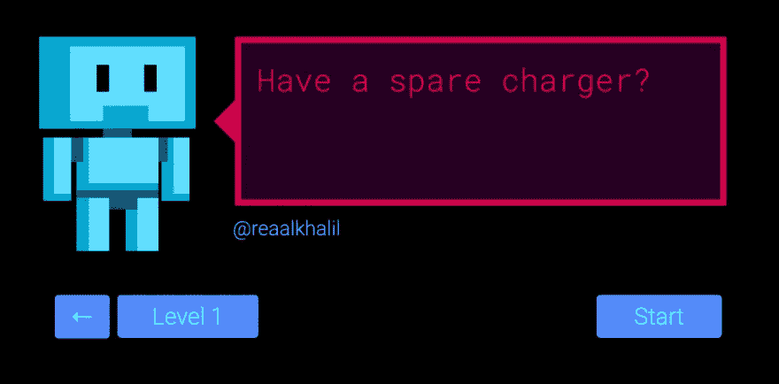
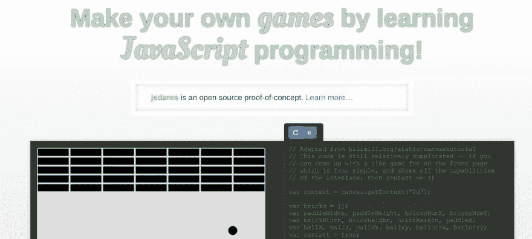
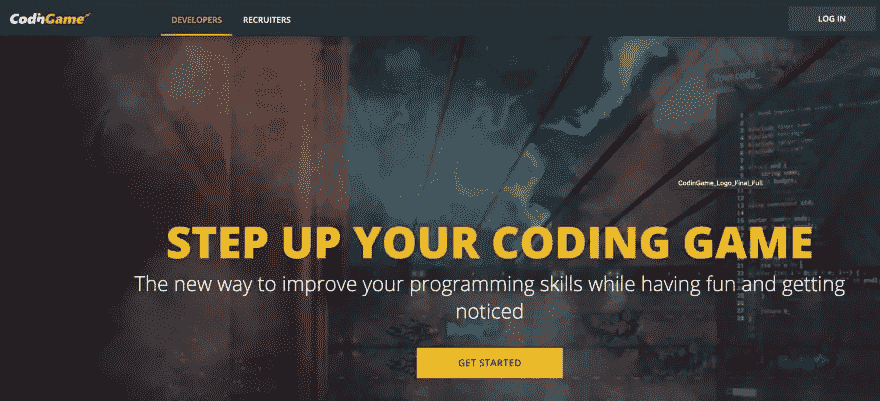
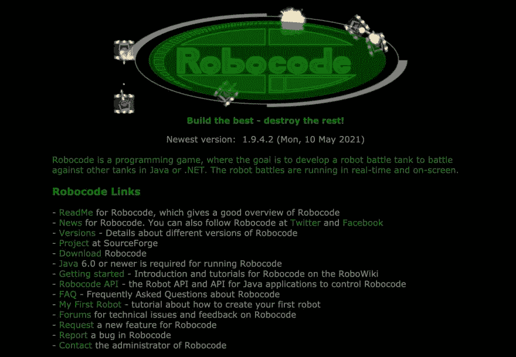
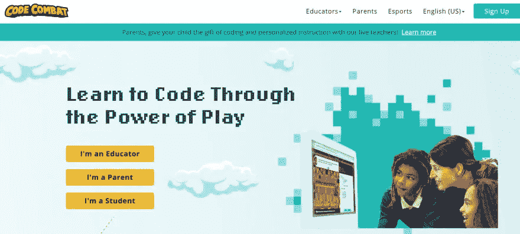
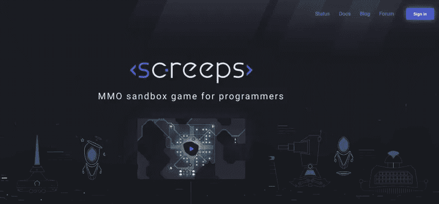
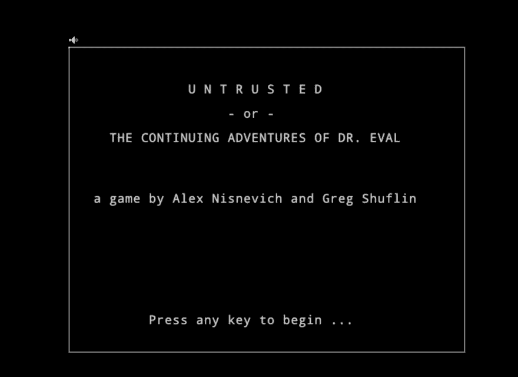
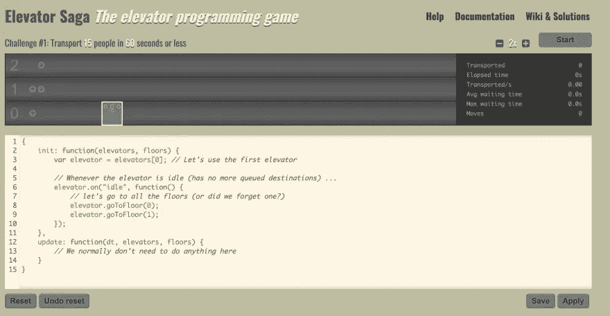

# 通过玩游戏学习 JavaScript 编码🎮

> 原文：<https://medium.com/geekculture/learn-javascript-coding-by-playing-games-7ff4598e5be9?source=collection_archive---------10----------------------->

您将通过创建以下十个游戏来学习 JavaScript 的基础知识:

# 1️. [CheckiO](https://checkio.org/)

世界各地的教师在他们的课程中使用 CheckiO 作为额外的工具，以便学生可以在学习新材料时练习他们的技能。

# 2️. [JSRobot](https://lab.reaal.me/jsrobot/)

通过玩平台游戏学习 JavaScript

# 3️. [JSDares](https://jsdares.com/)

你通过完成 dares 来学习编程。这些是简短的谜题，你必须用尽可能少的代码复制例子。

# 4️.[编码游戏](https://www.codingame.com/start)

CodinGame 是一个面向程序员的基于挑战的培训平台，在这里你可以通过有趣的练习提高你的编码技能(支持 25 种以上的语言)

# 5️.[机器代码](https://robocode.sourceforge.io/)

Robocode 是一个编程游戏，目标是开发一个机器人战斗坦克，以 Java 或. NET 与其他坦克作战。机器人战斗是实时运行的，并在屏幕上显示。

# 6️.[代码战斗](https://codecombat.com/)

CodeCombat 是一款 HTML5 角色扮演游戏(RPG ),教你基本的编程概念。CodeCombat 支持 5 种编程语言。

# 7️. [Screeps](https://screeps.com/)

Screeps 是一个有趣的游戏，有一个独特的角度。

# 8️.[不可信](https://alexnisnevich.github.io/untrusted/)

该游戏为您提供了一个类似 roguelike 的游戏环境和一个控制台窗口，其中包含生成每个关卡的 JavaScript 代码。

# 9️.[克朗彻斯拉](https://www.crunchzilla.com/)

Crunchzilla 提供交互式教程，让人们对编程感到兴奋。玩代码、构建和学习。

# 10.[电梯传奇](https://play.elevatorsaga.com/)

这是一个编程的游戏！你的任务是用 JavaScript 写一个程序，为电梯的运动编程。

感谢阅读！

希望你喜欢阅读这篇文章😉

🌟[推特](https://twitter.com/suprabhasupi) |👩🏻‍💻 [suprabha.me](https://www.suprabha.me/) 🌟 [Instagram](https://www.instagram.com/suprabhasupi/)