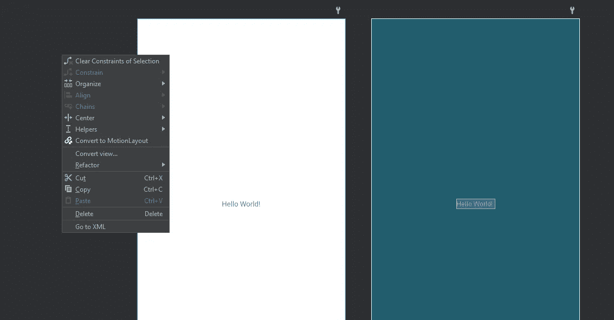
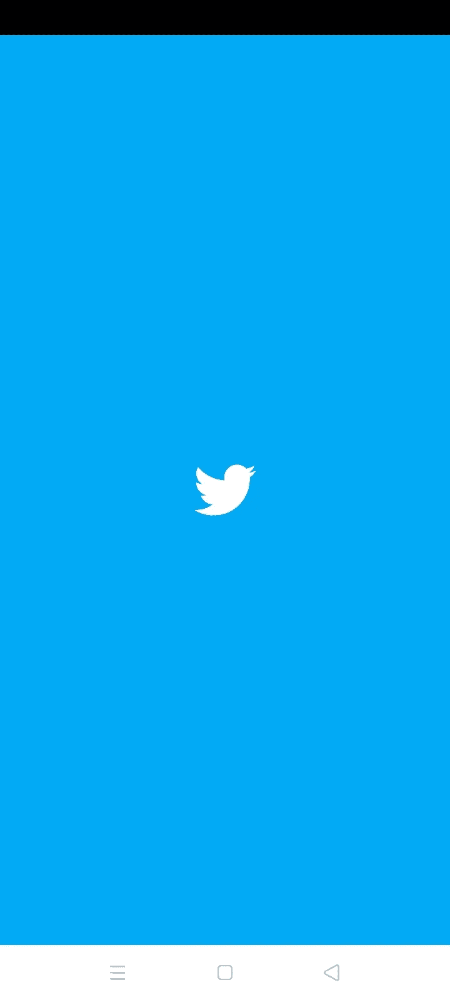
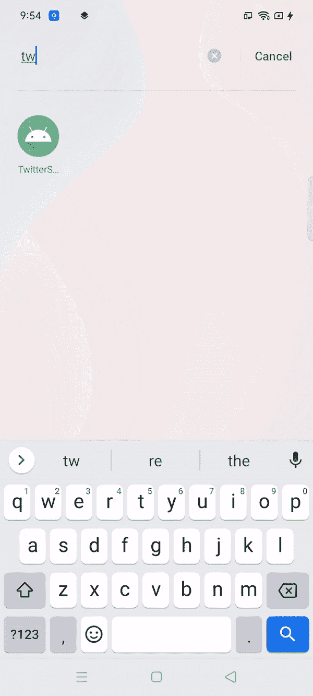

# 使用 Twitter 闪屏学习 Android 中的动作布局

> 原文：<https://medium.com/geekculture/learn-motion-layout-in-android-using-twitter-splash-screen-9c38160c46d?source=collection_archive---------7----------------------->


Motion layout animation

动画总是让我着迷。对象在屏幕上同步或不同步的移动，以及它的创作者的视觉，将创造一个令人愉快的体验。带有微妙动画的应用程序是一种享受。我记得一次又一次地打开同一个应用程序，看它实现的精彩动画。话虽如此，在 Android 应用中实现动画并不总是容易的。每当我着手在应用程序中实现动画时，我就意识到我必须处理大量的样板代码、混乱的 XML 文件和无组织的结构。

Android 在 2018 年推出了 Motion layout，以解决实现动画的许多挑战性问题。其优势在于，运动布局是约束布局的子类，并基于其丰富的布局功能。所以，今天我要分享一下我对 Android 中动作布局的想法。我还将创建一个著名的 twitter 闪屏(尽管有许多其他博客也是如此)。

# 让我们开始构建我们的项目

## 将约束布局转化为运动布局

1.  在 Android studio 中创建新项目。我用的是 Android studio 4.1.1 和 Kotlin。
2.  转到 MainActivity.kt 类的 XML 文件，并单击 Design 选项卡。
3.  右键单击项目窗格，你可以看到几个选项，包括“转换为运动布局。”点击它。
4.  🥳🥳🥳干得好。您刚刚将正常布局转换为动作布局。



Right click on the project pane

## 添加背景颜色和 Twitter 徽标

1.  给父布局一个新的背景颜色(类似 Twitter)。(#03A9F4)
2.  下载一个 twitter 徽标，并将其作为 ImageView 添加到您的布局中。

您的主布局现在将看起来像这样。

*activity_main.xml*

```
<?xml version="1.0" encoding="utf-8"?>
<androidx.constraintlayout.motion.widget.MotionLayout xmlns:android="http://schemas.android.com/apk/res/android"
    xmlns:app="http://schemas.android.com/apk/res-auto"
    xmlns:tools="http://schemas.android.com/tools"
    android:layout_width="match_parent"
    android:layout_height="match_parent"
    android:background="#03A9F4"
    app:layoutDescription="@xml/activity_main_scene"
    tools:context=".MainActivity">

    <ImageView
        android:id="@+id/imageView"
        android:layout_width="wrap_content"
        android:layout_height="wrap_content"
        app:layout_constraintBottom_toBottomOf="parent"
        app:layout_constraintEnd_toEndOf="parent"
        app:layout_constraintStart_toStartOf="parent"
        app:layout_constraintTop_toTopOf="parent"
        app:srcCompat="@drawable/ic_twitter" />
</androidx.constraintlayout.motion.widget.MotionLayout>
```

3.运行应用程序，检查是否一切正常。



Twitter Splash screen without animation

现在，思考一下 Twitter 闪屏是如何工作的。Twitter 标志将首先处于静止状态。然后它会缩小到几秒钟，然后它会回到原来的位置，然后它会放大到全屏。请查看下面的视频，以供参考。



Twitter splash screen

## 什么是运动场景？

运动场景是一个 XML 文件，包含相应布局的所有运动描述。在我们的例子中，我们为 Twitter 闪屏实现的任何动画都将被写入 motion scene XML 文件。

让我们来看看**的活动 _ 主 _ 场景**及其主要属性**。**

```
<?xml version="1.0" encoding="utf-8"?>
<MotionScene xmlns:android="http://schemas.android.com/apk/res/android"
    xmlns:motion="http://schemas.android.com/apk/res-auto">

    <Transition
        motion:constraintSetEnd="@+id/end"
        motion:constraintSetStart="@id/start"
        motion:duration="1000">
        <KeyFrameSet>
        </KeyFrameSet>
    </Transition>

    <ConstraintSet android:id="@+id/start">
    </ConstraintSet>

    <ConstraintSet android:id="@+id/end">
    </ConstraintSet>
</MotionScene>
```

**过渡**

当你考虑转变时，它是从一端到另一端的运动。在移动过程中，您可以添加某些修改，如运动持续时间、动画类型、定义开始和结束约束集等。

**约束集**

ConstraintSet 帮助我们精确定位布局中的每个项目，然后向该项目添加各种约束。在我们的例子中，我们必须为我们的 Twitter 徽标添加约束。如果您有多个视图，您可以根据需要添加更多约束。

我暂时只添加**开始**约束集。这些端点垂直居中(通过`app:layout_constraintTop_toTopOf="parent"`和`app:layout_constraintBottom_toBottomOf="parent"`)。水平方向上，端点位于屏幕的最左侧和最右侧。

```
<ConstraintSet android:id="@+id/start">
    <Constraint
        android:id="@+id/imageView"
        android:layout_width="wrap_content"
        android:layout_height="wrap_content"
        motion:layout_constraintBottom_toBottomOf="parent"
        motion:layout_constraintEnd_toEndOf="parent"
        motion:layout_constraintStart_toStartOf="parent"
        motion:layout_constraintTop_toTopOf="parent" />
</ConstraintSet>
```

**KeyFrameSet**

让我们想象转换的过程在 1 到 100 之间(从开始到结束)。如果我们想在此期间对视图进行一些更改，该怎么办。这些检查点称为关键帧集。它为我们提供了更多的属性，以便在这个转换过程中获得对视图的完全控制。比如，

*   KeyAttribute:指定运动序列中特定时刻的视图属性。在我们的例子中，我们将不得不在转换期间放大和缩小 Twitter 标志。关键属性将帮助我们实现这一目标。
*   framePosition:在这里，我们可以指定需要对关键帧进行更改的位置。
*   motionTarget:它指定哪个视图受关键帧集的影响。在我们的例子中，它将是 Twitter 的标志(ImageView)。

现在，让我们在关键帧集合中添加代码并分析其工作原理。

```
<KeyFrameSet>
    <KeyAttribute
        android:scaleX="1"
        android:scaleX="1"
        motion:framePosition="10"
        motion:motionTarget="@+id/imageView" />
    <KeyAttribute
        android:scaleX="0.5"
        android:scaleY="0.5"
        motion:framePosition="20"
        motion:motionTarget="@+id/imageView" />

    <KeyAttribute
        android:scaleX="0.5"
        android:scaleY="0.5"
        motion:framePosition="30"
        motion:motionTarget="@+id/imageView" />

    <KeyAttribute
        android:scaleX="50"
        android:scaleY="50"
        motion:framePosition="100"
        motion:motionTarget="@+id/imageView" />

</KeyFrameSet>
```

*   记得我之前说的吗？Twitter 的 logo 一开始会在静止的位置？是的。既然处于静止位置，那我们就给 **scaleX** 和 **scaleY** 取值 1(我觉得什么是 **scaleX** 和 **scaleY** )就不言自明了。由于它在此期间持续移动，我们给**帧位置**一个值 10。而 motionTarget 将是 Twitter 徽标，即 imageView。

```
 <KeyAttribute
        android:scaleX="1"
        android:scaleY="1"
        motion:framePosition="10"
        motion:motionTarget="@+id/imageView" />
```

*   接下来，我们必须在一定时期内在一定程度上缩小 Twitter 徽标。所以，我决定给 **scaleX** 和 **scaleY** 和 **framePosition** 赋值 0.5 作为 20 和 30。motionTarget 将是相同的 Twitter 标志。

```
<KeyAttribute
        android:scaleX="0.5"
        android:scaleY="0.5"
        motion:framePosition="20"
        motion:motionTarget="@+id/imageView" />

    <KeyAttribute
        android:scaleX="0.5"
        android:scaleY="0.5"
        motion:framePosition="30"
        motion:motionTarget="@+id/imageView" />
```

*   最后，我们需要将 Twitter 的 logo 放大到全屏。自然，如果我们需要将视图放大到全屏，那么 **scaleX** 和 **scaleY** 值将会很大。所以，我决定给 **scaleX** 和 **scaleY** 赋值 50。并且帧位置将是 100，因为过渡必须已经完成了它的过程。

```
 <KeyAttribute
        android:scaleX="50"
        android:scaleY="50"
        motion:framePosition="100"
        motion:motionTarget="@+id/imageView" />
```

不要忘记在“过渡”属性中添加线条 motion:auto Transition = " animate toend"。它有助于从一种状态到另一种状态的自动转换。在这里，我们使用“动画结尾”

完成 **activity_main_scene.xml** 代码。

```
<?xml version="1.0" encoding="utf-8"?>
<MotionScene xmlns:android="http://schemas.android.com/apk/res/android"
    xmlns:motion="http://schemas.android.com/apk/res-auto">

    <Transition
        motion:autoTransition="animateToEnd"
        motion:constraintSetEnd="@+id/end"
        motion:constraintSetStart="@id/start"
        motion:duration="1000">
        <KeyFrameSet>
            <KeyFrameSet>
                <KeyAttribute
                    android:scaleX="1"
                    android:scaleY="1"
                    motion:framePosition="10"
                    motion:motionTarget="@+id/imageView" />
                <KeyAttribute
                    android:scaleX="0.5"
                    android:scaleY="0.5"
                    motion:framePosition="20"
                    motion:motionTarget="@+id/imageView" />

                <KeyAttribute
                    android:scaleX="0.5"
                    android:scaleY="0.5"
                    motion:framePosition="30"
                    motion:motionTarget="@+id/imageView" />

                <KeyAttribute
                    android:scaleX="50"
                    android:scaleY="50"
                    motion:framePosition="100"
                    motion:motionTarget="@+id/imageView" />

            </KeyFrameSet>
        </KeyFrameSet>
    </Transition>

    <ConstraintSet android:id="@+id/start">
        <Constraint
            android:id="@+id/imageView"
            android:layout_width="wrap_content"
            android:layout_height="wrap_content"
            motion:layout_constraintBottom_toBottomOf="parent"
            motion:layout_constraintEnd_toEndOf="parent"
            motion:layout_constraintStart_toStartOf="parent"
            motion:layout_constraintTop_toTopOf="parent" />
    </ConstraintSet>

    <ConstraintSet android:id="@+id/end"></ConstraintSet>
</MotionScene>
```

现在，运行应用程序，检查是否一切都按照计划进行。

我与你分享的只是冰山一角。动作布局可以做得更多。这就是为什么开发人员很想知道 Motion layout 将如何与 Jetpack compose 集成。许多 Android 开发人员非常喜欢这个工具，他们不想在过渡过程中失去它。我希望 Android 团队能找到一种有效整合 Jetpack 合成和动作布局的方法。

你可以在这里找到完整的项目[。](https://github.com/clint22/TwitterSplashScreenUsingMotionLayout)

关注我的 [Twitter](https://twitter.com/DevClint) 获取 Android/Kotlin 相关新闻。

文章最初发布于[clintpauldev.com](https://clintpauldev.com/motion-layout-android-twitter-splash-screen/)

# 额外资源

有关`MotionLayout`的更多信息，请参见以下链接:

*   [使用 MotionLayout 制作 Android 应用动画(codelab)](https://codelabs.developers.google.com/codelabs/motion-layout)
*   [运动布局示例](https://developer.android.com/training/constraint-layout/motion-layout-examples)
*   [motion layout/constraint layout 示例(GitHub)](https://github.com/android/views-widgets-samples/tree/main/ConstraintLayoutExamples)
*   [motion layout 介绍(第一部分)](/google-developers/introduction-to-motionlayout-part-i-29208674b10d)
*   [运动布局介绍(第二部分)](/google-developers/introduction-to-motionlayout-part-ii-a31acc084f59)
*   [运动布局介绍(第三部分)](/google-developers/introduction-to-motionlayout-part-iii-47cd64d51a5)
*   [motion layout 简介(四)](/google-developers/defining-motion-paths-in-motionlayout-6095b874d37)

您可能还想阅读我最近关于

[](/swlh/android-room-testing-made-easy-using-dagger-hilt-89d2d5d0e7f2) [## 使用匕首柄使 Android 房间测试变得容易

### 我一直想知道是否有一种方法可以确保我们的 DAO 函数在运行…

medium.com](/swlh/android-room-testing-made-easy-using-dagger-hilt-89d2d5d0e7f2) [](/swlh/how-to-create-a-simple-camera-app-using-android-camerax-library-7367778498e0) [## 如何使用 Android CameraX 库创建简单的相机应用程序

### 我只记得少数几个由 Android 团队开发的 API 像这个 API 一样轻松和先进…

medium.com](/swlh/how-to-create-a-simple-camera-app-using-android-camerax-library-7367778498e0) [](/swlh/how-to-add-multiple-headers-to-grid-recyclerview-in-androidx-9dbd3460e06b) [## 如何在 AndroidX 中向 Grid recyclerView 添加多个头

### 这篇博文的封面图片不是巧合。我想和你分享我经历的情感创伤…

medium.com](/swlh/how-to-add-multiple-headers-to-grid-recyclerview-in-androidx-9dbd3460e06b)