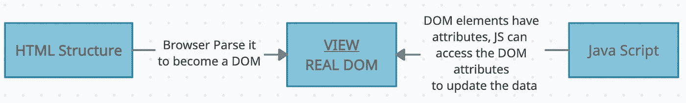
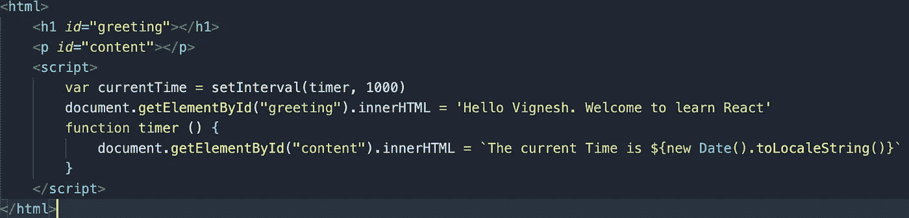
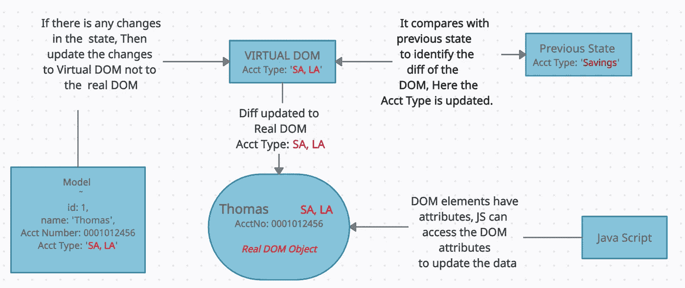
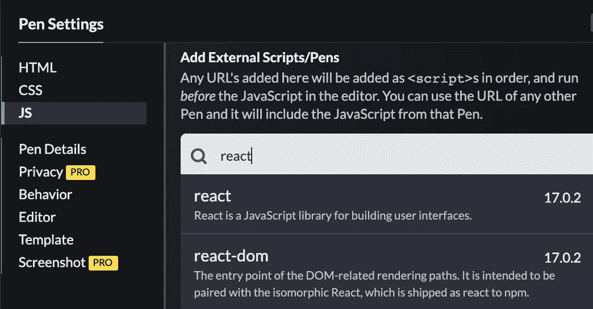
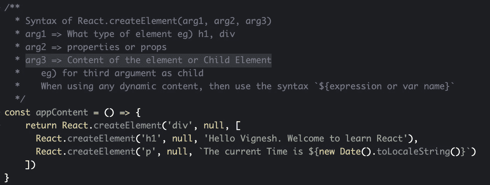
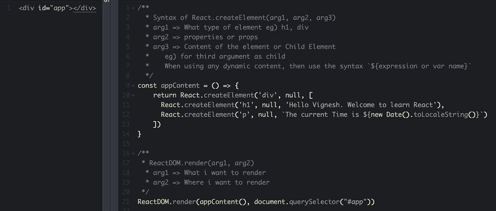
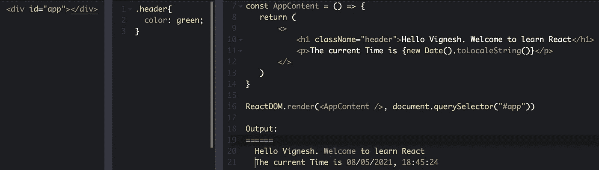

# 从头开始学习反应

> 原文：<https://medium.com/geekculture/learn-react-from-scratch-18fc9e89e8d2?source=collection_archive---------18----------------------->

**Table of Contents**

ReactJS 是一个用于构建用户界面的 JavaScript 库。它是由脸书开发的，用于创建 web 应用程序或复杂的 UI。在**微服务架构**中，服务如何打破应用程序的功能允许作为独立服务运行。类似地，UI 的每个部分都分解成一个独立的组件，并在需要时重用相同的组件。

如果你不熟悉 ES 特性，请用代码笔通过我们的故事列表中的 [**Es6 特性**](https://svignesh90-vs.medium.com/learn-es6-before-you-start-reactjs-e34a8910d964) 。在了解了 HTML、CSS、JavaScript 基础知识和 ES6 特性的基础上开始 ReactJS 是很好的。

**对 DOM 的理解** DOM 代表文档对象模型。在 web 应用程序中，我们通常创建 HTML 结构来显示数据。一旦浏览器解析了它，它就变成了 DOM。

DOM 将 HTML、CSS 和 JavaScript 代码集中到一个地方，由浏览器向用户显示。有了 JavaScript，页面变得可以与用户交互访问和修改。因此，每当 DOM 中有更新时，JavaScript 将在 DOM 中找到特定的元素并替换它。

**eg)** 这里我们在浏览器中解析 HTML，产生 DOM 对象。通过使用 JavaScript 可以访问 DOM 节点。具有 **id 或**类属性的节点用来插入文本。在本例中,“欢迎学习 React”文本被插入到元素 is < h1 >中。

假设在一个 DOM 中我们有不止**个 10K 节点。** JavaScript 试图接触一个节点以读取一个 **id 或类**属性或获取子节点，浏览器必须搜索、检查并解析节点的数量以反映变化。

这是很容易的一些变化，而不是非常频繁的变化，在这种情况下，使浏览器变慢。因此，我们并不认为本地 DOM 比反应 DOM 慢。这完全取决于需求。

**对虚拟 DOM 的理解** 虚拟 DOM 只是真实 DOM 的虚拟拷贝。虚拟 Dom 的创建是为了以更高效的方式解决频繁更新 DOM 的问题。每次应用程序的状态改变时，更新的是虚拟 DOM 而不是真实 DOM。

**Real DOM vs Virtual DOM Representation**

在虚拟 Dom 中，节点被表示为 JavaScript 对象，而不是遍历节点来搜索特定的属性。我们可以使用虚拟 DOM 的一小部分来找到属性。

React 知道哪些虚拟 DOM 对象已经改变，然后 React 只更新真实 DOM 中的那些对象。

下图说明，模型的“账户类型”字段有了一个新值。因此，状态发生了变化&向虚拟 DOM 发送更新。现在，虚拟 DOM 将当前状态与以前的状态进行比较，以找到 diff，最后，应该将 diff 更新到真实 DOM。

**How Virtual DOM identified the diff changes?**

**React 中的创建元素和渲染方法** [**代码笔**](https://codepen.io/071eE211/pen/PoWLNYK)React 大多使用 JSX 而不是手动创建 React 元素，但是了解 React 元素是如何创建的还是很好的。此外，我们不会立即创建 React web 应用程序。

我们将学习代码笔的一些基本功能。因此，如果您想测试它，请添加所需的脚本。

如果您想测试代码笔中的东西，不要忘记在 JS 部分添加外部脚本。
1。反应
2。反应范围

这个包提供了特定的方法来创建和渲染供我们使用。此外，包括 JavaScript 预处理器作为巴别塔，这包括 JSX 处理，这有助于在这个故事后面。

## **创建 React 元素的方法** [代码笔](https://codepen.io/071eE211/pen/PoWLNYK)

> **语法:** React.createElement(arg1，arg2，arg3)
> arg1 = >什么类型的元素 eg) h1，div
> arg2 = >属性或道具
> arg3 = >元素或子元素的内容

**Example of Create React Element**

如果你在这里看到第一个参数是元素的类型**‘div’&**第二个参数是**道具或属性，**到目前为止值是 **null，**我们可以在后面的故事中看到这一点。&第三个参数要么是内容，要么是子元素。这里最后一个子节点< p >包含了打印当前时间的字符串值。

## **方法渲染** [代码笔](https://codepen.io/071eE211/pen/PoWLNYK)

> **语法:** ReactDOM.render(arg1，arg2)
> arg1 = >我要渲染的东西
> arg2 = >我要渲染的地方

在本例中，render 方法使用第一个参数作为 appContent()，该参数返回要呈现的**内容**。第二个参数是在哪里渲染，应该在保存 id 为**“app】的**元素**内部。**

## 使用 JSX [**码笔**](https://codepen.io/071eE211/pen/MWJxevb)

JSX 代表 JavaScript XML。它允许我们在不使用 React.createElement()方法的情况下，用 JavaScript 编写 HTML 并将它们放在 DOM 中。

在上图的*方法呈现的主题*中，appContnet 方法使用**方法创建元素 *React.createElement()。*** 让我们看一个使用 JSX 改变方法的例子。

在上面的例子中，appContent 方法直接使用了组件中的 HTML 代码。所有元素都应该用一个父元素包装，这样我们就可以将所有元素包装在一个空标签中。

在 JSX，元素的 class 属性是 ***className*** ，因为 class 代表在 ES6 中创建对象。JSX 内部调用了 React.createElement 方法。它插入动态变量&使用语法{}解析表达式。

希望它能给出一个关于 ***DOM vs 虚拟 DOM* ， *React 创建元素& React 渲染方法&JSX***的使用的基本观点。如有疑问或修改，请写下您的问题。

让我们在下一个故事中讨论 ReactJS 的下一个特性。
下一个话题 **:** [**反应组件和道具**](https://svignesh90-vs.medium.com/react-components-and-props-166ab224668)