# 学习可靠性— 1:简单变量

> 原文：<https://medium.com/geekculture/learn-solidity-1-simple-variables-dc2750f05d57?source=collection_archive---------2----------------------->

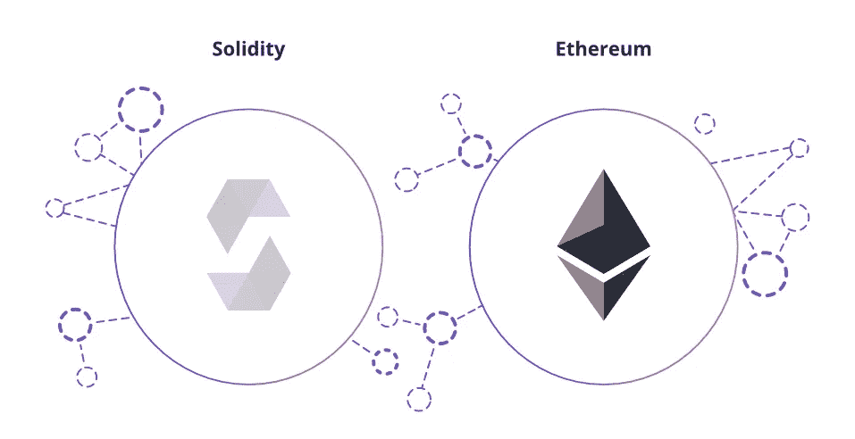

自从以太坊推出图灵完整系统**智能合约**以来，它彻底改变了区块链的功能，从比特币提出的去中心化货币交易到构建在不同可编程区块链上的数百个去中心化应用。


一份**智能合同**是一份自动执行的合同，买卖双方之间的协议条款被直接写入代码行。守则和其中包含的协议存在于一个分散的区块链网络中。代码控制执行，事务是可跟踪和不可逆的。

智能合约本质上是一个能够进行逻辑运算的状态机，它需要挖掘事务来改变其状态。

# 什么是扎实？

**Solidity** 是一种面向对象的高级语言，用于在各种区块链上实现智能合约，尤其是以太坊。受 C++、Python、JavaScript 的影响，针对**以太坊虚拟机(EVM)** 而设计。

 [## 坚固性-坚固性 0.8.11 文件

### 部署合同时，您应该使用最新发布的 Solidity 版本。除了特殊情况，只有…

docs.soliditylang.org](https://docs.soliditylang.org/en/v0.8.11/) 

在这篇文章中，我们将会看到坚实的基础。因此，让我们抓紧时间写下我们的第一行代码。

# 你好世界！

我们将编写一个简单的契约，显示古老的“hello world”字符串。现在，我们将使用 remix.ethereum 来编译和部署我们的代码。

 [## Remix -以太坊 IDE

### 编辑描述

remix.ethereum.org](https://remix.ethereum.org/) 

还要确保你安装了 Metamask，并从水龙头上拿到了测试乙醚。阅读我的这篇文章的前半部分，了解如何设置元掩码和获取测试醚。

[](/geekculture/simple-dapp-using-flutter-and-solidity-b64f5267acf4) [## 利用颤振和坚固性的简单 Dapp

### 创建一个简单的 flutter Dapp，它可以与部署在以太网上的智能契约进行交互。

medium.com](/geekculture/simple-dapp-using-flutter-and-solidity-b64f5267acf4) 

我们将开始定义我们将要使用的 solidity 的版本。理想情况下，我们倾向于使用最新版本，但由于兼容性和安全性问题，使用最新版本并不总是合适的。所以我们用这样的东西。

```
pragma solidity >=0.7.0 <0.9.0;
```

第一行是一个 **pragma 指令**，它告诉我们源代码是为 Solidity 版本 **0.7.0** 或任何更新的版本编写的，这些版本不会破坏功能，但不包括版本 **0.9.0** 。

```
pragma solidity ^0.7.0;
```

如果你想为一个在 0.7.0 之前不能编译的文件写一个编译指示，并且它也不能在从 0.8.0 开始的编译器上工作，那么我们将使用“^".”

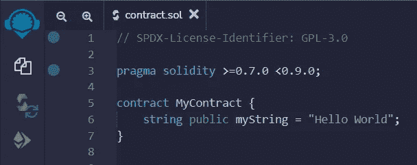

Simple Contract

在定义了 solidity 版本之后，我们创建了我们的第一个契约，“ **MyContract”。**我们定义了一个公共字符串，**“myString”**在契约里面，说“Hello World”。

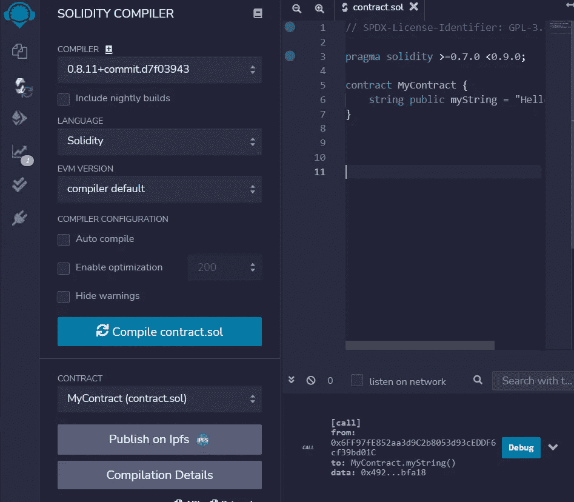

Compile

现在我们要**在 remix.ethereum 提供的编译器上编译**契约，然后再部署。

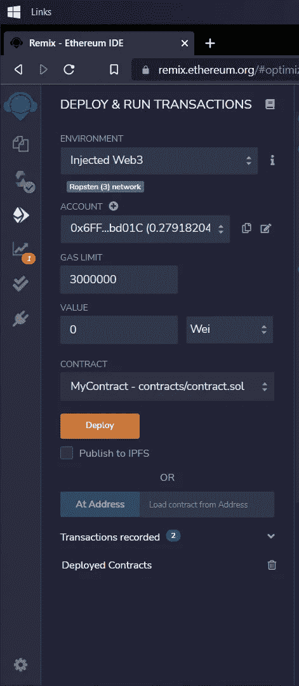

Deploy Contract

选择**注入的 Web3** 作为环境，并选择我们需要部署的契约。确保您的元掩码钱包地址指向带有测试以太网的地址。

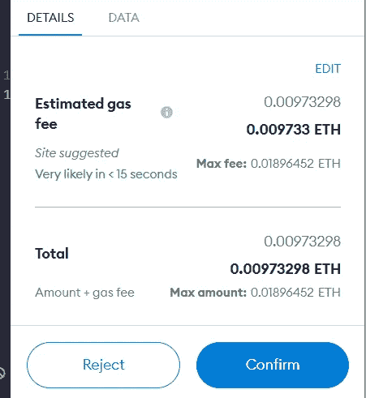

Metamask

当您部署合同时，Metamask 将要求您确认供气。确认后，需要一段时间才能将合同部署到区块链。

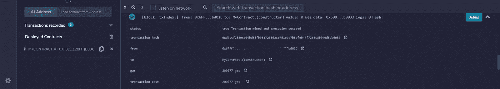

Contract Deployment Details

部署后，您可以看到交易散列、发件人地址和关于我们合同的各种其他细节。你也可以通过输入交易散列来查看我们的合同。

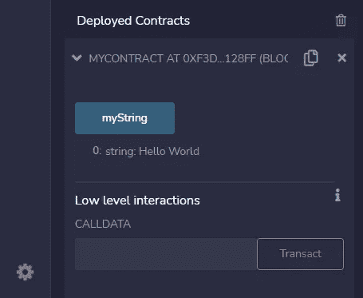

Deployed Contracts

在 remix 中的**已部署合同**部分，我们可以与刚刚部署的智能合同进行交互。

# 坚实度变量

像其他编程语言一样，Solidity 也有变量，这些变量基本上是运行时可以操作的数据的占位符。坚固性支持三种类型的变量，

1.  **状态变量**-其值永久存储在合同存储器中的变量。
2.  **局部变量**-其值在函数执行前一直存在的变量。
3.  **全局变量**-特殊变量存在于全局名称空间中，用于获取关于区块链的信息。

## 整数

整数类型变量可以是各种大小的有符号或无符号变量。关键词 **uint8** 到 **uint256** (无符号 8 到 256，以 8 为步长)和 **int8** 到 **int256** 。

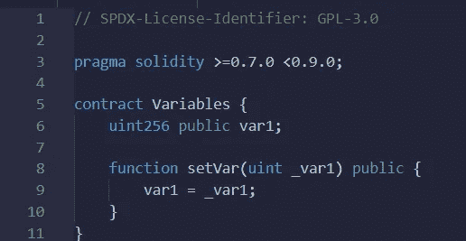

uint256 variable implementation.

**uint** 和 **int** 默认分别指 **uint256** 和 **int256** 。

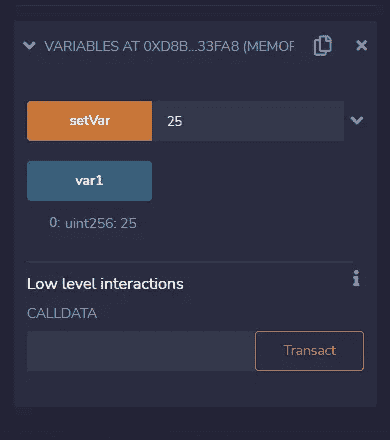

Contract Interaction.

## 布尔代数学体系的

布尔表示逻辑真值，**【真】****【假】**。像大多数编程语言一样，solidity 也有布尔变量。

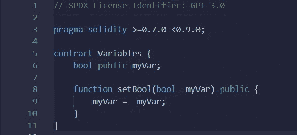

Boolean variable myVar.

## 地址

下一个变量类型是一个称为**地址**的特殊类型，它保存了代表**以太坊地址**大小的 *20 字节*值。一个地址可以用来分别通过*平衡*和*转移*方法获得平衡或转移平衡。

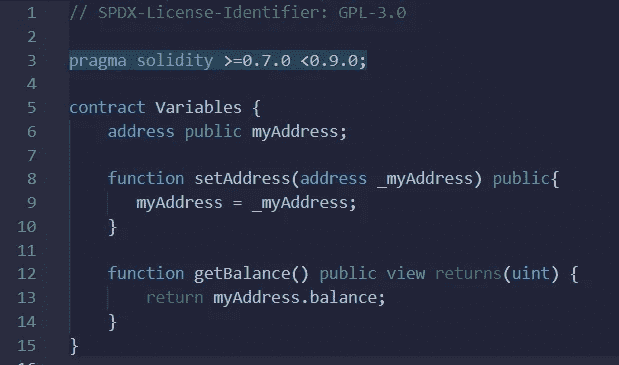

Address variable type

在这里，我们定义了两个函数， **setAddress()** 将用户输入地址设置为变量 *myAddress* 和 **getBalance()** 获取该地址持有的余额。

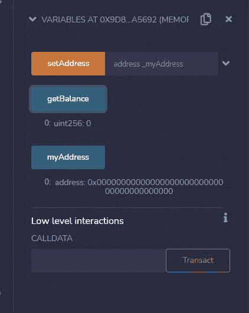

Deployed Contract

我们看到地址变量填充了 0x00…0 的初始地址**和余额 0。**

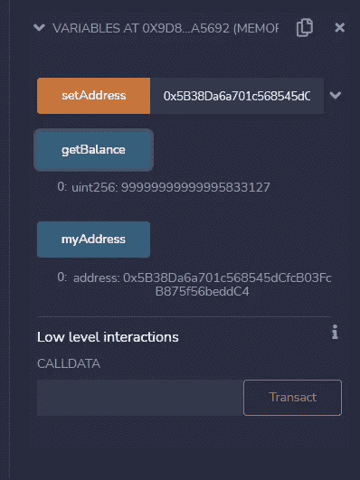

setAddress() and getBalance()

我将 remix 的 JavaScript VM 地址设置为变量，并通过调用 **getBalance()** 函数取回了 99 个醚的余额。

## 用线串

solidity 中的字符串在内部存储为**字节数组**。字节用于存储固定大小的字符集，而字符串用于存储等于或大于一个字节的字符集。

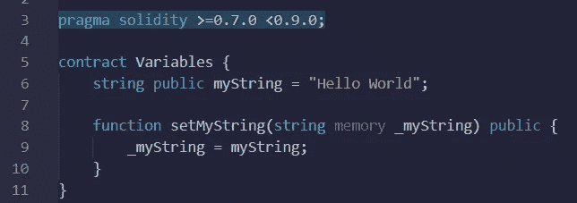

setMyString( ) function

字节的长度是从 **1** 到 **32** ，而字符串的长度是动态的。字节有一个优点，它使用较少的气体原料。

**内存**关键字用于保存临时值。它在(外部)函数调用之间被擦除，并且比在函数调用之间持久的**存储**关键字更便宜。

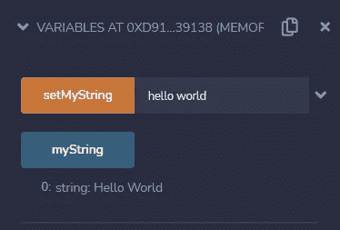

Deployed Contract

Solidity 有几个高级语言变量类型，都是静态类型的。还有一些特殊类型的变量是实性独有的，我们将在本系列的下一篇文章中讨论。

[](/geekculture/learn-solidity-2-addresses-and-global-variables-667ffdb924d7) [## 学习可靠性— 2:地址和全局变量

### 通过这个 Learn Solidity 系列学习构建智能合同！

medium.com](/geekculture/learn-solidity-2-addresses-and-global-variables-667ffdb924d7) 

# 参考

 [## 坚固性-坚固性 0.8.11 文件

### 部署合同时，您应该使用最新发布的 Solidity 版本。除了特殊情况，只有…

docs.soliditylang.org](https://docs.soliditylang.org/en/v0.8.11/)