# 学习可靠性:地址和全局变量

> 原文：<https://medium.com/geekculture/learn-solidity-2-addresses-and-global-variables-667ffdb924d7?source=collection_archive---------5----------------------->

这篇文章是正在进行的学习可靠性系列的继续。为了更容易理解这篇文章，请查阅以前的文章。

 [## 学习可靠性— 1:简单变量

### 自从以太坊引入了图灵完整系统——智能契约，它彻底改变了…

medium.com](/geekculture/learn-solidity-1-simple-variables-dc2750f05d57) 

# 更多关于地址的信息

在以太坊和 Solidity 中，地址的大小为 **20 字节值** (160 位或 40 个十六进制字符)。正如我们在上一篇文章中了解到的，一个地址可以分别通过 *balance* 和 *transfer* 方法来获取余额或转移余额。在本节中，我们将通过一个示例契约来更深入地了解这些方法。

我们将创建一个可以管理自己资金的示例合同。我们将从与合同交互的地址接收资金，也从合同向用户指定的地址发送资金。

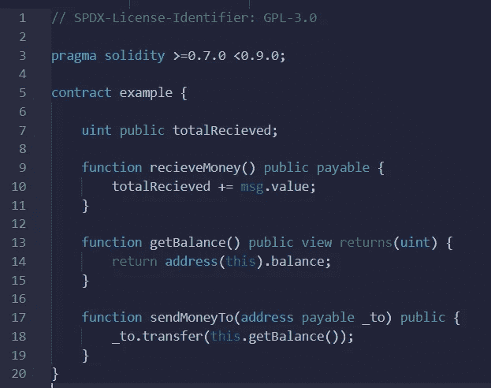

Example contract

在契约中，我们定义了三个函数，**receivemoneyto()**，它从与契约交互的地址接收资金， **getBalance()，**，它返回契约地址持有的余额，以及 **sendMoneyTo()，**，它将资金从契约地址发送到用户指定的地址。

注意，我们在 recieveMoneyTo()函数中使用了修饰符 **payable** 。应付款修饰符使函数处理非零值的事务处理。如果一个转移 Ether 的交易来到契约，调用某个函数 X，那么如果这个函数 X 没有 payable 修饰符，那么这个交易就会被拒绝。

在 recieveMoney()函数内部，我们使用了一个全局变量`msg`来更新 totalRecieved 的值。`msg`全局变量是特殊的全局变量，包含允许访问区块链的属性。`msg.value`是以太网上发送(状态转换)交易时 msg(消息)对象的成员。`msg.value`自动设置为通过`payable`功能发送的乙醚量。

还要注意，在函数 sendMoneyTo()中，我们声明了一个**地址应付款**变量 _to。`address`和`address payable`的区别在于，你可以发送以太到一个定义为 address payable 的变量，但不能发送到一个定义为 address 的变量。

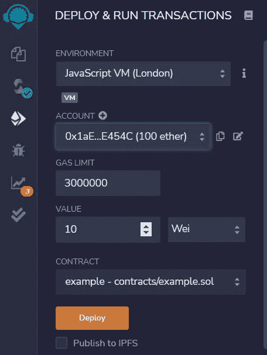

10 Wei as value.

我已经选择了一个有 100 个测试以太网的 JavaScript VM 帐户，并且我已经输入了 **10 Wei** 作为要发送给该帐户正在与之交互的合同的值。

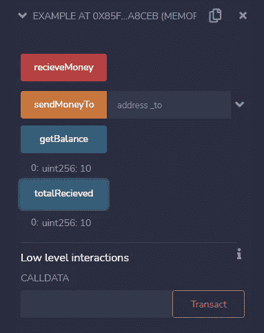

deployed contract.

recieveMoney()函数收到了我的帐户转来的 10 元钱。您可以使用 getBalance()查看余额。

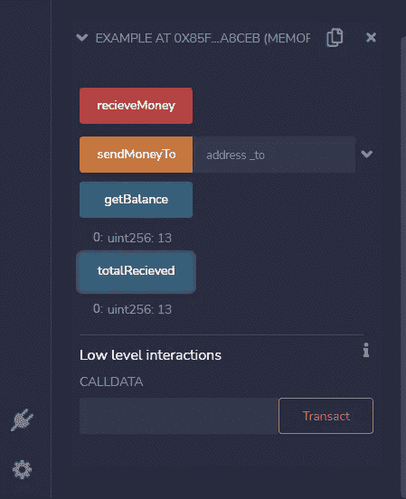

getBalance() and totalRecieved().

我又发送了 3 个 Wei 到契约，契约地址现在总共保存了 13 个 Wei。

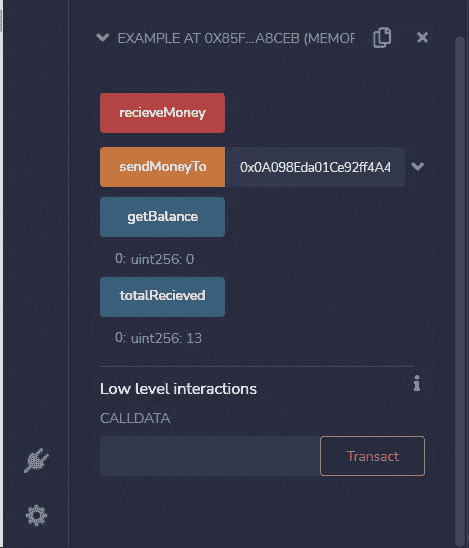

sendMoneyTo()

我使用 sendMoneyTo()函数将合同帐户持有的所有资金发送到我指定的另一个帐户。

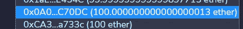

可以看到这个账户从合同中收到了 13 魏。现在，如果您检查收到的总额，金额将是 **13 魏**，而 getBalance 将是 **0** 。

在我们的示例合同中，我们看到有两种类型的帐户存储以太网，即**外部拥有的帐户**和**合同帐户**。外部拥有的帐户是由私钥控制的帐户，并且能够从私钥发送以太网和消息。我们用来向合同发送 ether 的 JavaScript 虚拟机帐户是外部拥有的帐户。合同帐户有一些相关的代码，可以发送或接收以太网。eoa 在以太坊区块链之外，而合约账户在区块链之内，完全由代码控制。

## 改进我们的示例合同

有时，我们只需要合同的所有者就可以提取发送给合同的资金，这与我们之前的合同不同。让我们学习如何使用全局变量和地址来实现这一点。

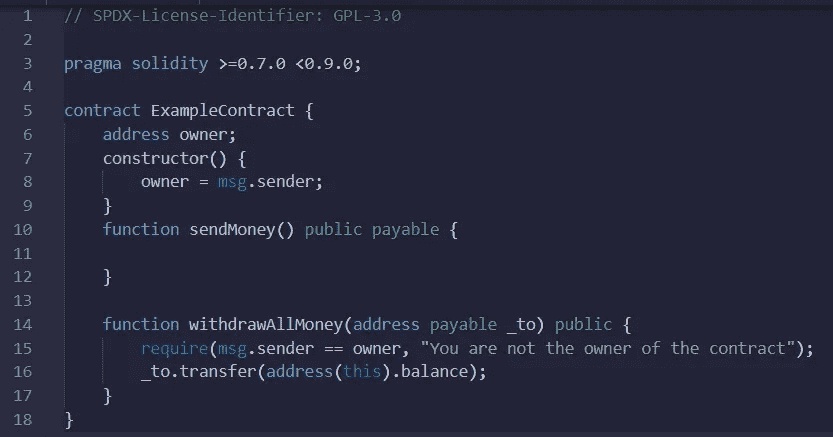

Example contract 2

我们定义了两个函数 *sendMoney()* ，通过它向合同发送资金，以及 *withdrawAllMoney()* ，通过它可以从合同中提取资金。

然后，我们定义一个**地址**所有者，在契约的**构造器**中，我们将它初始化为`msg.sender`，这是在部署契约时当前与契约交互的地址。因为只有在部署协定时才调用构造函数，所以设置了所有者地址。

为了取钱，我们检查当前与合同交互的地址是否等于所有者地址。如果是，那么钱就被取出来了。我们使用**要求**功能来检查条件。要求可靠性功能保证了在执行之前无法检测到的条件的有效性。

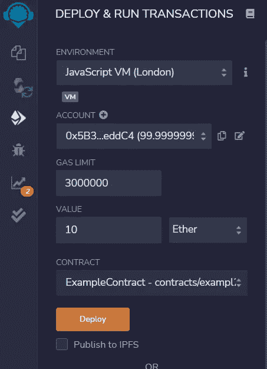

Contract Deploy and Run Transactions

我使用 *sendMoney()* 函数从所有者帐户向合同发送 10 个以太网。

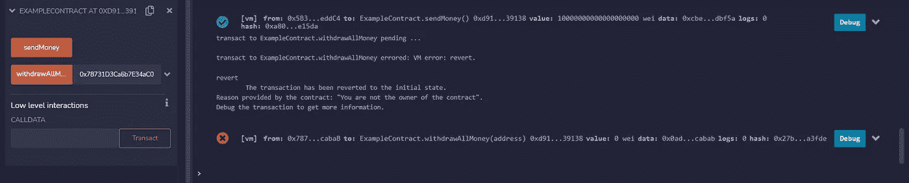

withdraeAllMoney()

现在，如果我试图从合同中汇款到一个不是所有者地址的不同地址，我会得到一条错误消息，说**“你不是合同的所有者”**，交易将恢复到初始状态。

我们可以添加额外的功能，如暂停和销毁智能合同到我们以前的合同，使其更加灵活。

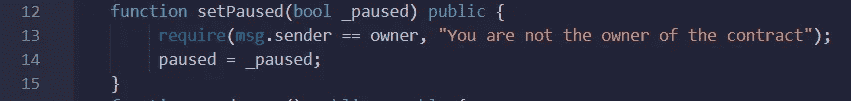

setPaused() function

此功能将暂停合同进行任何交易。我们以这样的方式定义 *setPaused()* 函数，只有合同所有者可以暂停合同。

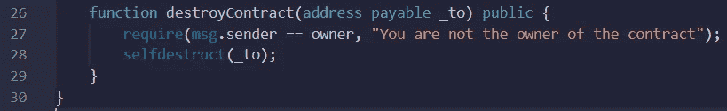

destroyContract() function

为了销毁契约，solidity 有*自毁()*功能，将契约中存储的所有剩余乙醚发送到指定地址。当使用*自毁()*功能时，你必须小心，因为恶意合同可以利用它来强制发送以太到任何合同。

这篇文章到此为止！我们将讨论映射、结构、数组等。在本系列的下一篇文章中。