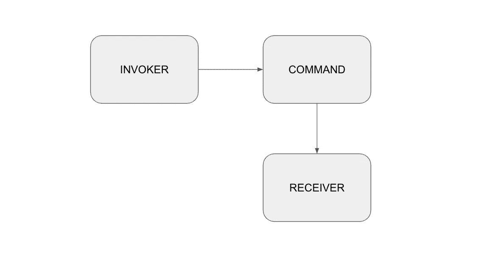
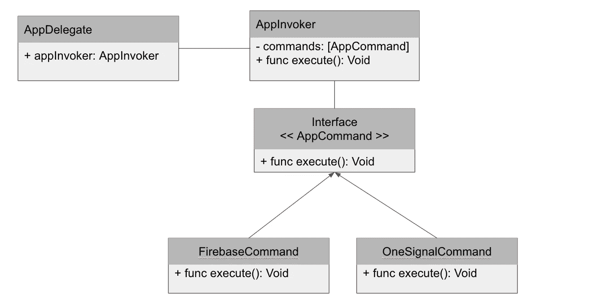

# 3 分钟学会 Swift 命令设计模式

> 原文：<https://medium.com/geekculture/learn-swift-command-design-pattern-in-3-minutes-ae2c9ddd2a51?source=collection_archive---------10----------------------->

大家新年快乐！返回设计模式系列:]

Photo by [Mike Yukhtenko](https://unsplash.com/@yamaicle?utm_source=medium&utm_medium=referral) on [Unsplash](https://unsplash.com?utm_source=medium&utm_medium=referral)

## 什么是命令设计模式？

命令设计模式是将命令或动作封装为对象行为模式。命令设计模式通常有三个主要组件，分别是**调用者、命令、**和**接收者。**

Invoker 是一个负责存储和执行命令的组件。**命令**是一个组件，它包装一个动作并将其封装为一个对象。**接收器**是根据命令动作的组件。让我们看看下面的代码给你更好的介绍:

这里我创建了一个简单的名为 Alarm 的接收器对象。它有一个属性`isOn`，以后可以根据给定的命令进行更改。

**AlarmCommand** 是我们用来确定命令规格的抽象接口。当我们想要创建一个新的命令时，我们可以创建一个新的类型并符合 **AlarmCommand** 接口。例如在上面的代码中，我们可以创建具体的命令实现，分别是 **TurnOnAlarmCommand** 和 **TurnOffAlarmCommand** 。

最后我们创建了**调用者**。顺便说一句，上面的例子有点随意，但我希望你已经明白了这一点:】。像我们之前的讨论一样，调用者是存储和执行命令的对象。AlarmInvoker 接收一个 Alarm 对象作为参数，然后我们基于随机数创建 commands 对象。如果随机数是偶数，那么我们附加 **TurnOnAlarmCommand** 否则，我们附加**turnonfalarmcommand。**报警调用程序有一个函数叫做`execute`，这个函数用来执行调用程序内部的命令。

## 不好的例子，不是吗？:]

那么我们如何使用这种设计模式来解决现实世界的问题呢？我举一个例子。在我的经验中，我经常看到一个关于 massive AppDelegate 或 SceneDelegate 实现的常见问题。在一个大的应用程序中，我们经常使用这么多第三方库，对吗？有时，我们需要在 AppDelegate 中进行一些初始化或设置库。如果我们不能很好地管理这一点，它将成为大规模实施和违反单一责任原则。理解了这个需求，那么我们如何用一个好的、优雅的解决方案来实现它呢？请看看这个简单的架构图。

在 AppDelegate 内部，我们需要一个对象来存储和执行所有命令，在本例中是 **AppInvoker。**然后我们需要一个抽象类型来确定命令的规格，我们创建了 **AppCommand** 接口，其中有一个函数作为需求。定义了命令接口后，我们可以创建具体的命令类型，例如 **FirebaseCommand** 和 **OneSignalCommand** 。下面是示例代码实现:

在定义了所有命令之后，我们可以继续创建 **Invoker** 对象。

很简单吧？这是 AppDelegate 的最终实现。

瞧，恭喜你，你的 AppDelegate 真的很干净优雅:】。这是您可以在 Swift 和 iOS 中使用命令设计模式众多示例之一。

## 从这里去哪里

恭喜你，你对命令设计模式有了新的认识。再次强调，理解设计模式对于软件工程师来说非常重要，这样你就可以有很多武器来解决你的日常问题。感谢您阅读本文，如果您有任何问题或反馈，请在下面的评论中提出，我将不胜感激！再次感谢大家，2022 新年快乐:]