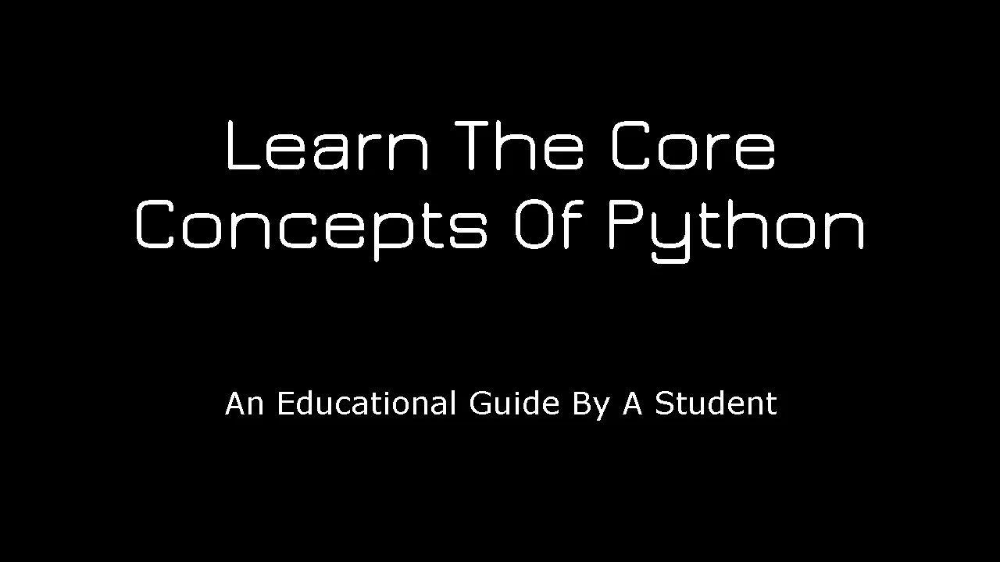

# 学习 Python 的核心概念

> 原文：<https://medium.com/geekculture/learn-the-core-concepts-of-python-de9f6317078?source=collection_archive---------18----------------------->

## Python 编程

## 初学者应该了解的基本概念。

众所周知，2021 年 9 月已经开始，2021 年即将结束。随着政府通过适当的标准作业程序控制病例，人民定期康复，新冠肺炎疫情正在逐渐消失。强加的…