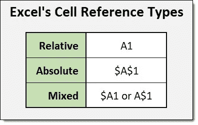

# 了解使用 Microsoft Excel 单元格引用类型的详细信息

> 原文：<https://medium.com/geekculture/learn-the-ins-and-outs-of-using-microsoft-excels-cell-reference-types-259311df26f6?source=collection_archive---------33----------------------->

当您开始使用 Microsoft Excel 时，您需要了解的关于该程序的基本内容之一是单元格引用及其工作原理。要理解单元格引用，首先需要理解 Excel 工作表的组成。

Excel 工作表包含跨越页面的列。列使用字母作为它们的名称…