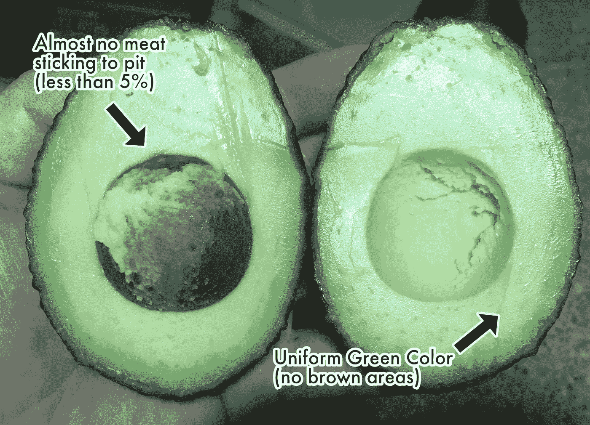

# 通过鳄梨挑战学会预测未来

> 原文：<https://medium.com/geekculture/learn-to-predict-the-future-with-the-avocado-challenge-5b80e2e4faee?source=collection_archive---------12----------------------->

预测未来很难，但你可以更擅长预测未来。你只需要一些美味的鳄梨。

# 即使是“专家”也不擅长预测未来

沃顿商学院教授菲利普·泰特洛克想让未来更容易预测。所以他举办了“预测锦标赛”，让来自…