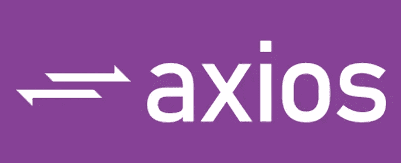

# 学习使用 Axios 和 React

> 原文：<https://medium.com/geekculture/learn-to-use-axios-with-react-ee92829d8ed6?source=collection_archive---------1----------------------->

我们使用 react 构建 web 前端。最有可能的是，在某个时候，您必须将前端与 web API 连接起来以使用数据。Axios 是一个轻量级的基于 HTTP 客户端的包，可用于与 REST APIs 通信。可以使用 Axios 从 React 前端调用后端 API 接口。

Javascript 也有一个类似的本地内置包，名为 Fetch API，与 Axios 非常相似…