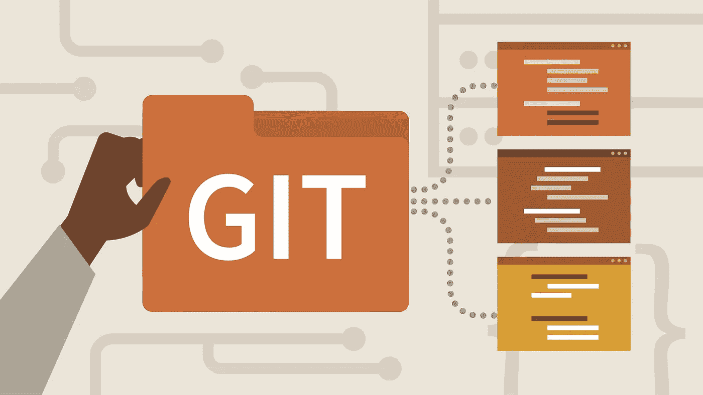

# 10 分钟学会使用 Git

> 原文：<https://medium.com/geekculture/learn-to-use-git-in-10-minutes-53e9a17bf8c2?source=collection_archive---------6----------------------->



如果你以前从未在你的项目中使用过 **Git** ，本质上，它跟踪文本变化，但是它的实际定义是一个**版本控制系统**。它是代码版本控制的首选标准，因为它是分布式的，而不是集中式的 **Apache Subversion (SVN)** 。

> **Git** 是最常用的版本控制系统。Git 跟踪你对文件所做的更改，这样你就有了所做工作的记录，如果需要的话，你可以恢复到特定的版本。Git 也让协作变得更容易，允许多人的变更被合并到一个源中。

# 安装 Git

要检查您的系统中是否安装了 Git，请在您的终端中运行:

```
git version
# git version 2.30.1 (Apple Git-130)
```

如果您还没有，请按照上的说明操作:

[https://git scm.com/downloads](https://git-scm.com/downloads)。

**Mac** 用户可以用 brew 安装:`brew install git`

# 正在配置 Git

我们必须配置一些东西:

```
git config --global user.name "John Doe" && # your name
git config --global user.email johndoe@example.com && # your email
git config --global init.defaultbranch main # default branch name, to be compatible with GitHub
```

您可以使用以下命令查看全局配置:

```
git config --global --list
# Type ":q" to close
```

Git 以纯文本形式存储配置，如果您愿意，您可以直接在`~/.gitconfig`或`~/.config/git/config`中编辑全局配置。

正如这个命令所暗示的，删除`--global`会使这些命令的作用范围局限于当前文件夹。

# 创建新存储库

存储库只是一个文件夹，其中包含您想要跟踪的所有文件。

要创建一个，请运行:

```
mkdir gitexample && 
cd gitexample && 
git init
# gitexample git:(main)
```

该命令在`gitexample`文件夹中创建一个文件夹`.git`。那个隐藏的`.git`文件夹就是存储库:所有本地配置和更改都存储在那里。

# 做出改变

让我们在存储库中创建一个文件:

```
echo "Hello, Git" >> hello.txt
```

如果我们运行`git status`，我们将看到新创建的未跟踪文件:

```
git status
# On branch main
# 
# No commits yet
# 
# Untracked files:
#  (use "git add <file>..." to include in what will be committed)
#   hello.txt
#
# nothing added to commit but untracked files present (use "git add" to track)
```

如输出所示，让我们添加文件。可以直接使用:

```
git add . # Or `git add hello.txt`, if we don't want all files
```

如果您检查存储库的状态，您会看到文件已经被添加或者也称为 ***暂存*** ，但是还没有提交:

```
git status
# On branch main
# 
# No commits yet
# 
# Changes to be committed:
#  (use "git rm --cached <file>..." to unstage)
#   new file:   hello.txt
```

为了记录更改，让我们运行一个提交命令:

```
git commit -m "Add hello.txt"
# [main (root-commit) a07ee27] Adds hello.txt
# 1 file changed, 2 insertions(+)
# create mode 100644 hello.txt
```

**提示** : `git commit -m <MESSAGE>`是一个简写命令，您可以使用`git commit`打开一个编辑器并提供详细的提交描述。

让我们用以下代码来检查更改:

```
git log
# type :q to close
```

它将显示如下内容:

```
commit a07ee270d6bd0419a50d1936ad89b9de0332f375 (HEAD -> main)
Author: Your Name <your@email.address>
Date:   Sun Jul 11 11:47:16 2021 +0200 Adds hello.txt
(END)
```

# 创建分支

拥有初始代码的独立版本在很多情况下都很有用，比如在测试您不确定的功能时，或者在一起工作时避免代码冲突。

这就是 git **分支**的确切含义——它是从历史中的特定点发展而来的。

创建分支运行`git branch NAME`和切换分支运行`git checkout NAME`。或者简单地说:

```
git checkout -b dev # switches to a new branch called "dev"
# Switched to a new branch 'dev'
# gitexample git:(dev)
```

让我们更改一下`hello.txt`文件中的内容，并提交更改:

```
echo "\nHello, Git Branch" >> hello.txt &&
git commit -am "Change hello.txt"
```

现在让我们切换回主版本:

```
git checkout main &&
cat hello.txt
# Switched to branch 'main'
# Hello, Git
```

如您所见，文件内容仍然和原来一样。要比较分支，我们可以运行:

```
git diff dev
# diff --git a/hello.txt b/hello.txt
# index 360c923..b7aec52 100644
# --- a/hello.txt
# +++ b/hello.txt
# @@ -1,3 +1 @@
# Hello, Git
# -
# -Hello, Git Branch
# (END)
# type ":q" to close
```

让我们也在主分支中进行更改:

```
echo "\nHi from Main Branch" >> hello.txt &&
git commit -am "Change hello.txt from main"
# [main 9b60c4b] Change hello.txt from main
# 1 file changed, 2 insertions(+)
```

现在让我们试着结合这些变化:

```
git merge dev
# Auto-merging hello.txt
# CONFLICT (content): Merge conflict in hello.txt
# Automatic merge failed; fix conflicts and then commit the result.
```

因为文件在同一个地方被修改了两次，所以我们遇到了冲突。看一下文件:

```
cat hello.txt
<<<<<<< HEAD
Hello, GitHi from Main Branch
=======
Hello, Git
>>>>>>> dev
```

还有一个工具可以单独查看更改:

```
git diff --ours # :q to close 
git diff --theirs #:q to close
```

您可以手动编辑文件并提交更改，但是假设我们只想要其中一个版本。我们将从中止合并开始:

```
git merge --abort
```

并使用“**their**”策略重新开始合并，这意味着在冲突的情况下，我们将使用传入分支坚持的任何内容:

```
git merge -X theirs dev
# Auto-merging hello.txt
# Merge made by the 'recursive' strategy.
# hello.txt | 5 +----
# 1 file changed, 1 insertion(+), 4 deletions(-)
```

这个策略的对立面是“我们的”。将两个更改合并在一起需要手动编辑(或使用`git mergetool`)。

要查看所有分支的列表，请运行:

```
git branch # type :q to close
#  dev
# * main
```

最后，要删除分支，运行:

```
git branch -d dev
# Deleted branch dev (was 6259828).
```

# 重建树枝基

分支从 git 历史中的某个特定点“生长”出来， ***rebase*** 允许我们改变那个点。让我们创建另一个分支，并再次向 *hello.txt* 添加一些更改:

```
git checkout -b story &&
echo "Once upon a time there was a file">>story.txt &&
git add story.txt &&
git commit -m "Add story.txt"
# Switched to a new branch 'story'
# [story eb996b8] Add story.txt
# 1 file changed, 1 insertion(+)
# create mode 100644 story.txt
```

现在，让我们回到主分支，在那里添加更改:

```
git checkout main &&
echo "Other changes" >> changes.txt &&
git add changes.txt &&
git commit -m "Add changes.txt"
```

要重放我们在`main`到`story`分支中所做的更改，运行:

```
git checkout story &&
git rebase main
# Successfully rebased and updated refs/heads/story.
```

您可以看到在`main`分支中创建的新文件被添加到`story`分支中:

```
ls
# changes.txt hello.txt   story.txt
```

**注意**:不要改变其他人可能使用的分支，例如主分支。此外，请记住，远程存储库上的每个历史操作都需要强制这些更改生效。

# 远程存储库

如果你还没有，创建一个 [GitHub](https://github.com/signup) 账户，登录并创建一个[新的空存储库](https://github.com/new)(私有或公共)。

假设存储库名称为“example ”,运行以下命令(改为您的用户名):

```
git remote add origin git@github.com:USERNAME/example.git &&
git push -u origin main
```

您可以刷新页面并查看主分支中的文件。要将所有本地分支推送到远程存储库，请运行:

```
git push --all origin
```

让我们在 GitHub 上编辑一些东西:只需点击任何文件和铅笔图标。添加一行您想要的任何文本，然后按“提交更改”。

现在，在本地运行该命令以获取远程更改:

```
git checkout main &&
git pull
```

# 管理未提交的更改

如果您想保存您的本地更改供以后使用，您可以使用`git stash`:

```
echo "Changes" >> hello.txt &&
git stash
```

现在，您可以使用以下命令来检查、应用或放弃这些更改:

```
git stash list
# stash@{0}: WIP on main: 92354c8 Update changes.txt
git stash pop # to apply changes
git stash drop # to drop changes
```

**提示**:你可以使用一个隐藏号码，即`git stash pop 0`来应用一个特定的隐藏或者`git stash drop 0`来放弃它。

如果您希望放弃所有本地更改，而只是将存储库恢复到上次提交的更改，请运行:

```
git restore .
```

# 管理提交的变更

一旦创建了一个 commit，这个更改就会保存在本地 git 历史中。如前所述，所有影响远程历史的更改都需要一个`git push --force`。请记住以下所有命令。

让我们从编辑最后一条提交消息开始:

```
git commit --amend # type :wq to save and close
# Press "i" to edit, "Esc" to stop editing
```

我们把一切从头开始怎么样？
要找到第一次提交的 ID，运行该命令并滚动(箭头向下)到最末尾:

```
git log --abbrev-commit
# commit a07ee27
# Author: Your Name <your@email.address>
Date:   Sun Jul 11 11:47:16 2021 +0200 Adds hello.txt
(END)
# type ":q" to close
```

现在运行此命令来重置存储库，但保持所有更改不被转移:

```
git reset --soft COMMIT # e.g. a07ee27
```

你也可以用`git reset --hard COMMIT`进行硬复位，去掉所有的改动。

您可以从官方的 [git 文档](https://git-scm.com/docs/git-reset)中了解其他几种类型的重置。

# 别名

大多数情况下，您将只使用少数几个命令(主要是 checkout、add、commit、pull、push 和 merge)，但有些东西您可能希望“以防万一”。

存储它们的一种方法是 git 别名。要配置别名，只需在配置中设置它。例如，我经常使用的一个别名是`git tree`，它以树的形式打印了一个很好的历史日志:

```
git config --global alias.tree 'log --graph --decorate --pretty=oneline --abbrev-commit'
# Try it with `git tree`
```

另一个有用的别名是删除所有合并的分支:

```
git config --global alias.clbr '!git branch --merged | grep -v \* | xargs git branch -D'
```

如你所见，它的前缀是“！”，它允许我们使用任何命令，而不仅仅是 git 命令。

就是这样！当您构建下一个项目时，利用 Git 来简化版本管理、管理和协作。