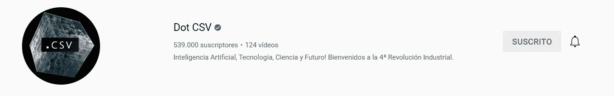
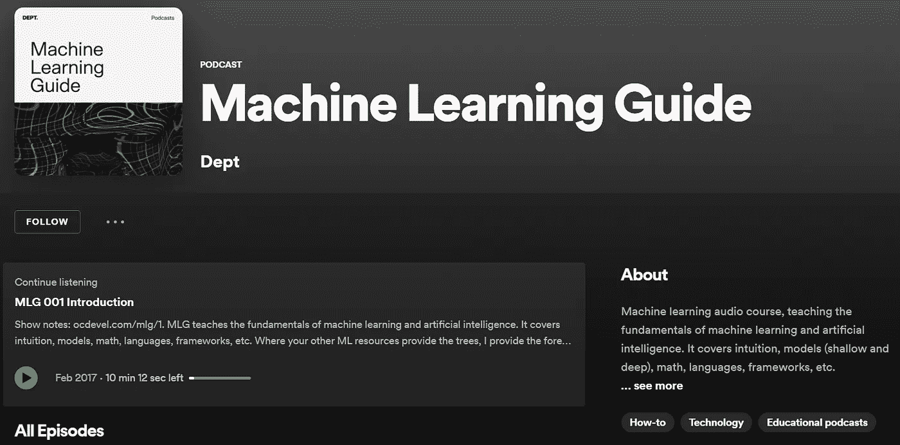
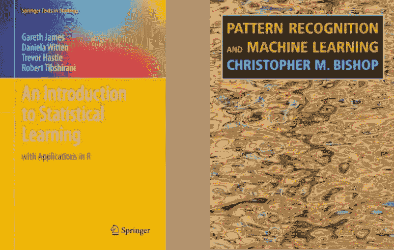
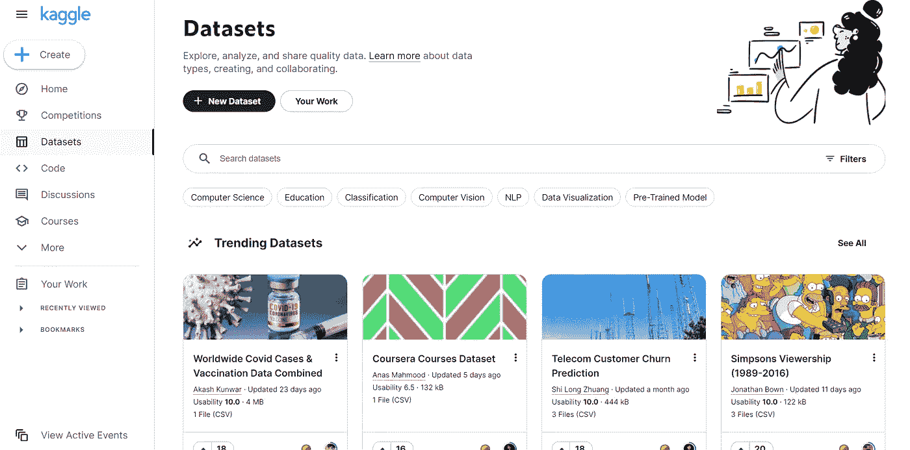

# 2022 年学习 AI

> 原文：<https://medium.com/geekculture/learning-ai-in-2022-1d8aa3dbc1e4?source=collection_archive---------13----------------------->

## 我在日常学习中使用的 5 种学习资源的列表，用来学习人工智能和了解该领域的最新消息。

Photo by [Jeff Sheldon](https://unsplash.com/@ugmonk?utm_source=unsplash&utm_medium=referral&utm_content=creditCopyText) on [Unsplash](https://unsplash.com/s/photos/computer?utm_source=unsplash&utm_medium=referral&utm_content=creditCopyText)

开始学习人工智能可能会**令人不知所措**和**令人沮丧**，因为互联网上有各种各样的话题和概念。此外，大多数人认为人工智能是一项困难、神秘、难以理解的技术，而事实是，除了对数学的基本理解——字面上的**和**、**积、**和一点**导数**——你可以很容易地从头开始学习。

在这篇文章中，我将分享我在 2022 年开始学习 AI 的 5 个学习资源和最后几个对你的旅程有帮助的**小贴士**(剧透提醒:**没有课程！**)。

> **注意**:这些资源不仅仅是给刚开始学习的人，也是给那些想继续学习新课题并深入研究的人

# 目录

## *资源列表*

1.  [***YouTube***](#fde3)
2.  [***播客***](#7466)
3.  [***书籍***](#775c)
4.  [***文章和论文***](#870f)
5.  [***练习！练习！练习！***](#7583)

## [*提示*](#cad7)

# 资源列表

## 1.油管（国外视频网站）

谷歌平台聚集了数百万人，他们分享自己的知识，可以教你任何你能想象到的东西，当然，人工智能也不例外。如果你想获得关于复杂主题的直觉，学习主要的 AI 编程 python 库，或者了解世界上最新的更新，我推荐你访问以下渠道:

[**点 CSV**](https://www.youtube.com/c/DotCSV)

[YouTube: Dot CSV](https://www.youtube.com/c/DotCSV)

主要致力于关于 AI 的复杂话题的**新闻**和**解释**，不过也可以找一些编码教程。这个频道最棒的一点是它令人难以置信的动画，创作者用它来使解释变得简单易懂。

虽然这是一个西班牙语频道，但你可以打开 YouTube 的自动翻译字幕，实际上，这些字幕是用人工智能生成的。

[deep learning ai](https://www.youtube.com/c/Deeplearningai)

[YouTube: DeepLearningAI](https://www.youtube.com/c/Deeplearningai)

这个频道收集了大量的机器学习内容，但我特别向您推荐由 Andrew NG 制作的列表，他是人工智能领域的著名教授和研究人员，他制作了一系列视频来解释人工智能背后的理论概念。

这一系列视频属于 Coursera 中的专业化人工智能课程，如果您选择选项*“审计课程”，您可以免费观看**。***

**[**阿拉丁佩尔森**](https://www.youtube.com/c/AladdinPersson) **和** [**森德克斯**](https://www.youtube.com/c/sentdex)**

****

**[YouTube: Aladdin Persson](https://www.youtube.com/c/AladdinPersson)**

****

**[YouTube: sendtex](https://www.youtube.com/c/sentdex)**

**两个频道都专注于**编码教程**和**论文评论**，非常有助于更好地理解。**

## **2.播客**

**最近越来越受欢迎，音频资源的一个最大优势是，你可以在上班的路上一边散步或做运动一边听。**

**[**机器学习指导播客**](https://open.spotify.com/show/5M9yZpSyF1jc7uFp2MlhP9) 很不错，强烈推荐。演讲者 Tyler Renelle 以一种恰当而清晰的方式解释了 ML 和 AI 的概念，并从头到尾用例子来说明他的解释。**

**这个播客的一个关键点是，谈论了机器学习的最简单的**浅层算法**，这是其他重要的强大工具。**

****

**[Spotify: Machine Learning Guide](https://open.spotify.com/show/5M9yZpSyF1jc7uFp2MlhP9)**

## **3.书**

**接下来的两本书关注的是**简单的 ML 算法**和**数学概念**，它们是更好地理解更复杂的模型所必需的。**

> *****澄清 AI 和 ML*** :人工智能和机器学习并不是不同的研究领域，其实 ML 是归类在 AI 之内的。这意味着 AI 就像一个巨大的世界，ML 是它的一个大洲。此外，深度学习——人工智能以此闻名，神经网络和复杂模型也属于此——就像是人工智能大陆上的一个国家。**

**如今大多数最大的人工智能模型都是基于几十年前开发的想法和更简单的 ML 模型。然而，更重要的是**许多实际问题可以使用那些技术**来解决，需要更低的成本和更少的时间，因此了解和理解它们对于开发最佳解决方案至关重要。**

****

**(Left) [Amazon: An Introduction to Statistical Learning](https://www.amazon.com/Introduction-Statistical-Learning-Applications-Statistics/dp/1071614177/ref=sr_1_1?keywords=an+introduction+to+statistical+learning&qid=1659563171&sprefix=an+introdution+to+stat%2Caps%2C186&sr=8-1). (Right) [Amazon: Pattern Recognition and Machine Learning](https://www.amazon.com/Pattern-Recognition-Learning-Information-Statistics/dp/0387310738/ref=sr_1_1?crid=3IF9M2DLF4JGD&keywords=pattern+recognition+and+machine+learning&qid=1659563140&sprefix=pattern+reco%2Caps%2C187&sr=8-1)**

## **4.文章和论文**

**虽然文章是为广大公众创建的易于阅读的信息内容，但论文是科学界的第一手信息。知道如何**组合它们**并提取最有价值的内容片段是你研究中的**省时器**。**

**尽管论文倾向于使用难懂的符号，它们很难理解，但最终，随着时间和练习，你将能够读懂它们。试着阅读你对主题熟悉的论文，通常如果你以前读过一些信息性文章或看过一些 YouTube 视频会更好。**

**你可以从网上的一个主要论文库完全免费下载它们，那就是 arxiv.com 的网站**

**另一方面，对于文章，我强烈推荐阅读面向数据科学的媒体出版物**，许多研究人员和科学普及者在那里发布他们的内容。****

## ****5.练习！练习！练习！****

****最后但并非最不重要的一点是，**会让你学到比之前任何资源都多的东西**:练习。****

****理论知识非常重要，但是如果没有应用，它是没有用的。因此，除了前面所有的内容，我建议你**开始开发你自己的项目**并亲眼看看如何规划和构建一个项目。****

****为此，我建议你使用**。Kaggle 是一个平台，在这里你可以找到数千个与 AI 相关的数据库和项目。除此之外，它还有一些基础项目需要从头开始学习。******

************

******Screenshot of the Kaggle website******

******另一个寻找数据库的有趣平台是 UCI 机器学习库******

# ******技巧******

*   ******按时间顺序排列艾大约在 50 岁左右出生，从那以后经历了令人眩晕的成长。为了理解最新的进展，有必要回顾过去并理解简单的模型，从神经元到多层感知器和反向传播算法，每一个发现都是基于以前的发现(如同所有科学领域一样)。为了提高你的学习速度，最好**遵循一个顺序，从最简单的基础开始，到当今最复杂的概念。********
*   ****专注于一个主题，在你完全理解它之后，转向另一个主题
    你可能已经注意到，人工智能是一个巨大的领域，试图在短短几口时间内涵盖它是一个很大的错误。打好基础后，你要**选择一个研究领域，专注于一个特定的课题**，比如*图像生成与甘*、*图像分类器*、*情感分析*、*文本理解*……有很多开放的研究前沿，每一个都需要一段时间的专业化和研究。如果你只是读了一些关于 GAN 的东西，然后切换到 NLP，然后是预测模型，然后是图像分类器…你最终会对每个领域都有非常肤浅的理解，但没有有价值的信息。****
*   ******把事情分解成更简单的概念，从最简单的开始** 这是一个很常见的学习练习，让你更容易消化复杂的概念。例如，如果你试图理解一个图像分类器，首先你需要知道图像在计算机中是如何表示的，然后是卷积层如何工作，其他层如何处理图像，最后是交叉熵损失函数如何工作以及为什么使用它。****
*   ******不要只关注最新的超级模特，记住许多问题不需要如此复杂的解决方案** 正如泰勒·勒内尔在他的一个播客中所说:*“深度学习就像一个火箭筒，你可以用它去猎兔并得到它，但还有其他更便宜、更容易的方法”*。如果你想为公司或客户解决问题，**作为人工智能专家，你必须找到最佳解决方案**，这也包括**低成本、省时** **和易于实施。**此外，运营最新项目的公司并不公布有关它们的所有信息，因此其他企业无法复制它们。****