# 学习 IaC:第一部分—地形

> 原文：<https://medium.com/geekculture/learning-iac-part-one-terraform-8f8edacc42f0?source=collection_archive---------15----------------------->


Photo by [Mike Yukhtenko](https://unsplash.com/@yamaicle?utm_source=medium&utm_medium=referral) on [Unsplash](https://unsplash.com?utm_source=medium&utm_medium=referral)

最近，我决定开始学习代码为 (IaC)的**基础设施，我想使用这些新技术来构建一些东西，以帮助我巩固我的理解。经过深思熟虑，我决定为一个角色扮演游戏( [***【沙丘:帝国历险记】***](https://www.modiphius.net/products/dune-adventures-in-the-imperium-core-rulebook-standard-edition) )构建一个 Discord 服务器机器人，该游戏基于我最喜欢的弗兰克·赫伯特科幻系列之一: ***【沙丘*** *。***

这个机器人的目的是将用户输入作为命令，并执行一些动作，如为游戏滚动虚拟骰子或查找规则。然而，这一系列将不是关于实际的机器人，而是关于它的创建和托管。目标是从一个集中的地方使用尽可能多的代码来完成这项工作。我将使用的技术如下:

*   **地形**:在数字海洋上提供服务器、防火墙和存储。
*   **Ansible** :配置远程服务器来托管和运行 bot。
*   **Python** :构建并编程机器人。
*   GitHub :存储 bot 并维护 CI/CD 工作流。
*   **MongoDB** :为 bot 提供数据持久性。

我的志向是创作一系列记录这一旅程的作品，以便其他人可以跟随类似的项目。希望我们都能在这个过程中学到一些东西！

本文将带我们了解使用 [Terraform](https://www.terraform.io/) 在数字海洋上配置服务器的过程，Terraform 是一种开源 IaC 软件工具，它提供了一致的 CLI 工作流来管理云服务。但是，请注意，本文不是关于如何使用 Terraform。有很多关于使用这种技术的教程，所以如果你不熟悉或者想了解更多，我强烈建议你找一个适合你特殊学习风格的教程。

这个旅程从在[数字海洋](https://www.digitalocean.com/)创建账户开始。还有许多其他的云提供商，包括 AWS 和 GCP 这样的巨头，但我已经使用 Digital Ocean 有一段时间了，发现它很容易与像我这样的新手合作。

建立帐户后，我们需要创建一个无密码的 SSH 密钥对，并将公钥添加到数字海洋中。一旦创建好，这将是我们用来与服务器交互的 SSH 密钥。生成 SSH 密钥(我使用了 **ssh-keygen** )后，让我们复制公钥并前往数字海洋的仪表板，单击左侧的**设置**，然后单击**安全**选项卡:


让我们单击**添加 SSH 密钥**按钮，然后将我们复制的公钥粘贴到 SSH 密钥内容框中，给密钥命名，并单击蓝色的**添加 SSH 密钥**按钮:

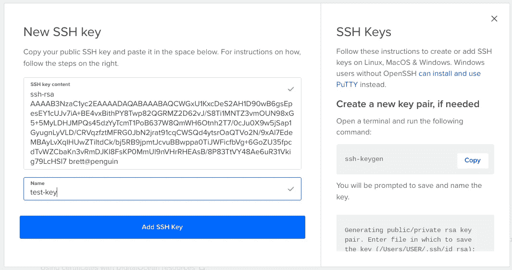

之后，我们应该会看到我们的 SSH 密钥被添加到仪表板中。我们把出现的指纹复制下来，存放在安全的地方。我们稍后会用到它:

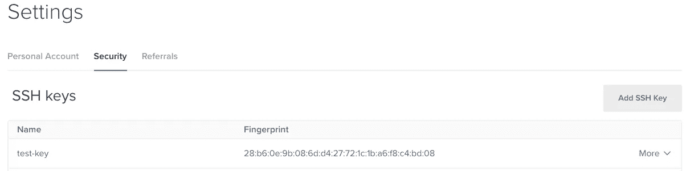

接下来，我们需要在数字海洋上创建一个个人访问令牌(PAT)。让我们单击仪表板左侧的 **API** ，然后单击**令牌/密钥**选项卡，并单击**生成新令牌**按钮:

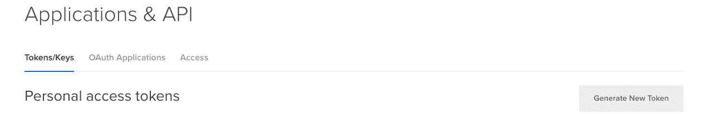

在出现的框中，我们需要给令牌一个名称，并确保两个范围都被选中，以便我们可以远程读写数字海洋。完成后，让我们单击蓝色的**生成令牌**按钮:

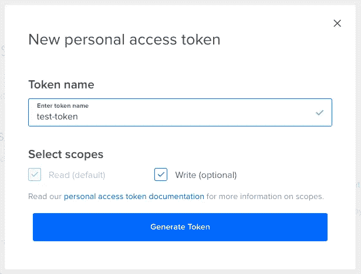

之后，我们应该会看到我们的 PAT 列在仪表板上。我们需要复制此处出现的令牌，并将其保存到安全的位置。这将是我们唯一一次看到实际的令牌，因此我们需要确保完成这一步:

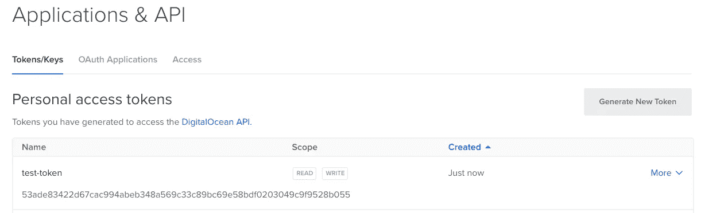

好了，我们的数字海洋账户已经创建好了，可以远程工作了。现在让我们看看如何使用 Terraform 来创建我们的基础设施。

首先，我们需要安装 [Terraform CLI](https://learn.hashicorp.com/tutorials/terraform/install-cli) 来使用这些命令。根据我们使用的机器类型，这个过程对于每个操作系统可能会有所不同。

现在我们已经安装了 Terraform，让我们导出一些全局变量。还记得我们之前保存的 PAT 和 SSH 密钥吗？既然我用的是 Chromebook，我就把这些秘密储存在我的 ***里。巴沙尔*** 文件。用前缀 **TF_VAR_** 命名变量是非常重要的。因此，这两个变量应该是这样的:

```
export TF_VAR_do_token="53ade83422d67cac994abeb348a569c33c89bc69e58bdf0203049c9f9528b055"export TF_VAR_ssh_key_fingerprint="28:b6:0e:9b:08:6d:d4:27:72:1c:1b:a6:f8:c4:bd:08"
```

现在我们准备开始写一些 HCL (HashiCorp 配置语言)。我有一个名为 **dune-bot** 的项目根目录，在其中我有另一个名为 **dune-terraform** 的目录。这是我为这个项目保存 Terraform 配置文件的地方。随意使用任何对你有意义的结构。

我们将创建的第一个文件是 ***provider.tf*** 。在这里，我们将详细说明我们的项目需要的供应商。为了找到提供商信息，我们去 [Terraform 注册中心](https://registry.terraform.io/)搜索数字海洋提供商。找到后，让我们单击**使用提供者**按钮，复制右边显示的代码:

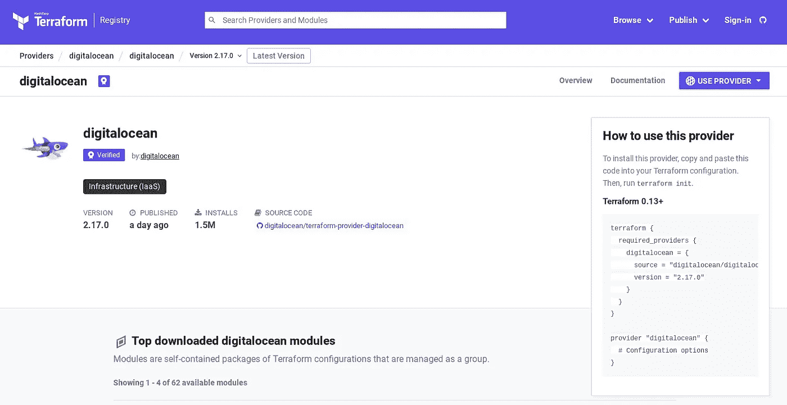

接下来我们将代码粘贴到 ***provider.tf*** 文件中。在实际的 provider 块中，我们需要创建一个对数字海洋令牌的引用(在下一步中将在变量文件中创建)。因此，最终文件应该如下所示:

接下来是 ***variables.tf*** 文件。如果我们想要包含我们不想提交给版本控制的变量，我们可以将文件命名为***terraform . TF vars***并将其包含在 ***中。gitignore*** 文件，但出于这个目的，前者的名字就可以了。这里我们将建立两个变量，它们的值来自我们之前在 ***中导出的全局变量。bashrc*文件。这里除了变量的名称和描述之外，什么都不需要:**

我们要创建的最后一个文件是***droplet _ volume . TF****文件。这里是所有真正工作发生的地方。这里有几个资源块详细说明了我们想要做的事情。让我们看一下代码，然后我们将逐块浏览:*

*第一个资源块 **digitalocean_volume** ，描述了我们想要创建的卷。“卷”是数字海洋用来表示额外存储空间的术语。这里有相当多的论点。我们可以随时查看[注册表](https://registry.terraform.io/providers/digitalocean/digitalocean/latest/docs/resources/volume)来了解这些参数的含义以及如何使用它们。在这种情况下，我们将使用 ext4 文件系统创建一个 10 GB 的小卷，并托管在 NYC1 区域。*

*下一个资源块， **digitalocean_droplet** ，描述了我们想要创建的 droplet。“水滴”是数字海洋对其云服务器的称呼。同样，有几个参数，我们可以查看[注册表](https://registry.terraform.io/providers/digitalocean/digitalocean/latest/docs/resources/droplet)来了解如何使用它们。这个块创建了一个小 droplet，它有一个 Intel CPU，1 GB 内存，运行 Debian 11，也托管在 NYC1 区域。此外，我们将包含变量中的 SSH 密钥指纹，这样我们的 droplet 将在已经安装了 SSH 密钥的情况下创建。*

*第三个资源块，**digital ocean _ volume _ attachment**，简单地将我们正在创建的卷附加到我们同时正在创建的 droplet 上。我们的 droplet 从 15 GB 的存储空间开始，所以我们将它增加了 10，总共有 25 GB 的存储空间专门用于这个 droplet。同样，关于这个资源的信息可以在[注册表](https://registry.terraform.io/providers/digitalocean/digitalocean/latest/docs/resources/volume_attachment)中找到。*

*最后一个资源块， **digitalocean_firewall** ，为我们的 droplet 创建了一个防火墙，只允许来自任何地方的入站 SSH 流量(这并不总是最好的主意，但它适用于我们这里的情况)。我们仍然允许我们的 droplet 连接到所有出站的东西。该资源的详细信息也可以在[注册表](https://registry.terraform.io/providers/digitalocean/digitalocean/latest/docs/resources/firewall)中找到。*

*我们文件中的最后一个语句是一个输出变量，它简单地列出了这个过程完成后新创建的 droplet 的 IP 地址，我们很快就会看到。*

*现在我们已经完成了所有的编码工作，让我们运行 Terraform 来创建我们的 droplet。在我们做任何事情之前，我们需要将终端导航到我们的***dune-terra form***目录，并运行以下命令:*

```
*$ terraform init*
```

*如果一切都配置正确，我们应该会看到如下输出:*

*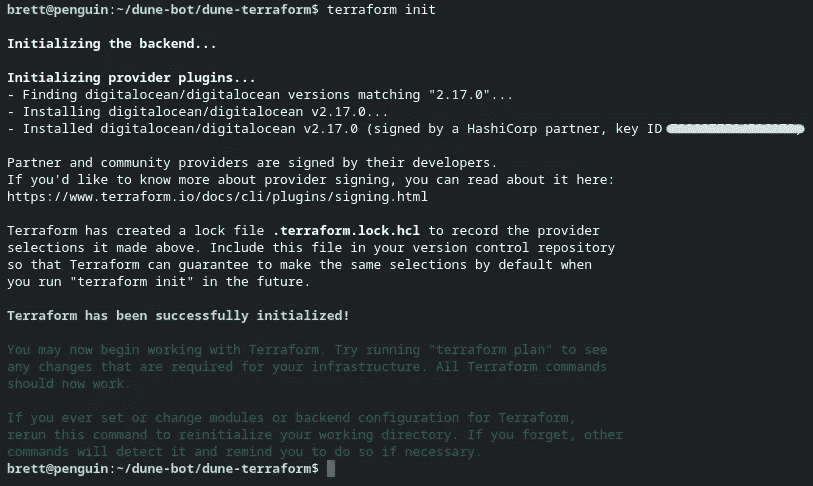*

*下一步是运行计划:*

```
*$ terraform plan*
```

*如果没有错误，输出的最终部分应该如下所示:*

*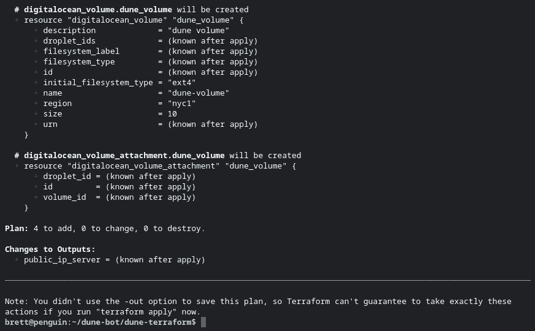*

*到目前为止一切顺利！最后一步是应用和执行计划:*

```
*$ terraform apply*
```

*在此步骤中，Terraform 会询问我们是否要执行这些操作。它在这里只接受输入 **yes** ，所以让我们添加它并点击 **Enter** 继续:*

*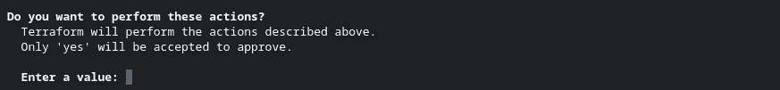*

*创建所有资源可能需要一分钟时间。CLI 将显示过程中每一步的进度。如果一切顺利，我们应该会看到下面的最终输出:*

*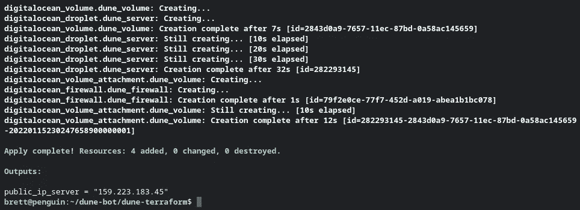*

*就是这样！我们已经使用 Terraform 通过 HCL 完全配置了云服务器。现在我们可以去数字海洋仪表盘查看一切。*

*如果我们一直保持数字海洋开放，我们可能需要刷新页面才能看到我们的变化。首先，让我们看看**水滴**部分下面:*

*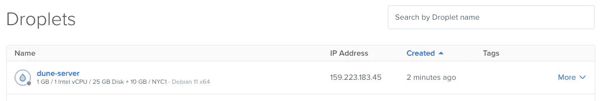*

*现在，我们应该看到新创建的 droplet 列在那里。让我们点击液滴名称，然后点击**卷**子菜单来查看我们附加的卷:*

*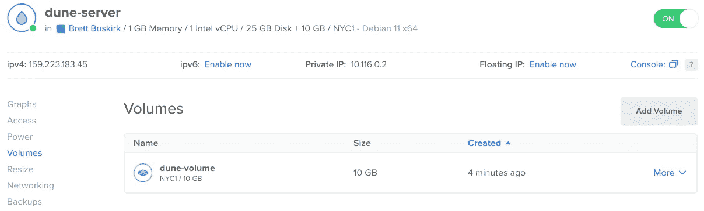*

*一切都在意料之中。现在，如果我们单击屏幕最左侧的**网络**菜单，然后在**防火墙**选项卡上，我们也应该看到我们的防火墙列表:*

*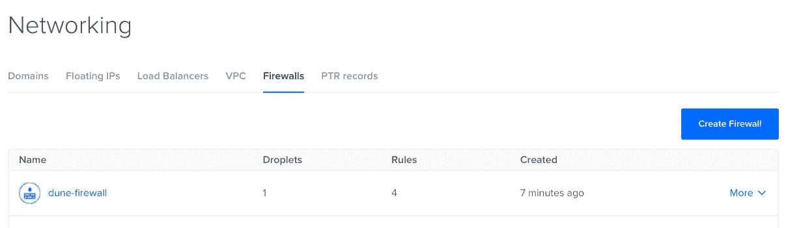*

*单击防火墙名称将显示我们应用的详细信息和规则:*

*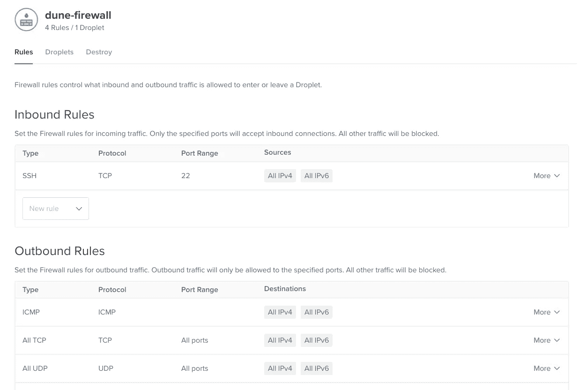*

*一切正常。我们现在已经有了一个云服务器，可以随时使用了！*

*好了，本期就到这里。下一次，我们将看看如何创建基本的 bot，将其连接到 Discord，然后在 GitHub 中设置它，这样一旦我们使用 Ansible 配置了 droplet，就可以自动部署了。*

*感谢跟随和快乐编码！*