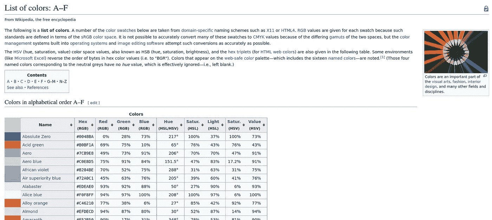
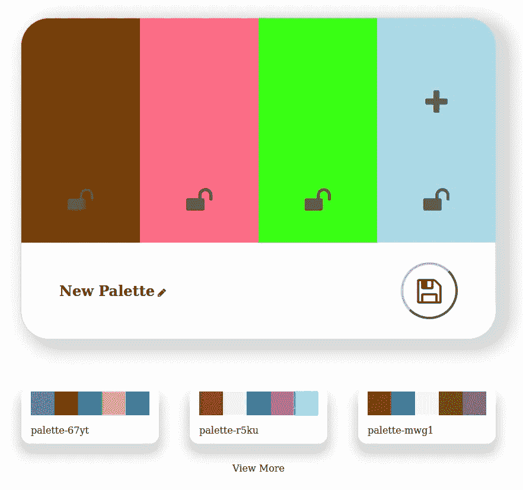
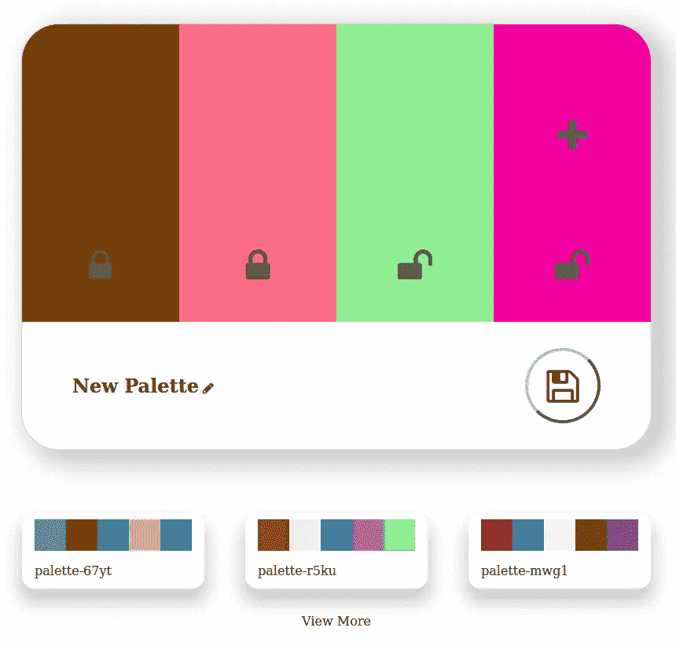
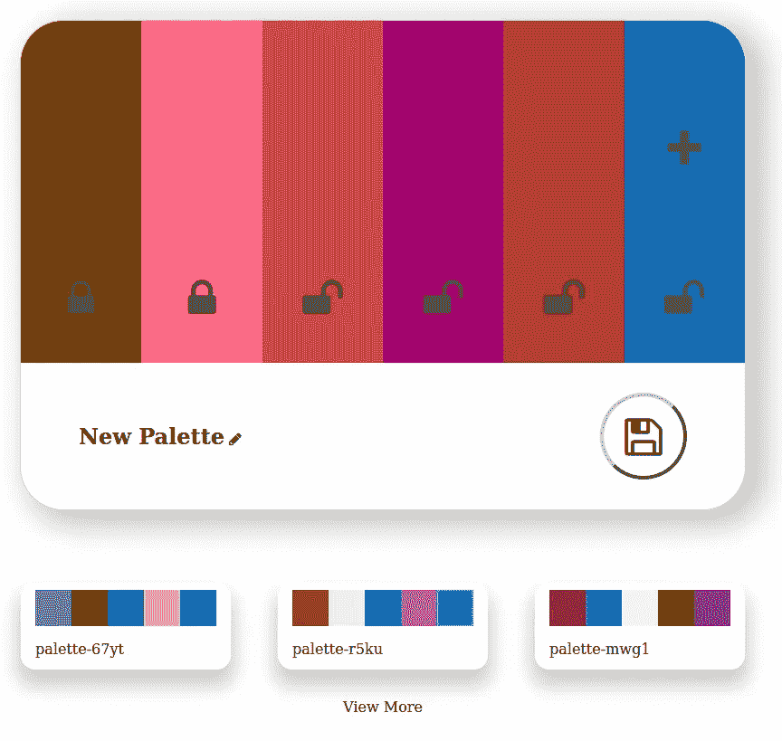
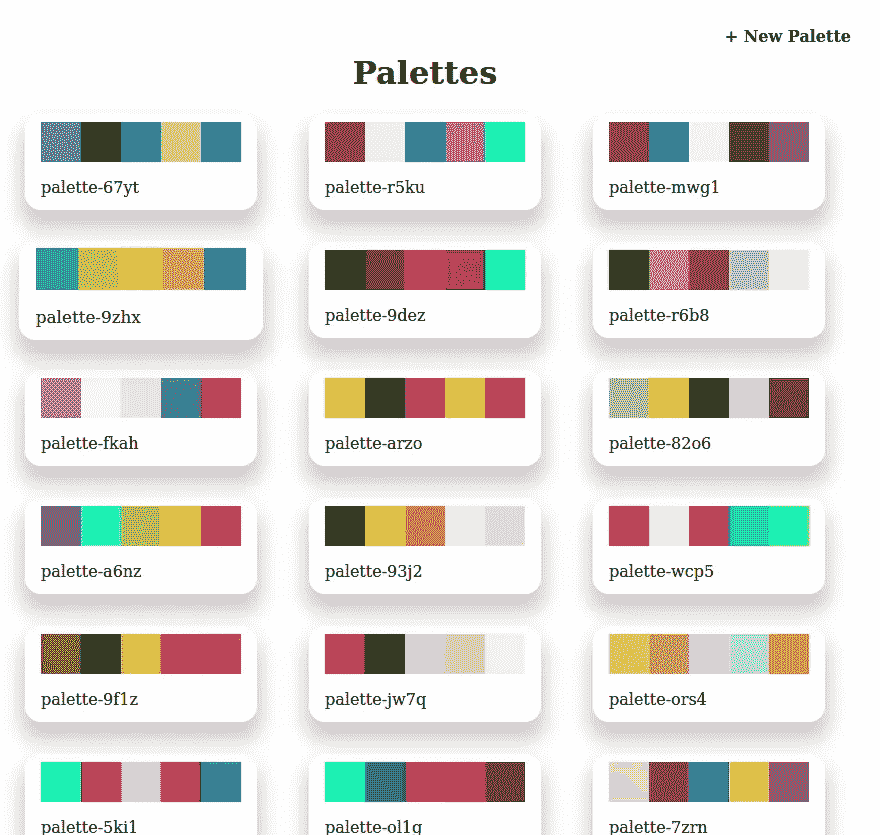

# 通过粗略克隆酷派来学习 JavaScript

> 原文：<https://medium.com/geekculture/learning-javascript-by-roughly-cloning-coolors-20115cab8a8e?source=collection_archive---------6----------------------->

直到最近，我才具备了非常基础的 JavaScript 知识，我已经以令人满意的速度和内存使用解决了一些 leetcode 问题，我可以在 DOM 元素上设置事件监听器来做一些基本的事情，我甚至尝试过向 API 发出请求。尽管如此，我还是感觉不到使用 python 或 ruby 时的自信。在过去的几周里，我埋头于 JavaScript 的研究，并真正对这种语言的工作原理有了更好的理解。为了激发我对几个概念的理解，我制作了一个我喜欢的应用程序 Coolors 的基本仿制品。这是一个允许你通过按空格键生成我称之为“监督随机”调色板的应用程序。

对于这个应用程序的整体结构，我使用了 rails JSON API 和一个普通的 JavaScript/html/CSS 前端。

# 后端

对于应用程序的后端，我用 rails 创建了一个简单的 JSON API，我想做的就是:

1.  要求指定数量的随机选择的颜色。
2.  将新的调色板(带有标题列的 HABTM 颜色模型)保存到数据库中。
3.  请求数据库中所有调色板的信息。

使用 API 标志用 rails 创建一个 API 非常简单，如下所示

```
rails new PROJECT_NAME --api
```

使用 api 标志 rails 将自动省略通常包含在常规 rails 应用程序中的多余中间件，使应用程序控制器从 ActionController::API 继承而不是基本省略浏览器使用的任何 ActionController 功能，并告诉生成器跳过视图。生成资源时的助手和资产。

# 模型

我的 API 有两个模型:颜色和调色板。这两个模型通过 has _ and _ owners _ to _ many 关系相关联，事后看来，这对于我最终使用的功能来说是不必要的，但是当我刚刚开始这个项目时，我计划拥有一个“最流行的颜色”功能，并且通过颜色可以访问调色板会使这很容易做到。

**颜色:**

颜色模型具有用于存储值的列，这些值允许颜色被格式化为几种格式:“名称”、十六进制、RGB、HSL、HSV。

**调色板:**

除了时间戳之外，调色板模型只有一列，即名称。

# 关于源数据的说明:

为了给数据库播种，我写了一个网页抓取器，从维基百科[页面](https://en.wikipedia.org/wiki/List_of_colors)中抓取 971 种颜色

scraper 搜索所有三个页面(A-F、G-M、N-Z ),并返回一个散列数组，其中包含表中每种颜色的值。



Wikipedia list of colors

使用该数组，数据库中会填充颜色记录。在颜色被记录到数据库之后，调色板类方法被用来创建 5 个随机选择的颜色的 25 个调色板。

```
def self.newRandom()
   palette = Palette.new(name: "palette-#{("a".."z").to_a.concat((0..9).to_a).shuffle.slice(0,4).join("")}")
   palette.colors.concat(Color.all.sample(5))
   palette.save()
   return palette
end
```

这为乱搞和使用 app 提供了充足的数据。

# 端点

因为应用程序只有 3 个端点，所以我在 routes.rb 中显式声明了它们

```
Rails.application.routes.draw do
  get '/api/colors', to: 'colors#index'
  get '/api/palettes', to: 'palettes#index'
  post '/api/palettes', to: 'palettes#create'
end
```

1.  Get /api/colors:第一条路径由 colors 控制器的 index 操作处理。向/api/colors 发送 GET 请求将返回 JSON 格式的所有颜色，或者使用“count”查询字符串，返回 JSON 格式的指定数量的随机选择的颜色，这用于在用户打开调色板创建页面时填充新的调色板，以及在调色板创建期间更改未锁定的颜色。
2.  Get /api/palettes:第二条路线由 palettes 控制器的 index 操作处理。此操作以 JSON 格式返回数据库中的所有调色板，或者接受类似 colors route 的“count”查询字符串，以返回指定数量的最近创建的调色板。这在调色板视图页面上使用，并呈现调色板创建界面下的三个小调色板。
3.  Post /api/palettes:最终的路径由 palettes 控制器的 create 操作处理，当用户保存调色板名称时，使用 JavaScript 将所选颜色的 id 发送到 api。在 create 动作中，使用一个实例方法从 JSON 数据创建一个调色板。

# 克-奥二氏分级量表

关于 CORS 或跨源资源共享的补充说明。简而言之，CORS 是浏览器确定允许客户端请求资源是否安全的一种方式。开箱即用的 JavaScript 前端将被阻止向 API 发出请求。要启用 CORS，您可以将“rack-cors”添加到 Gemfile 并运行 bundle install，您还必须告诉 rails 应用程序使用 application.rb 文件中的 rack-cors 中间件[有关更多信息，请参考文档](https://github.com/cyu/rack-cors)。

# 前端

有了 API，剩下的就是用 JavaScript 来消费它了。

# 责任

通过写出我希望前端做的所有事情，我能够将所有功能分成 4 个独立的块(不包括主例程)

1.  **调色板:**调色板类处理如下任务:实例化和管理调色板中的颜色，将未锁定的颜色更改为新的随机颜色，在保存调色板时创建散列以发送到 api，添加新颜色，将加号按钮添加到调色板中的最后一种颜色。
2.  **Color:**Color 类处理如下任务:访问颜色的 DOM 元素，当颜色更新时改变 DOM 元素的背景，当颜色的锁定状态改变时切换锁图标，更新 DOM 元素的数据属性。
3.  API:API 对象是处理与 API 通信的函数的散列:获取 n 种颜色，获取 n 个调色板，并在保存调色板时将调色板散列发送给 API
4.  **Render:**Render 对象也是函数的散列，这次处理 DOM 元素的创建:创建显示在主调色板创建界面下面的迷你调色板，一个助手接受一个标签和一个可选的类名数组，返回一个指定标签的 DOM 元素和提供的类名(如果有的话)。

# 主程序

全部 JavaScript 功能都是在事件侦听器触发器中由 DOMContentLoaded 事件执行的，这意味着 JavaScript 会等到整个页面加载到浏览器中后才开始执行，这可以防止程序在加载静态 DOM 元素之前尝试访问它们。

**流量**

1.  首先实例化一个新的 palette 对象，并将保存迷你 palette 元素的容器 div 保存到一个变量中，以便于访问。
2.  接下来，对 palette 对象调用 initColors()方法，该方法使用 api.getColor()从 api 获取 4 种颜色，并将一个新的颜色实例推送到 Palette 实例的 Colors 数组中。
3.  palette.initColors()调用是"。然后与 renderColors() palette 方法进行“d ”,该方法清除 DOM 调色板的颜色行，然后将每个调色板实例的颜色元素追加到 DOM 调色板的颜色行。
4.  一个事件侦听器被添加到 save button DOM 元素中，该元素调用调色板上的 savePalette 方法。该方法检查是否使用了自定义名称，否则它使用浏览器警告来指示用户这样做，然后它向 API 发送调色板名称和调色板颜色 id 的字典。当请求完成时，该方法调用 render 方法，该方法刷新页面底部的小调色板以显示最近保存的调色板。
5.  一个事件监听器被添加到文档主体中，该事件监听器通过按下键盘键来触发，如果该键是空格键，并且当前聚焦的元素不是调色板名称输入，则调用 palette.shuffle()方法。shuffle 方法遍历调色板的颜色，如果颜色被解锁，则调用 updateColor()方法，并使用 api.getColor()方法提供新的颜色哈希
6.  最后，调用 render.palettes()方法在调色板创建界面下呈现最近保存的 3 个调色板。

# 使用

当客户端在浏览器中打开时，用户会看到调色板界面，三个最近创建的调色板和一个查看数据库中每个调色板的链接。



按空格键将更改所有未锁定列的颜色，按下锁图标将锁定该列，以保留调色板中所需的颜色。



按加号图标将向调色板添加另一种颜色。



要保存调色板，必须更改标题。按照“查看更多”链接查看数据库中的所有调色板



单击调色板以查看调色板的十六进制和 RGB 值


# 笔记

我最初让我所有的 API 方法接受回调，但是很快就陷入了[回调地狱](http://callbackhell.com/)，所以我切换到使用 async/await，这极大地提高了我代码的可读性。

如果你喜欢我的写作，请随时查看我的[网站](https://svrourke.com/)，并通过 [LinkedIn](https://www.linkedin.com/in/samuel-v-rourke/) 与我联系