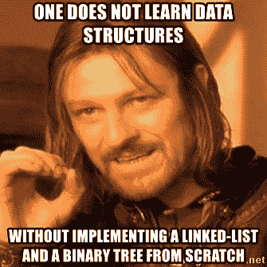
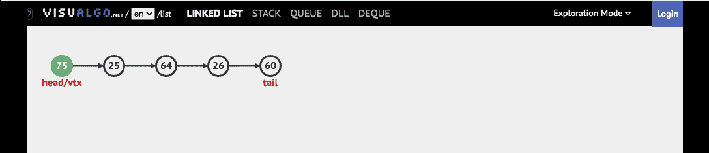
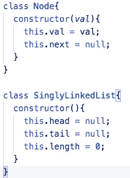
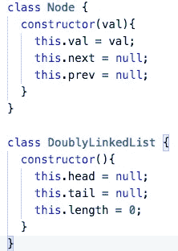
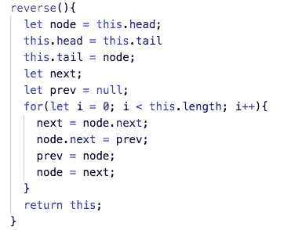

# 学习链表

> 原文：<https://medium.com/geekculture/learning-linked-lists-e28e992f619f?source=collection_archive---------15----------------------->

我会承认，当我刚开始学习数据结构和算法的时候，我非常害怕。研究了一会儿之后，我真的很喜欢它们。我的印象是，大多数热爱编程的人会喜欢学习 DS，如果他们还没有的话。对我来说，这种消极情绪与害怕必须知道工作面试的每一个数据结构和排序算法有关。一旦我真正开始学习，很容易忘记工作面试的压力，只是享受编码。

因为我知道这看起来让人不知所措，所以我写这篇文章来概述什么是链表，最常见的链表操作的时间复杂度(大 O ),以及什么时候你可能想要使用它。因为链表不是 JavaScript 为我们提供的数据结构，所以我们必须将它们创建为类。这里是我为[单向链表](https://repl.it/@liamH47/singly-linked-lists)和[双向链表](https://repl.it/@liamH47/doubly-linked-lists#index.js)制作的 Repl.it 页面的链接。每个页面都有一个 JavaScript 类，其中包含数据结构中最常用的一些方法，比如 push、pop、shift 和 unshift。

与数组非常相似，链表是数据的有序列表。然而，它们的工作方式截然不同。在数组中，我们用一个数字来索引每一项。链表由节点组成，每个节点都有一个值，并由一个“指针”连接。单链表(SLL)中的节点有一个值，然后有一个“指针”将它连接到列表中的下一个节点。在双向链表(DLL)中，每个节点都有一个指向其后节点和前节点的指针。链表的开始和结束分别被称为头和尾。需要注意的重要一点是，尾部不会连接到节点，而是将“null”作为其向前指针的值。在 DLL 中，头部也有一个“空”指针，因为在它之前没有节点。

**单链表**

check out this and more great visualizations from [visualgo.net](https://visualgo.net/en)

Constructors for both a SLL and it’s nodes.

**双向链表**

check out this and more great visualizations from [visualgo.net](https://visualgo.net/en)

Constructors for both a DLL and it’s nodes

**链表大 O**

check out [bigocheatsheet.com](https://www.bigocheatsheet.com/) for more great information

看完这些图片后，您可能会想，既然两种链表在结构和性能上如此相似，为什么还要费心去创建它们呢？如果它们执行的是相同的，为什么还要做额外的设置并使用 DLL 来消耗更多的内存呢？答案在于边缘案例。

如果您需要以逆序访问列表中的数据(浏览器历史记录就是一个很好的例子)，双向链表的性能会好得多。这是因为你要做的就是找到尾部，看前面的节点，等等。将此代码与下面的单向链表代码进行比较。

此外，从 DLL 中移除一项总是一个常数时间。对于 SLL，它实际上可以根据你从哪里移动而变化。如果我们想添加到一个 SLL 的末尾，我们必须遍历整个内容，直到找到倒数第二个节点。在 DLL 中，我们可以直接到尾部。如果不需要逆序访问链表，SLL 可能是一个不错的选择，尤其是当您担心每个节点上增加一个指针会占用额外的内存时。

我真的很喜欢学习链表和从头开始编写类方法。它教会了我比我预期的更多的编程知识，我很高兴能继续学习更多的数据结构！感谢阅读！