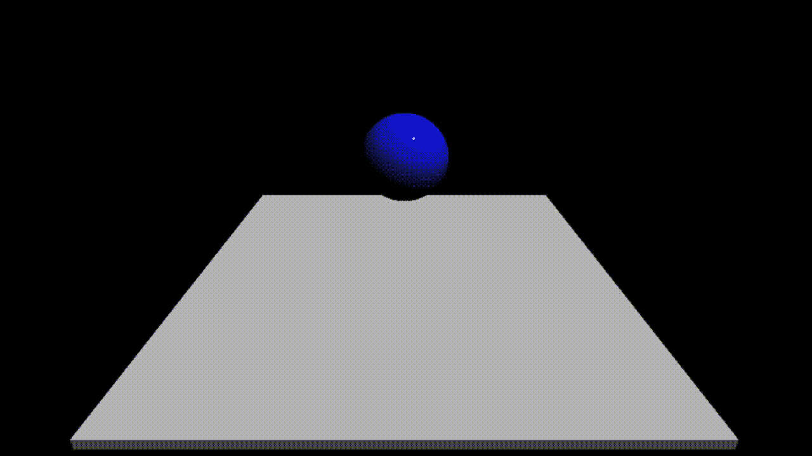

# 学习 Three.js: #1 如何制作弹跳球

> 原文：<https://medium.com/geekculture/learning-three-js-1-how-to-create-a-bouncing-ball-5f423a629e59?source=collection_archive---------9----------------------->

这是**“学三. js”**系列的第一篇教程！这个系列是关于**学习 Three.js，和你一起**。虽然 Three.js 已经存在了一段时间，但我在这个领域绝对是个初学者。我之所以想学这个是因为我真的想为我的网站制作很酷的 3D 动画，就像那些在[awwwards.com](https://www.awwwards.com/)上很酷的网站一样。

和往常一样，这个演示的完整代码将会在 Github 的[这个链接](https://github.com/franky-adl/bouncing-ball)上。

# 设置 Webpack

我们需要的最重要的包当然是 Three.js 包。从 npm 安装它:

```
npm install --save three
```

看一下我的`package.json`文件，看看我们构建这个项目还需要哪些开发依赖项。

```
 "devDependencies": {
    "[@babel/core](http://twitter.com/babel/core)": "^7.14.3",
    "[@babel/preset-env](http://twitter.com/babel/preset-env)": "^7.14.4",
    "autoprefixer": "^10.2.6",
    "babel-loader": "^8.2.2",
    "css-loader": "^5.2.6",
    "html-webpack-plugin": "^5.3.1",
    "postcss": "^8.3.0",
    "postcss-loader": "^5.3.0",
    "postcss-preset-env": "^6.7.0",
    "sass": "^1.34.0",
    "sass-loader": "^11.1.1",
    "style-loader": "^2.0.0",
    "webpack": "^5.38.1",
    "webpack-cli": "^4.7.0",
    "webpack-dev-server": "^3.11.2"
  }
```

虽然我们没有太多的 SCSS 来定义这个简单的例子，但它只是一个样板设置，我用在网站上。`HtmlWebpackPlugin`将帮助我们获取一个 html 模板，并将我们的主脚本插入其中。使用`webpack-dev-server`，我们可以让 Webpack 在每次添加变更和保存文件时重新捆绑项目。

# 让我们深入研究代码

我们将所有与 Three.js 相关的代码放在主脚本 index.js 中。

除了导入我们的`style.scss`，为了简单起见，我们从‘three’导入所有的模块作为`THREE`，还有`[OrbitControls](https://threejs.org/docs/#examples/en/controls/OrbitControls)`模块允许用户通过拖动屏幕来‘环绕’我们的对象。

```
import * as THREE from 'three';
import {OrbitControls} from 'three/examples/jsm/controls/OrbitControls';
```

我们来设置一下 Three.js 场景。

```
const scene = new THREE.Scene();
const canvas = document.querySelector("#canvas");
const camera = new THREE.PerspectiveCamera( 75, window.innerWidth / window.innerHeight, 0.1, 1000 );
camera.position.set(0, 20, 50);
camera.lookAt(0, 0, 0);
const controls = new OrbitControls(camera, canvas);// Set up the renderer
const renderer = new THREE.WebGLRenderer({canvas});
renderer.setSize( window.innerWidth, window.innerHeight );
```

一个`[Scene](https://threejs.org/docs/#api/en/scenes/Scene)`对象包含了你想要通过`[WebGLRenderer](https://threejs.org/docs/?q=WebGL#api/en/renderers/WebGLRenderer)`渲染的所有可视对象。画布是显示渲染结果的 html 元素。

`[PerspectiveCamera](https://threejs.org/docs/#api/en/cameras/PerspectiveCamera)`构造函数的参数基本意思是:创建一个 75 度视野的透视相机，与浏览器窗口具有相同的纵横比，并且仅使 0.1 单位和 1000 单位距离内的所有对象可见。

`OrbitControls`对象的实例化允许用户改变默认情况下环绕原点的场景的摄像机角度。

`setSize`方法允许你以不同于浏览器窗口的分辨率来呈现你的应用。通常你会喜欢一样的。

# 要有光！

```
function addLighting(scene) {
  let color = 0xFFFFFF;
  let intensity = 1;
  let light = new THREE.DirectionalLight(color, intensity);
  light.position.set(0, 10, 0);
  light.target.position.set(-5, -2, -5);
  scene.add(light);
  scene.add(light.target);
}
addLighting(scene);
```

在 Three.js 中有许多类型的照明，如`[AmbientLight](https://threejs.org/docs/?q=Scene#api/en/lights/AmbientLight)`、`[PointLight](https://threejs.org/docs/?q=PointLi#api/en/lights/PointLight)`等。我们在这里使用的`[DirectionalLight](https://threejs.org/docs/#api/en/lights/DirectionalLight)`就像太阳一样，场景中的光线都是相互平行的，指向灯光位置画出的特定方向。请注意，使用`DirectionalLighting`时，您需要将灯光对象和灯光目标都添加到场景中。

# 球需要从一个表面上弹开

让我们为弹跳球添加一个“地板”！

```
function addFloor(scene) {
  let geometry = new THREE.BoxGeometry(50, 1, 50);
  let material = new THREE.MeshStandardMaterial({color: 0xDDDDDD, roughness: 0});
  const floor = new THREE.Mesh( geometry, material );
  floor.position.set(0, -10, 0);
  floor.name = 'my-floor';
  scene.add(floor);
}
addFloor(scene);
```

我们创建一个`[BoxGeometry](https://threejs.org/docs/?q=BoxGeo#api/en/geometries/BoxGeometry)`对象，然后为它应用浅灰色`[MeshStandardMaterial](https://threejs.org/docs/#api/en/materials/MeshStandardMaterial)`。如果稍后需要通过名称从场景中查询对象，为对象设置名称会很有帮助。

`MeshStandardMaterial`是一种神奇的材料，可以让你的物体在所有照明场景下做出“正确”的反应。

# 让我们添加球

```
function addSphere(scene) {
  let geometry = new THREE.SphereGeometry( 5, 32, 32 );
  let material = new THREE.MeshStandardMaterial({color: 0x0000ff, roughness: 0});
  let sphere = new THREE.Mesh( geometry, material );
  sphere.position.set(0, 5, 0);
  sphere.name = 'my-sphere';
  scene.add( sphere );
}
addSphere(scene);
```

我们使用`[SphereGeometry](https://threejs.org/docs/#api/en/geometries/SphereGeometry)`创建一个半径为 5 个单位、32 个宽和高分段的球体。你的球体的宽度/高度分段越多，它看起来就越像一个完美的球体。这是一个蓝色的球。

# 开拍。

```
// setting initial values for required parameters 
let acceleration = 9.8;
let bounce_distance = 9;
let bottom_position_y = -4;
let time_step = 0.02;
// time_counter is calculated to be the time the ball just reached the top position
// this is simply calculated with the s = (1/2)gt*t formula, which is the case when ball is dropped from the top position
let time_counter = Math.sqrt(bounce_distance * 2 / acceleration);
let initial_speed = acceleration * time_counter;
let sphere = scene.getObjectByName("my-sphere");// Animate the scene
const animate = () => {
  requestAnimationFrame( animate ); // reset time_counter back to the start of the bouncing sequence when sphere hits through the bottom position
  if (sphere.position.y < bottom_position_y) {
    time_counter = 0;
  }
  // calculate sphere position with the s2 = s1 + ut + (1/2)gt*t formula
  // this formula assumes the ball to be bouncing off from the bottom position when time_counter is zero
  sphere.position.y = bottom_position_y + initial_speed * time_counter - 0.5 * acceleration * time_counter * time_counter;
  // advance time
  time_counter += time_step;renderer.render( scene, camera );
};
animate();
```

这部分对你来说可能有点复杂，因为这涉及到一些使用物理定律的计算。基本的想法是，每当球落地，我就简单地重置弹跳序列，让它再次重复。所以实际上，如果你保持浏览器标签打开，球将永远反弹！

你需要理解的重要部分是动画循环是如何工作的。最简单的动画循环是这样的:

```
function animate() {
 requestAnimationFrame( animate );
 renderer.render( scene, camera );
}
animate();
```

引自[官方教程](https://threejs.org/docs/?q=Sphere#manual/en/introduction/Creating-a-scene):

> 这将创建一个循环，使渲染器在每次屏幕刷新时绘制场景(在典型的屏幕上，这意味着每秒 60 次)。如果你是在浏览器中编写游戏的新手，你可能会说*“我们为什么不创建一个 setInterval 呢？”*事实是——我们可以，但是 requestAnimationFrame 有很多优点。也许最重要的一点是，当用户导航到另一个浏览器标签时，它会暂停，因此不会浪费他们宝贵的处理能力和电池寿命。

因此，您可以在`requestAnimationFrame`调用和`render`调用之间放置任何代码来改变对象的位置/方向/任何其他属性，以便为对象制作动画。

# 给你，一个永远弹跳的球:



# 参考

1.  [https://threejs.org/docs/](https://threejs.org/docs/)
2.  [https://three js fundamentals . org/three js/lessons/three js-lights . html](https://threejsfundamentals.org/threejs/lessons/threejs-lights.html)