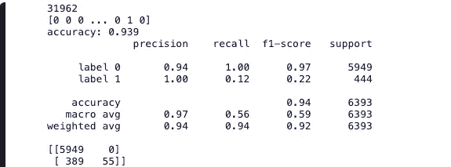
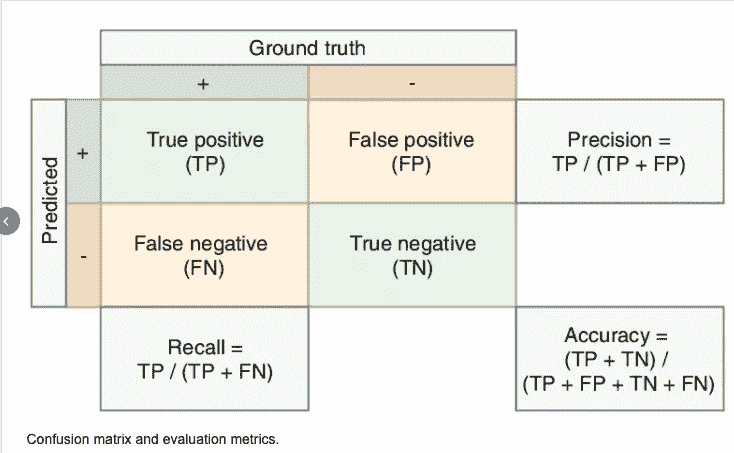
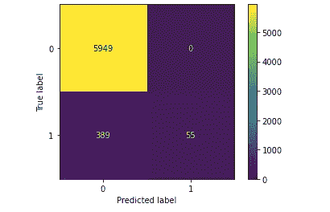
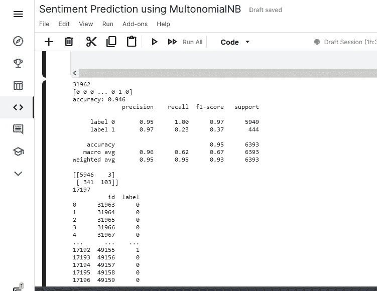
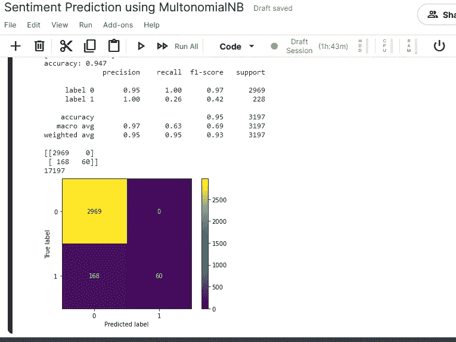
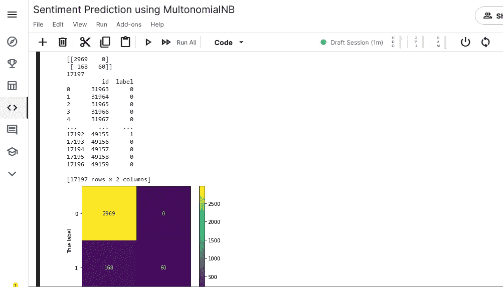

# 学习使用多项式预测推文情绪

> 原文：<https://medium.com/geekculture/learning-to-predict-tweet-sentiment-using-multinomialnb-aa150c5fd6b2?source=collection_archive---------16----------------------->

一段时间以来，来自网络聊天的情感分析一直是每个品牌的首要任务之一。市场上有很多工具可以帮你做到这一点。以至于“全球情绪分析”市场的行业规模预计到 2023 年将达到 60 亿美元左右。

本文试图揭示潜在的问题，从机器学习的角度来看它到底意味着什么，最后是一个使用#Python 为我们执行这一任务的工作模型。

为了让事情集中在我们问题的**#机器学习**部分，我将不进入文本预处理和文本清理等细节。使用#NLP 进行文本提取和操作是一个很大的主题，我计划在以后的另一篇文章中讨论它。在这里，我正在使用超级棒的 scikit-learn 库中的一些棒的工具。我使用的是由[团队 AV](https://medium.com/u/c7c686fcd4b?source=post_page-----aa150c5fd6b2--------------------------------) 提供的数据集，可以在#Kaggle 上找到，数据集的链接在下面。

[](https://www.kaggle.com/dv1453/twitter-sentiment-analysis-analytics-vidya) [## Twitter 情绪分析-分析 Vidya

### 通过分析实践问题

www.kaggle.com](https://www.kaggle.com/dv1453/twitter-sentiment-analysis-analytics-vidya) 

好的，让我们从设置编码环境和加载数据集开始。

```
import pandas as pd
import warnings
from sklearn.model_selection import train_test_split
from sklearn.naive_bayes import MultinomialNB
from sklearn.feature_extraction.text import TfidfVectorizer
from sklearn.pipeline import make_pipeline
from sklearn import metricswarnings.filterwarnings("ignore")

df = pd.read_csv("/kaggle/input/twitter-sentiment-analysis-analytics-vidya/train_E6oV3lV.csv")
dfr = df[['tweet','label']]
print(len(df))
print(df)
```

我们看到数据集有 **31962** 行，包含 tweet 及其各自的标签和 id，这是我们的训练数据集，我们将使用它来训练和测试我们的模型，我们将使用它来预测同一问题数据集的一个单独表中提供的数据的标签。


Checking the content and shape of dataset

快速查看数据集的摘要，我们发现没有丢失值，我们可以使用整个数据集进行模型训练。我正在使用内置的强大功能，描述如下

**train_test_split() :** 我们需要从我们的数据中学习，该函数根据指定的分割标准将数据集分割为训练集和测试集，我们从分数设置 0.2 开始，这意味着我们将使用 80 %的数据集来训练我们的模型，20 %用于测试和评估我们的模型。

**tfidf vectorizer():**Tf-idf 是用于机器学习目的的处理文本数据的最有效的方法之一，它代表**术语频率—逆文档频率**并由下面的公式表示，使用该函数我们将所有单词转换成 Tf-IDF 分数。

**TF — IDF = TF(词频)* IDF(逆文档频)**

*术语频率——术语在给定文档中出现的次数。*

*IDF —找到给定术语的文档数。*

**make_pipeline() :** 此函数用于定义我们的数据管道，我们可以应用一系列转换，然后是最终估计量，在我们的情况下，它是一个多项式。

**MultinomialNB() :** 每个有抱负的数据科学家的工具包中都必须有一个，这个版本的著名的 Naive Baye 算法考虑了术语频率，并计算了给定输入文本的每个标签的概率。

现在我们知道了这些函数的用途，让我们开始用训练数据训练我们的模型，下面的代码块将我们的数据集分成训练和测试数据。我们使用 TfidVectorizer()定义了一个 50K 单词的词汇表，我们的模型将使用它进行学习。

```
# split the data such that we have 80% of the data as train sizetrain,test = train_test_split(dfr, test_size=0.2, shuffle=False)#Define our model with 50 k Vocabulary and training our modelmodel = make_pipeline(TfidfVectorizer(max_features = 50000,smooth_idf=True), MultinomialNB())model.fit(train.tweet, train.label)
labels = model.predict(test.tweet)
print(labels)#Check the accuracy of our MultinomialNB classifier
score = metrics.accuracy_score(test.label,labels,normalize=True)print("accuracy: %0.3f" % score)print(metrics.classification_report(test.label,labels,target_names=['label 0','label 1']))print(metrics.confusion_matrix(test.label, labels))
```

我们使用问题陈述本身中给出的指标精度、召回率、f1 分数和支持来评估我们的模型。我们还打印了指标混淆矩阵。



model evaluation and quality scores

对，所以我们的模型的准确度是 0.939，这意味着它的预测准确率是 93.9 %。为了理解这些术语的含义，我们需要理解度量混乱矩阵。这方面有很多学术资料，我在下面引用一个。



[Source : Rune Hylsberg Jacobsen](https://www.researchgate.net/figure/Confusion-matrix-and-evaluation-metrics_fig3_334840641)

好了，现在我们知道了这些术语的含义，让我们看看模型返回的输出。



Metrics confusion matrix visualised from our trained model

**改进我们的模型:**让我们通过微调用于训练的参数来尝试改进我们的模型，例如，让我们将词汇的大小从 50k 更改为 10 k，重新训练模型会给出以下输出。



Reducing the size of vocabulary to 10 k



Results with vocabulary 10 K and increase train data size to 90%

因此，几个迭代下来，我们有了这个总体性能更好的新模型，我们可以通过增加训练数据大小和调整其他参数来保持**微调**模型，训练中仅增加 10%就导致 f 1 得分和召回的明显更好的性能。

现在让我们进入问题陈述的最后一部分，我们必须预测在文件“test_tweets_anuFYb8.csv”中找到的 tweets 的类别，并以规定的格式导出一个 csv 文件。

```
#import the csv file with tweets to be labelled
test_df = pd.read_csv("/kaggle/input/twitter-sentiment-analysis-analytics-vidya/test_tweets_anuFYb8.csv")
print(len(test_df))
test2=test_df[['tweet',"id"]]
test2["label"] = ""model.fit(train.tweet, train.label)
labels = model.predict(test2.tweet)test2["label"] = labels
test2 = test2[['id',"label"]]
print(test2)
test2.to_csv('test_predictions.csv', header=True)
```



Final output with predicted labels

笔记本上传到 Kaggle 上，也可以从下面的链接下载。

[](https://www.kaggle.com/vijayendrad/sentiment-prediction-using-multonomialnb) [## 使用多术语的情感预测

### 使用 Kaggle 笔记本探索和运行机器学习代码|使用来自 Twitter 情绪分析的数据-分析…

www.kaggle.com](https://www.kaggle.com/vijayendrad/sentiment-prediction-using-multonomialnb)