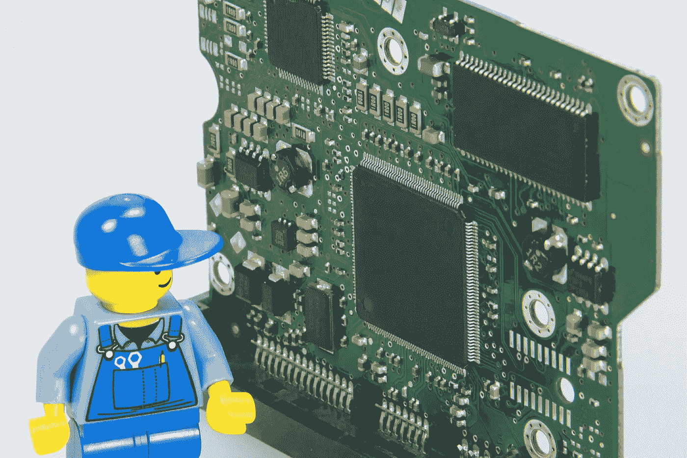

# 学习用数据科学解决问题，来自乐高的教训

> 原文：<https://medium.com/geekculture/learning-to-solve-problems-with-data-science-lessons-from-legos-ac8b497c220c?source=collection_archive---------17----------------------->

不是每个人都有所有的部分，所以我们把我们有的放在一起，形成最佳的解决方案

Image by [1910 Images](https://pixabay.com/photos/electrician-lego-repair-handyman-499799/) from [Pixabay](https://pixabay.com/?utm_source=link-attribution&utm_medium=referral&utm_campaign=image&utm_content=4914536)

我喜欢乐高。

如果你一直在关注我，你已经在过去的文章中看到了我对这家大型玩具公司毫不隐晦的建议。

这一切都是从我小时候开始的。我过去常常花几个小时建造各种…