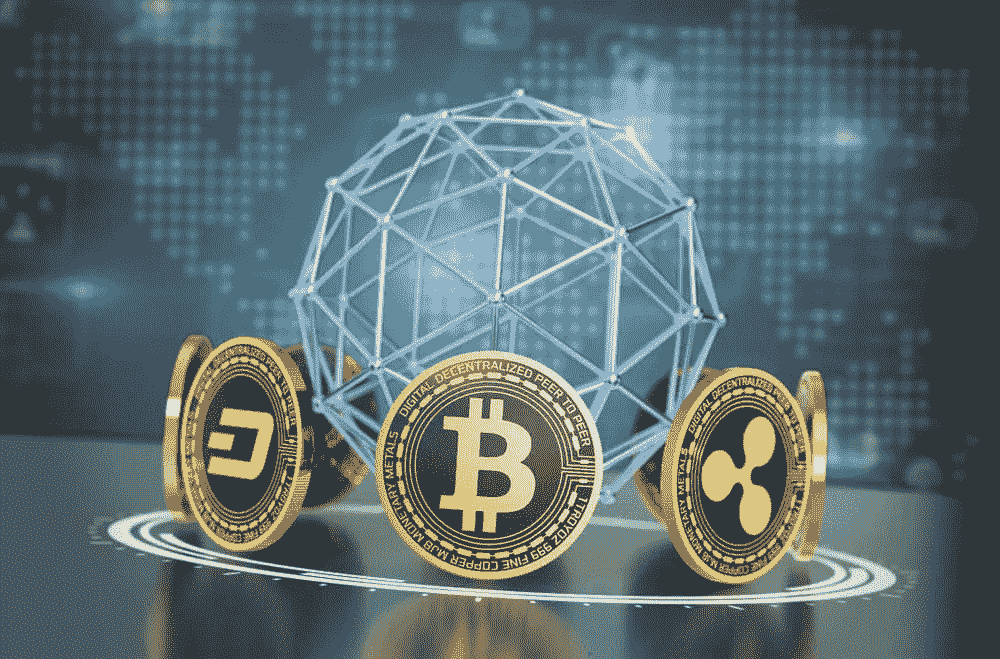
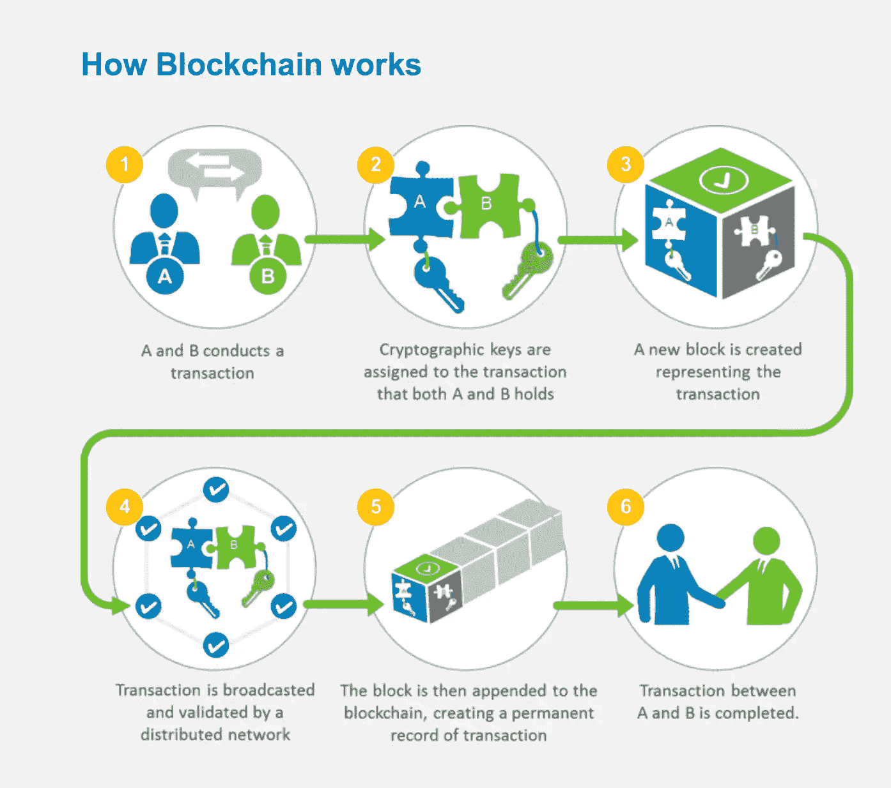
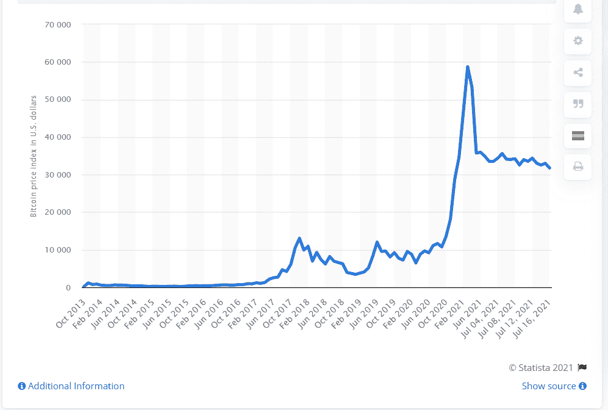

# 从加密货币和加密安全大师班学到的知识

> 原文：<https://medium.com/geekculture/learnings-from-a-masterclass-on-cryptocurrency-and-cryptosecurity-8a98ebc903f3?source=collection_archive---------35----------------------->

Image Source: [Here](https://economictimes.indiatimes.com/markets/stocks/news/crypto-conundrum-digital-currency-future-seems-vague-in-india/articleshow/81146253.cms)

*如果你不相信或者不明白，我没有时间去试图说服你，抱歉。”——***中本聪，被誉为发明比特币的匿名人士。**

加密货币的兴起是我们这个时代最令人兴奋的发展之一。理解这些是如何工作的，以及未来是什么样子，对于当今时代的每一个专业人士来说都是至关重要的。

为了揭开加密货币和加密安全世界的神秘面纱，我们组织了一个关于这个主题的大师班。本次会议的发言人是顶级加密安全公司 TRM Labs 的商业战略主管[阿坎德·西塔拉](https://www.linkedin.com/in/akandsitra/)。

> 大师班是一次穿越加密星系的过山车之旅。我们从了解加密货币的基础知识和使加密系统安全可靠的技术开始。然后，我们去了快节奏的加密犯罪和加密安全的世界。最后，我们通过讨论加密货币耐人寻味的地缘政治结束了我们的旅程。在这个过山车的过程中，我们也停下来了解去中心化金融和智能合约。

以下是大师班涵盖的关键概念和问题。

## **货币基础**

*   货币(如卢比、美元、欧元)是交易双方(买方和卖方)之间的交换媒介。
*   为了让货币发挥作用，买卖双方必须就其价值达成一致。
*   货币的价值来源于国家中央银行的支持。印度央行行长的签名让印度卢比升值了。
*   没有央行的支持，纸币只是一张纸。
*   中央银行还负责控制货币供应(通过印刷纸币)。

## **加密货币基础知识**

*   加密货币是一种数字货币，可用于在线进行安全的点对点支付。
*   **加密货币的例子**:比特币、以太坊、系绳等。(*比特币之外的所有加密货币都称为 Altcoins* )
*   **加密货币的潜在用途**:价值储存(如数字黄金)、点对点支付、分散金融(稍后解释)。
*   “加密”一词是固定的，因为他们使用加密技术来保护交易记录，控制额外硬币的创造和验证硬币所有权的转移。
*   加密货币的定义特征是它们是分散的，即它们不由任何金融机构发行或控制。

## **加密货币的技术基础**

*   每个加密货币的硬币的有效性由区块链提供。区块链是一个不断增长的记录列表，称为块，使用加密技术进行链接和保护。
*   区块链技术涉及一个分布式账本，可公开访问，包含所有交易的记录。
*   **节点:**是连接到加密货币网络的计算机系统。一个节点可以用来执行以下功能:托管区块链的副本、中继事务、验证事务。
*   **挖掘:**是对交易进行确认和验证的计算。
*   **挖掘节点**相互竞争解决一个密码问题来验证交易。无论哪个节点先解决问题，都会验证它正在构建的块，并将其添加到区块链。*(作为工作奖励，采矿节点获得加密货币的硬币)*
*   挖矿是产生新加密货币的唯一途径。(*这以加密货币协议预先确定的速率发生，从而帮助控制供应*)
*   如果矿工人数减少，对系统的稳定性没有影响。只有验证交易的加密问题会变得更容易解决。

## **加密货币交易的架构图**

Image by [mlsdev.com](https://mlsdev.com/blog/156-how-to-build-your-own-blockchain-architecture)

## **与加密货币相关的价格上涨和价格波动**

比特币对美元的价格大幅波动。

Bitcoin price relative to the US dollar ([Source](https://www.statista.com/statistics/326707/bitcoin-price-index/))

*   供求定律假设，当需求超过供给时，任何资产的价格都会上涨。
*   金融资产的价格可能因为好的或坏的原因而上涨。一只股票的价格可能会上涨，因为整个行业都在增长，或者因为人们对公司的增长前景有基本的信心。股票价格的一个不好的原因可能是投机交易。
*   "**加密货币价格上涨的充分理由**"更多的人对加密货币作为替代交易媒介产生了信心，加密货币交易的改善，机构采用(公司和平台接受加密货币进行支付)。
*   **加密货币价格上涨的不利原因**“人们寻求快速获利，而不是对加密货币的长期增长前景有任何基本信念，从而进行大规模投机交易。
*   目前，“不好的理由”似乎占了“好的理由”的大多数。
*   预测价格趋势是一件弄巧成拙的事情。因为如果一种加密货币被预测上涨，它将被超买，最终会降低其价格。因此，请专注于阅读白皮书和理解用例，以便更好地了解 cryptos 的未来。

**问题—** 一个人的推文可以引起加密货币价格的上下波动，这一事实表明了极大的不稳定性。这难道不是加密货币体系的系统性风险吗？

**回答** —我们需要缩小。这仍然是非常早期的日子。才 10 年左右。波动性将逐渐减少，我们将看到这种加密变得更加主流。之后，一个人的行为不会对价格产生太大影响。

## **加密货币世界中的犯罪**

*   加密货币的匿名性使得它们很容易成为暗网上非法活动的目标。
*   已知加密货币被用于非法活动，例如:*洗钱、恐怖主义融资、贩毒、身份欺诈、信用卡欺诈。*

A terror group solicits funds for weapons by asking for donations in bitcoin ([Source](https://www.npr.org/2020/08/13/902269353/department-of-justice-seizes-bitcoin-websites-from-terror-groups))

*   法定货币到加密货币的转换过程被称为**入口**。“入口”可以通过加密交换、实物比特币自动取款机、支付应用等方式实现。“入口匝道”是执法机构的一个重要入口。(*另一方面，“出站”是指将加密货币转换回法定货币*)
*   “入口”的便捷性使得在几分钟内将非法洗钱转换成加密货币成为可能。

这就是加密安全公司介入创造一个更安全的加密系统的地方

## **检测和预防使用加密货币的犯罪**

*   正是这种技术使得使用加密货币犯罪成为可能，也使得追踪这些犯罪并抓住犯罪者变得容易。
*   多亏了区块链技术，所有发生过的交易都是公开的，任何人都可以分析它们来发现可疑的模式。
*   TRM labs 等加密安全机构的运作方式如下:它们通常标记某些字母数字地址和 IP 地址，以跟踪可疑活动，有时还会冻结这些活动。其实现方式如下:1)他们将地址与现实世界的实体联系起来 2)他们在区块链跟踪资金，并实时检测可疑模式
*   加密的金融情报正以良好的速度增长，由于区块链的全面综合性质，有办法限制这种非法活动。

## ***地缘政治与加密货币***

就采用率而言，我们注意到地缘政治在决定采用率方面发挥了重要作用。

2021 年 6 月，萨尔瓦多成为首个将比特币作为法定货币的国家。萨尔瓦多是一个严重依赖汇款的国家。国际银行为促成这些交易收取的高额费用高得不可持续。

通过采用比特币作为法定货币，该国总统声称，由于没有第三方中介，交易成本将大幅下降，汇款将会增加。

因此，最有可能采用加密货币的国家是那些对当前金融经济体系感到不利的国家。对于因严厉制裁而接收跨境汇款能力受限的国家(如叙利亚、古巴)来说尤其如此。

## **分散融资的承诺(DeFi)**

*   **定义**:它是一种基于区块链的金融形式，不依赖银行等金融中介提供金融产品。
*   **潜在好处:**，基于 DeFi 的平台可以通过消除银行(“中间人”)并直接连接借款人和贷款人，实现融资渠道的民主化。
*   **限制**:金融中介机构扮演着评估个人信用的重要角色，以最大限度地降低不良贷款的风险。因此，DeFi 平台如何执行这些任务的具体细节仍在研究中。但是最终目标非常明确。

## **结论**

加密货币最初是一个书呆子的东西，比特币支付发生在非常小众的圈子里。

过去几年，人们对加密货币的兴趣大幅增加。从公司接受它作为一种支付方式，到国家宣布它为法定货币，加密货币确实走过了漫长的道路。

接下来的几年将会是激动人心的时刻，见证加密革命如何发展。

**进一步阅读**

*   [https://one zero . medium . com/why-decentralization-matters-5e 3f 79 f 7638 e](https://onezero.medium.com/why-decentralization-matters-5e3f79f7638e)
*   [https://a16z.com/2019/11/08/crypto-glossary/](https://a16z.com/2019/11/08/crypto-glossary/)
*   [https://github . com/ethereum book/ethereum book/blob/develop/01 what-is . asciidoc #区块链 _ 组件](https://github.com/ethereumbook/ethereumbook/blob/develop/01what-is.asciidoc#blockchain_components)
*   [https://github . com/bitcoinbook/bitcoinbook/blob/develop/ch01 . asciidoc](https://github.com/bitcoinbook/bitcoinbook/blob/develop/ch01.asciidoc)
*   [https://a16z.com/crypto-startup-school/](https://a16z.com/crypto-startup-school/)
*   [https://www . matthuang . com/static/bit coin _ For _ The _ Open _ Minded _ suspect . pdf](https://www.matthuang.com/static/Bitcoin_For_The_Open_Minded_Skeptic.pdf)
*   一些不错的每日简讯&博客—[https://www . LinkedIn . com/posts/akandsitra _ cryptocurrences-区块链-比特币-活动-6753898107819446272-dmkZ](https://www.linkedin.com/posts/akandsitra_cryptocurrencies-blockchain-bitcoin-activity-6753898107819446272-dmkZ)