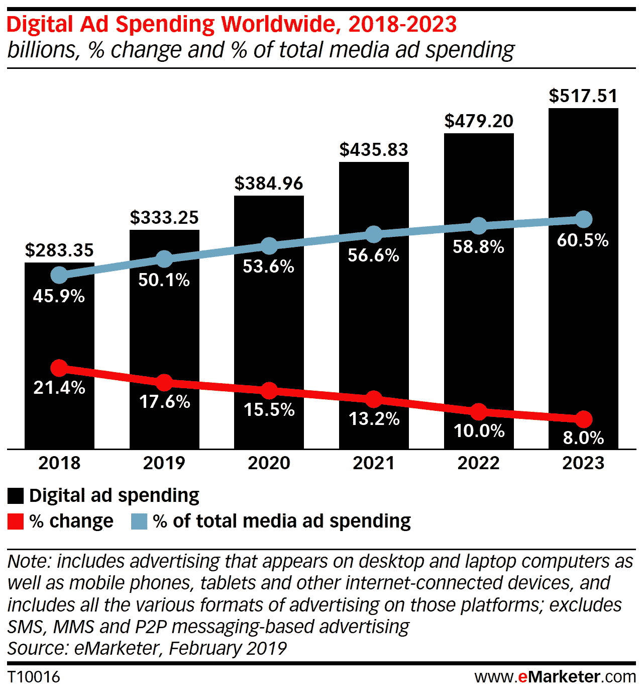
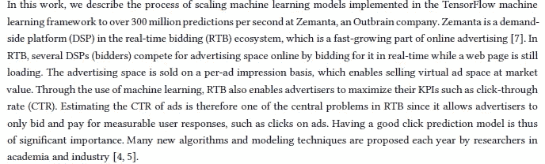
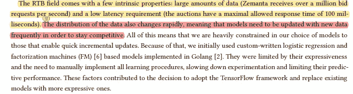
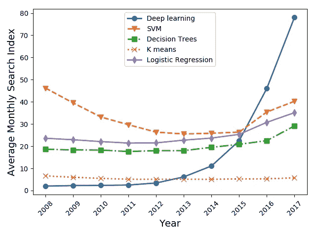
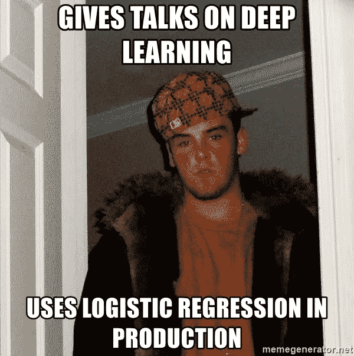
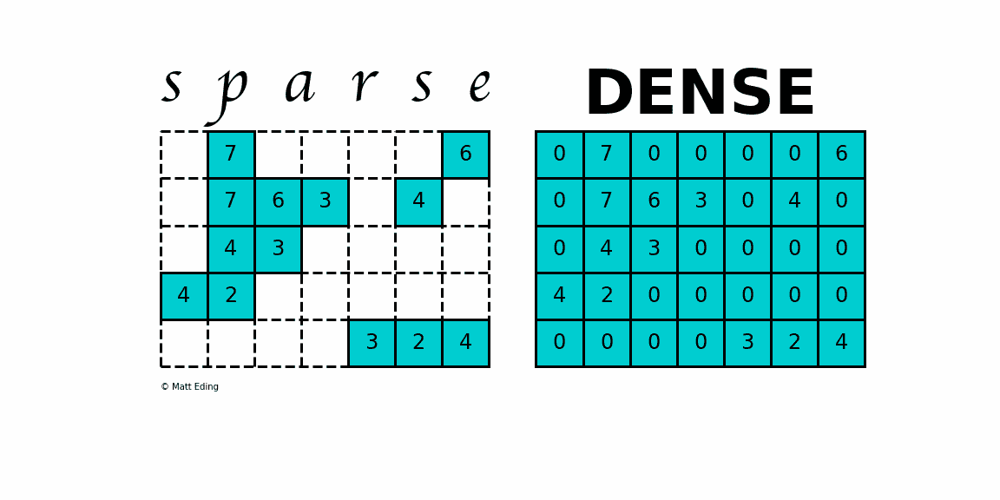
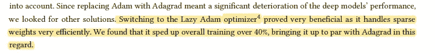

# 将 TensorFlow 扩展到每秒 3 亿次预测的经验

> 原文：<https://medium.com/geekculture/learnings-from-scaling-tensorflow-to-300-million-predictions-per-second-333d9488d0c1?source=collection_archive---------8----------------------->

## 你没看错。3 亿次预测。每秒钟

为了帮助我了解您[请填写此调查(匿名)](https://forms.gle/7MfQmKhEhyBTMDUD7)

机器学习正在改变许多领域。其中最大的一个是广告。虽然谷歌和脸书等公司因使用大数据瞄准个性化广告而臭名昭著，但这一领域还有许多其他公司。这并不奇怪，因为在线广告据说是一个**1000 亿美元的产业**。

We’re looking at some big numbers here

从技术角度来看，这个行业是两个领域的有趣融合，网络和机器学习。这提出了一系列有趣的挑战，必须加以处理。我们需要高精度、不断更新的模型和非常低的延迟。这使得很难实施传统的方法/模型。论文的作者“ [**将 TensorFlow 扩展到每秒 3 亿次预测**](https://arxiv.org/abs/2109.09541) ”详细介绍了他们面临的挑战和解决问题的方法。他们通过分享与 Zemanta 合作的经验来做到这一点。

Good background knowledge to help you understand the setting of this paper/work

以上是作者的一段话。它解释了 Zemanta 是什么，该服务如何运作，以及广告空间如何出售。最后一点详细说明了机器学习在最大化他们的 KPI 中的使用是非常有趣的。也许这篇文章的读者会继续从事这方面的工作(一定要记得我 lol)。

Some context to the design choices made.

在本文中，我将分享 Zemanta 的作者/团队使用 TensorFlow 框架每秒进行 3 亿次预测的经验。像往常一样，本文的注释版将在最后(arxiv 链接已经共享)。一定要自己通读。你觉得这些学习中哪一个最有趣？请在评论中告诉我。如果你想更详细地讨论这篇论文，请随时通过社交媒体联系我。

# 学习 1:简单的模型仍然是王道

这是从事机器学习的人非常了解的。如果你认为机器学习等同于具有复杂步骤的大型模型，这是可以原谅的。大多数初学者将机器学习与深度学习混为一谈，这并不奇怪。他们会看到关于 GPT 3 号或谷歌 ResNet 的新闻。他们认为，要建立伟大的模型，你需要知道如何建立这些需要几天训练的巨大网络。

Deep Learning has gained a lot of interest in recent days.

本文呈现了现实。任何从事机器学习的人都可以证明，以下迷因是准确的:

简单的模型更容易训练，可以更快地测试，不需要太多的资源，一般不会落后太多。大规模应用大型模型会大大增加服务器/运行成本。作者从论文中引用了以下内容，反映了类似的观点:

> 此外，我们在生产中不使用 GPU 进行推理。在我们的规模下，为每台机器配备一个或多个顶级 GPU 会非常昂贵，另一方面，只有一小群 GPU 机器会迫使我们过渡到基于服务的架构。鉴于这两个选项都不是特别可取，而且我们的模型与深度学习其他领域(如计算机视觉或自然语言处理)的最先进模型相比相对较小，我们认为我们的方法更经济。我们的用例也不太适合 GPU 工作负载，因为我们的模型使用稀疏权重

许多公司没有大型的 GPU 系统，可以用来训练和预测数据。而且它们大多是不必要的。引用作者的话:相对较小的型号**更经济**。

# 学习 2:不要忽视懒惰的优化者

稀疏矩阵指的是值大部分为 0 的矩阵。它们用于表示两对组件之间相互作用有限的系统。例如，想象一个人性矩阵，其中我们的行和列对应于地球上的人。如果两个人互相认识，特定指数的值为 1，如果不认识，则为 0。这是一个稀疏矩阵，因为世界上大多数人都不认识其他人。

泽曼塔研究的基质很少。他们认为这是因为大多数特征都是绝对的。使用 Adam 优化器大大增加了运行成本(比 Adagrad 多 50%)。另一方面，阿达格拉德的表现很糟糕。幸运的是，有一种替代品，性能很好，而且不太贵:LazyAdam。

懒惰评估是软件工程中的一种成熟的实践。惰性加载通常用于基于 GUI/交互的平台，如网站和游戏。懒惰的优化者在机器学习中得到认可只是时间问题。当它真的发生时，你要保持警惕。如果你正在寻找机器学习的研究途径，这可能是一个有趣的选择。

# 学习 3:更大的批量→更低的计算成本

这完全出乎我的意料。"*通过深入研究 TF，我们认识到，如果我们在计算批处理中增加示例的数量，计算(每个示例)会更高效。这种低线性增长是由于 TF 代码被高度矢量化。TF 对于每个计算调用也有一些开销，然后分摊到更大的批处理中。有鉴于此，我们认为，为了减少计算调用的数量，我们需要将许多请求合并到一个计算中。”*

这是一个新的。大训练批次导致计算成本更低？老实说，我不明白为什么。如果你们谁知道原因，一定要分享给我。我很想知道为什么。规模也令人惊讶。**他们将计算成本减半**。这样优化的全部结果是:

> 该实现经过了高度优化，能够将计算调用的数量减少 5 倍，将 TF compute 的 CPU 使用率减半。在少数情况下，批处理线程没有获得 CPU 时间，这些请求将超时。然而，只有不到 0.01%的请求会出现这种情况。我们观察到平均延迟略有增加，平均增加约 5 毫秒，在高峰流量时可能会更高。我们实施 SLA 和适当的监控，以确保稳定的延迟。由于我们没有显著增加超时的百分比，这是非常有益的，并且仍然是我们 TF 服务机制的核心

稍微增加的延迟是有意义的。要了解他们到底做了什么，请查看第 3.2 节。这是一个网络的东西，所以我不是专家。但是结果不言自明。

# 关闭

这篇论文读起来很有趣。它结合了工程、网络和机器学习。此外，它还提供了对较小公司使用机器学习的见解，在这些公司中，庞大的模型和 0.001%的性能改善并不重要。

你可以在这里阅读我的完整注释论文(可以免费下载):

# 向我伸出手

如果那篇文章让你对联系我感兴趣，那么这一部分就是为你准备的。你可以在任何平台上联系我，或者查看我的其他内容。如果你想讨论家教，发短信给我。如果你想支持我的工作，使用我的免费罗宾汉推荐链接。我们都有免费的股票，对你没有风险。**所以不使用它只是失去免费的钱。**

查看我在 Medium 上的其他文章。:[https://rb.gy/zn1aiu](https://rb.gy/oaojch)

我的 YouTube:[https://rb.gy/88iwdd](https://rb.gy/88iwdd)

在 LinkedIn 上联系我。我们来连线:[https://rb.gy/m5ok2y](https://rb.gy/f7ltuj)

我的 insta gram:[https://rb.gy/gmvuy9](https://rb.gy/gmvuy9)

我的推特:【https://twitter.com/Machine01776819 

我的子栈:【https://codinginterviewsmadesimple.substack.com/ 

获得罗宾汉的免费股票:[https://join.robinhood.com/fnud75](https://www.youtube.com/redirect?redir_token=QUFFLUhqa0xDdC1jTW9nSU91WXlCSFhEVkJ0emJvN1FaUXxBQ3Jtc0ttWkRObUdfem1DZzIyZElfcXVZNGlVNE1xSUc4aVhSVkxBVGtHMWpmei1lWWVKNzlDUXVJR24ydHBtWG1PSXNaMlBMWDQycnlIVXNMYjJZWjdXcHNZQWNnaFBnQUhCV2dNVERQajFLTTVNMV9NVnA3UQ%3D%3D&q=https%3A%2F%2Fjoin.robinhood.com%2Ffnud75&v=WAYRtSj0ces&event=video_description)