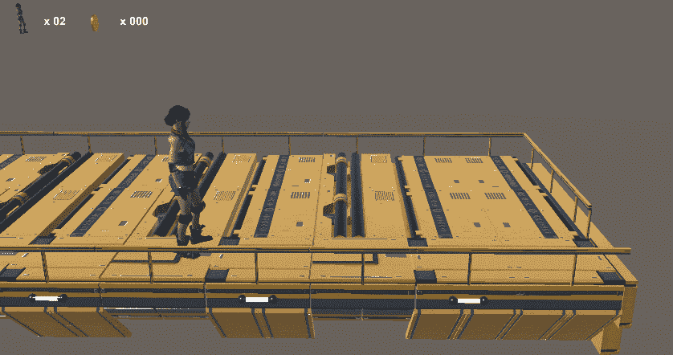

# 攀爬:根部运动还是非根部运动？

> 原文：<https://medium.com/geekculture/ledge-grab-climbing-root-motion-or-not-root-motion-bfab692c89f6?source=collection_archive---------15----------------------->

**目标**:使用 StateMachineBehaviour 脚本，通过攀爬动画完成该功能

今天我们将介绍一个**新工具**，以达到我们的目标。

上次我们设法让角色抓住壁架，这次我们想给角色一个爬上去的输入，让角色爬到一个我们已经知道的固定位置…