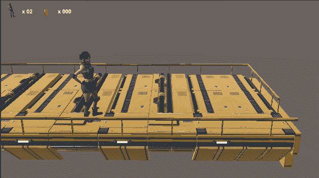
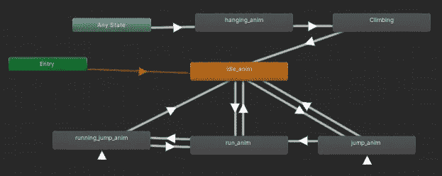
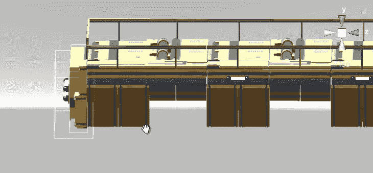
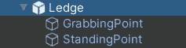
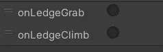

# 壁架抓取—抓取

> 原文：<https://medium.com/geekculture/ledge-grab-grabbing-1a4333bc9355?source=collection_archive---------30----------------------->

**目标**:使用专用动画实现一个壁架抓取系统

在本教程中，我们将实现一个壁架抓取功能:当跳跃不够好，无法直接降落在平台上时，角色将**抓取平台(一个特殊的平台)的壁架**。

为了做到这一点，我们现在要添加几个动画(即抓取和攀爬壁架)并定义壁架抓取的逻辑。

奇怪的是，我发现从动画开始很有用。也许他们吓到我了，所以我想尽快解决他们。我在 [Mixamo](https://www.mixamo.com) 上搜了一下，发现了一个闲挂动画和一个攀爬动画。和往常一样，我在 Unity 中导入了它们，并把它们拖进动画器中，烘烤到位。

这个想法是从任何状态过渡到**悬挂**动画，当角色必须抓住壁架时(根据我们将要定义的一些逻辑)。从那里过渡到攀登动画，但这是下一个教程的材料。

使抓取发生的最简单的方法是使用**触发器**。我们定义了一个触发器**从壁架上伸出**，这样当角色通过它时，我们可以触发一些抓取逻辑，我们就完成了！用这种方法，我们只需要预制一个触发物体，并把它放在任何我们想让我们的角色抓住的地方。

> 不要忘记刚体组件！

然后，我们要用空的对象(壁架的孩子)来存储两个重要的位置:哪里抓，爬上去后待在哪里。

这些都要靠经验**和试错**才能找到。

## 抓住窗台

一旦盒子碰撞器(触发器)被很好地定位，我们就可以处理逻辑了。

我们要检测角色**什么时候进入**触发器，然后告诉角色在哪里卡，在哪里爬，最后激活悬挂动画。为了做到这一点，我写了剧本，一个从角色的角度，另一个从窗台的角度。

角色逻辑简化为一个方法:这里我们得到角色控制器组件并且**禁用**它，这将使角色卡在壁架上并且**通过我们脚本化的**重力**阻止**它落下。

然后，我们通过设置其触发参数来触发悬挂动画。

我们通过**将角色抓牢**到抓取位置并存储攀爬位置来结束这个方法。为了得到后者，我们从抓取开始，到达父母，然后到达另一个孩子。

## 检测壁架

前一个方法将在触发器进入时被调用，由 ledge 脚本检测。

我们将抓取位置传递给方法，在壁架的子对象中进行挑选。

让我们看看我们有什么。

看起来很酷！但是不要误会我的意思:在获得紧凑的马赫之前，我不得不尝试几次抓举位置。

在下一个教程中，我们将关注**向上爬**的部分，我们还将介绍另一个有用的**工具**！