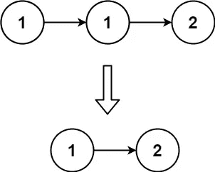
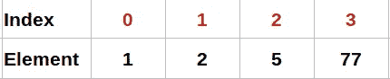
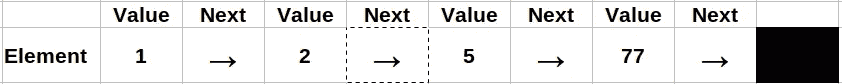
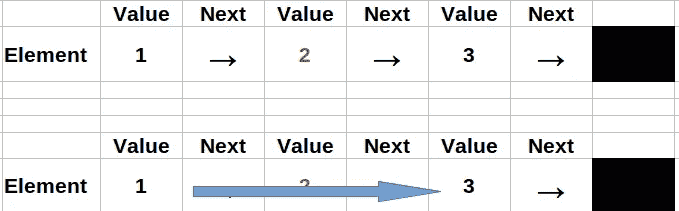

# LeetCode 算法挑战:从排序列表中删除重复项—列表与数组

> 原文：<https://medium.com/geekculture/leetcode-algorithm-challenge-remove-duplicates-from-sorted-list-lists-vs-arrays-dc270795955e?source=collection_archive---------52----------------------->

# 问题

[给定一个排序链表的](https://leetcode.com/problems/remove-duplicates-from-sorted-list/) `[head](https://leetcode.com/problems/remove-duplicates-from-sorted-list/)` [，*删除所有重复项，使得每个元素只出现一次*。返回*链表* ***排序后的*** *以及*。](https://leetcode.com/problems/remove-duplicates-from-sorted-list/)

**例 1:**



```
**Input:** head = [1,1,2]
**Output:** [1,2]
```

**例 2:**


```
**Input:** head = [1,1,2,3,3]
**Output:** [1,2,3]
```

# 列表与数组

当我第一次看到这个问题时，我非常确定我已经做过类似的事情，并且我回顾了我以前的挑战。我找到了——[如何从一个排序数组](https://javascript.plainenglish.io/remove-duplicates-from-sorted-array-leetcode-challenge-ae9e676e70db)中移除重复项，并且非常确定，这应该很容易解决。我看到的唯一区别是返回值，在之前的任务中我需要返回一个长度的数组，而在这里我需要返回一个没有重复的列表。所以我一头扎进去，稍微修改了一下代码，实际上我唯一需要修改的是一个返回值。

```
return nums.length;
```

更改为

```
return head;
```

当我高兴的时候，我试着用 LeetCode 提交了一个代码，得到了一个错误，因为与`nums`比较的`head`不是一个数组，而是一个列表。这是让我无法解决这个挑战的主要区别。

我们来看看[数组](https://en.wikipedia.org/wiki/Array_data_type)和[链表](https://en.wikipedia.org/wiki/Linked_list)的区别。

## [阵列](https://en.wikipedia.org/wiki/Array_data_type)

> 一个**数组类型**是一个[数据类型](https://en.wikipedia.org/wiki/Data_type)，它代表一个*元素* ( [值](https://en.wikipedia.org/wiki/Value_(computer_science))或[变量](https://en.wikipedia.org/wiki/Variable_(computer_science)))的集合，每个元素由一个或多个索引(标识键)选择

所以数组的每个元素都有一个索引。



我的解决方案中使用的`[**splice()**](https://developer.mozilla.org/en-US/docs/Web/JavaScript/Reference/Global_Objects/Array/splice)`方法是数组方法中的一种，它不适用于列表。

## [链表](https://en.wikipedia.org/wiki/Linked_list)

> 一个**链表**是数据元素的线性集合，其顺序不是由它们在内存中的物理位置给出的。相反，每个元素[指向下一个](https://en.wikipedia.org/wiki/Pointer_(computer_programming))。

所以每个元素都没有索引，而是只指向下一个值。



所以最后一个元素的下一个值不指向任何东西。在列表中，为了到达第三个元素，我需要通过前两个元素到达第三个元素。

# 解决办法

因为我们没有列表长度，所以当我们有当前值和下一个值时，我们将使用`while`进行循环。

```
while (current && current.next) {~~~~}
```

删除列表中的值很简单，你只需跳过它，让下一个显示到下面的数字。在下面的图片中，数字 2 不再是列表的一部分，因为没有链接到它，所以第一个列表是[1，2，3]，但第二个是[1，3]。



因此，如果当前元素的值等于下一个元素的值，我们将通过将下一个值指向下一个元素来将其从列表中移除。否则，我们将转到下一个元素。

```
if(current.val === current.next.val){ current.next = current.next.next;} else { current = current.next;}
```

正如我之前提到的，现在我们可以返回我们的列表了。

```
return head;
```

# 密码

*请在以下社交网络上查看我，我希望收到您的来信！——*[*LinkedIn*](https://www.linkedin.com/in/nick-solonyy/)*，* [*GitHub*](https://github.com/nicksolony) ，[](https://www.facebook.com/nick.solony)**。**