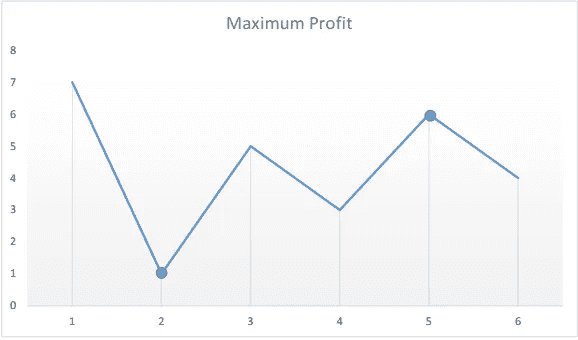

# leet code——买卖股票的最佳时机

> 原文：<https://medium.com/geekculture/leetcode-best-time-to-buy-and-sell-stock-6bc3651ef78f?source=collection_archive---------18----------------------->

# 问题陈述

给你一个数组*价格*，其中*价格【I】*是给定股票在第天*的价格。*

你想通过选择一个**单日**买入一只股票，并选择未来的**不同日**卖出该股票，从而实现利润最大化。

返回*你从这笔交易*中可以获得的最大利润。如果你不能获得任何利润，返回 *0* 。

问题陈述摘自:[https://leet code . com/problems/best-time-to-buy-and-sell-stock](https://leetcode.com/problems/best-time-to-buy-and-sell-stock)

**例 1:**

```
Input: prices = [7, 1, 5, 3, 6, 4]
Output: 5
Explanation: Buy on day 2 (price = 1) and sell on day 5 (price = 6), profit = 6-1 = 5.
Note that buying on day 2 and selling on day 1 is not allowed because you must buy before you sell.
```

**例 2:**

```
Input: prices = [7, 6, 4, 3, 1]
Output: 0
Explanation: In this case, no transactions are done and the max profit = 0.
```

**约束:**

```
- 1 <= prices.length <= 10^5 
- 0 <= prices[i] <= 10^4
```

# 说明

## 强力方法

最简单的方法是使用两个嵌套的 for 循环，并获取两个数之间的最大差值。

上述方法的一个 C++片段如下:

```
int maxProfit = 0;

for (int i = 0; i < prices.length - 1; i++) {
    for (int j = i + 1; j < prices.length; j++) {
        int profit = prices[j] - prices[i];
        if (profit > maxProfit)
            maxProfit = profit;
    }
}

return maxProfit;
```

上述程序的时间复杂度为 **O(N )** 。

## 一次通过方法

如果我们查看下图中几天的股票价值，我们需要考虑最大值和最小值。



让我们检查下面的算法:

```
- set maxP = 0
      minP = INT_MAX

- loop for i = 0; i < prices.size(); i++
  - minP = min(minP, prices[i])

  - if prices[i] > minP
    - maxP = max(maxP, prices[i] - minP)

- return maxP
```

上述方法的时间复杂度为**O(log(N)】**，空间复杂度为 **O(1)** 。

## C++解决方案

```
class Solution {
public:
    int maxProfit(vector<int>& prices) {
        int maxP = 0;
        int minP = INT_MAX;

        for(int i = 0; i < prices.size(); i++){
            minP = min(minP, prices[i]);
            if(prices[i] > minP){
                maxP = max(maxP, prices[i] - minP);
            }
        }

        return maxP;
    }
};
```

## 戈朗溶液

```
const MaxUint = ^uint(0)
const MaxInt = int(MaxUint >> 1)

func maxProfit(prices []int) int {
    maxP := 0
    minP := MaxInt

    for i := 0; i < len(prices); i++ {
        minP = int(math.Min(float64(minP), float64(prices[i])))

        if prices[i] > minP {
            maxP = int(math.Max(float64(maxP), float64(prices[i] - minP)))
        }
    }

    return maxP
}
```

## Javascript 解决方案

```
var maxProfit = function(prices) {
    let maxP = 0;
    let minP = Number.MAX_VALUE;

    for( let i = 0; i < prices.length; i++ ) {
        minP = Math.min(minP, prices[i]);

        if( prices[i] > minP ) {
           maxP = Math.max(maxP, prices[i] - minP);
        }
    }

    return maxP;
};
```

让我们试运行一下我们的算法，看看解决方案是如何工作的。

```
Input: prices = [7, 1, 5, 3, 6, 4]

Step 1: maxP = 0
        minP = INT_MAX

Step 2: loop for i = 0; i < prices.size()
        0 < 6
        true

        minP = min(minP, prices[i]);
             = min(INT_MAX, prices[0])
             = min(INT_MAX, 7)
             = 7

        if prices[i] > minP
           prices[0] > 7
           7 > 7
           false

        i++
        i = 1

Step 3: loop for i < prices.size()
        1 < 6
        true

        minP = min(minP, prices[i]);
             = min(7, prices[1])
             = min(7, 1)
             = 1

        if prices[i] > minP
           prices[1] > 1
           1 > 1
           false

        i++
        i = 2

Step 4: loop for i < prices.size()
        2 < 6
        true

        minP = min(minP, prices[i]);
             = min(1, prices[2])
             = min(1, 5)
             = 1

        if prices[i] > minP
           prices[2] > 1
           5 > 1
           true

           maxP = max(maxP, prices[i] - minP)
                = max(0, 5 - 1)
                = max(0, 4)
                = 4

        i++
        i = 3

Step 5: loop for i < prices.size()
        3 < 6
        true

        minP = min(minP, prices[i]);
             = min(1, prices[3])
             = min(1, 3)
             = 1

        if prices[i] > minP
           prices[3] > 1
           3 > 1
           true

           maxP = max(maxP, prices[i] - minP)
                = max(4, 3 - 1)
                = max(4, 2)
                = 4

        i++
        i = 4

Step 6: loop for i < prices.size()
        4 < 6
        true

        minP = min(minP, prices[i]);
             = min(1, prices[4])
             = min(1, 6)
             = 1

        if prices[i] > minP
           prices[4] > 1
           6 > 1
           true

           maxP = max(maxP, prices[i] - minP)
                = max(4, 6 - 1)
                = max(4, 5)
                = 5

        i++
        i = 5

Step 7: loop for i < prices.size()
        5 < 6
        true

        minP = min(minP, prices[i]);
             = min(1, prices[5])
             = min(1, 4)
             = 1

        if prices[i] > minP
           prices[5] > 1
           4 > 1
           true

           maxP = max(maxP, prices[i] - minP)
                = max(5, 4 - 1)
                = max(5, 3)
                = 5

        i++
        i = 6

Step 8: loop for i < prices.size()
        6 < 6
        false

Step 9: return maxP

So we return the answer as 5.
```

*原载于*[*https://alkeshghorpade . me*](https://alkeshghorpade.me/post/leetcode-best-time-to-buy-and-sell-stock)*。*