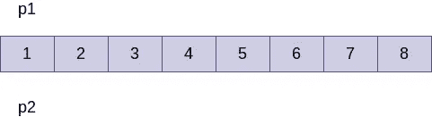
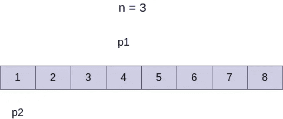
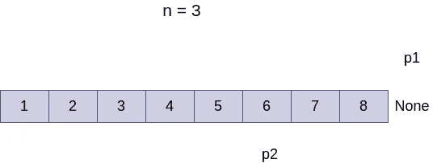

# LeetCode 挑战:使用 python 从末尾删除链表的第 n 个节点

> 原文：<https://medium.com/geekculture/leetcode-challenge-delete-nth-node-of-a-linked-list-from-the-end-using-python-ec8e1c3336c7?source=collection_archive---------45----------------------->

## Python 中的数据结构和算法


image source: dineshkumarkb

**注:非会员，此处有**[](https://dineshkumarkb.com/tech/leetcode-challenge-delete-nth-node-of-a-linked-list-from-the-end-using-python/)****的故事。****

# **简介:**

**这篇文章解释了如何在给定链表头的情况下从末尾删除链表的第 n 个节点。这类似于从`linked list`的末尾得到第 n 个`node`。这是中的一个问题。**

## **步骤:**

1.  **创建一个链接列表。**
2.  **从链表的末尾获取第 n 个节点。**
3.  **从链表的末尾删除第 n 个节点。**

# **创建一个链接列表**

**我们将创建一个链表并在头部插入节点。如果您希望从后端插入元件，请参考本文中的[代码。](https://dineshkumarkb.com/tech/reverse-a-linked-list-without-additional-datastructures-using-python/)**

**下面的代码将元素插入头部。**

```
class Node:

    def __init__(self, data):
        self.data = data
        self.next = None

class LinkedList:

    def __init__(self):
        # Initialize the head object
        self.head = None

    def insert_node(self, data):

        if data is None:
            return

        # create a node object
        node = Node(data)

        # insert the node at the head
        node.next = self.head
        self.head = node

    def get_head(self):
        # return the current head object
        return self.head

    def display_lst(self):
        """
        Method to print the elements of the linked list
        :return:
        """

        current = self.head

        while current:
            print(current.data, end="->")
            current = current.next

l = LinkedList()

l.insert_node(10)
l.insert_node(20)
l.insert_node(30)
l.insert_node(40)
l.insert_node(50)
l.insert_node(60)
l.insert_node(70)
l.insert_node(80)

l.display_lst()Output: 80->70->60->50->40->30->20->10->
```

# **获取链表的第 n 个节点**

**获得链表的第 n 个节点的最有效的方法是拥有 2 个指针(p1 和 p2)。**

1.  **初始化两个指针，最初指向链表的头部**
2.  **在链表中移动 n 个节点的指针之一**
3.  **现在 p1 和 p2 之间的距离等于 n。**
4.  **现在，移动 p1 和 p2，直到 p1 到达链表的末尾。**

****

**Initial position of pointers**

****

**Moved p1 n nodes**

****

**Final positions of p1 and p2**

**注:请与面试官确认 n 值应该以 0 还是 1 开头。相应地，我们可以在 for/while 循环中移动 p1 和 p2 值。在我的例子中，我假设 n 应该从 1 开始。**

```
def delete_nth_node(head, n):

        # initialize 2 pointers to the head of the linked list
        p1 = head
        p2 = head

        # move the first pointer n nodes
        for i in range(n):
            p1 = p1.next

        # Iterate to the last non null node.
        # We don't allow p1 to reach the None node as we 
        # need to stop one node before nth node to delete
        while p1.next:
            p1 = p1.next
            p2 = p2.next

        # delete the node of interest
        p2.next = p2.next.next

# call the delete function        
delete_nth_node(2)Output: 
80->70->60->50->40->30->10-> # The node with value 20 is deleted
```

**请随时在评论中留下反馈/建议。**

***原载于 2021 年 7 月 19 日 https://dineshkumarkb.com*[](https://dineshkumarkb.com/tech/leetcode-challenge-delete-nth-node-of-a-linked-list-from-the-end-using-python/)**。****