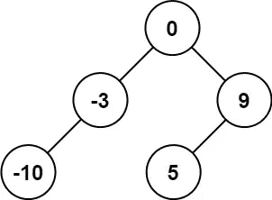
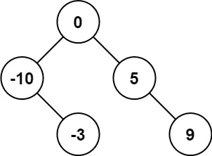
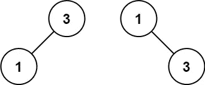

# LeetCode —将排序后的数组转换为二叉查找树

> 原文：<https://medium.com/geekculture/leetcode-convert-sorted-array-to-binary-search-tree-dc4f1038a69?source=collection_archive---------18----------------------->

# 问题陈述

给定一个整数数组 *nums* ，其中元素按**升序**，*将其转换为一个高度平衡的***二叉查找树*。*

*高度平衡的二叉树是这样一种二叉树，其中每个节点的两个子树的深度相差不超过 1。*

*问题陈述摘自:[https://leet code . com/problems/convert-sorted-array-to-binary-search-tree/](https://leetcode.com/problems/convert-sorted-array-to-binary-search-tree/)*

***例 1:***

**

```
*Input: nums = [-10, -3, 0, 5, 9]
Output: [0, -3, 9, -10, null, 5]
Explanation: [0, -10, 5, null, -3, null, 9] is also accepted*
```

**

***例 2:***

**

```
*Input: nums = [1,3]
Output: [3,1]
Explanation: [1,3] and [3,1] are both a height-balanced BSTs.*
```

***约束:***

```
*- 1 <= nums.length <= 10^4 
- -10^4 <= nums[i] <= 10^4 - nums is sorted in a strictly increasing order.*
```

# *说明*

*二叉查找树是一种基于节点的二叉树数据结构，具有以下属性:*

*   *节点的左子树只包含键小于该节点键的节点。*
*   *节点的右边子树只包含键大于节点键的节点。*
*   *左侧和右侧的子树都必须是二叉查找树。*

*正如问题陈述中提到的，数组按升序排序，中间的元素是根元素。数组中间元素的左侧将是左子树，同样，数组中间元素的右侧将是它的右子树。*

*我们来检查一下算法。*

```
*// in sortedArrayToBST function
- if nums.size() == 0
  - return NULL

- return sortedArrayToBSTUtil(nums, 0, nums.size() - 1)

// in sortedArrayToBSTUtil function
- if( start > end )
  - return NULL

- set mid = ( start + end ) / 2

- set TreeNode* root = new TreeNode(nums[mid])

// call sortedArrayToBSTUtil recursively for the left and right sides of the array.
- set root->left = sortedArrayToBSTUtil(nums, start, mid - 1)
- set root->right = sortedArrayToBSTUtil(nums, mid + 1, end)

- return root*
```

## *C++解决方案*

```
*class Solution {
public:
    TreeNode* sortedArrayToBSTUtil(vector<int>& nums, int start, int end){
        if(start > end)
            return NULL;

        int mid = (start + end)/2;

        TreeNode* root = new TreeNode(nums[mid]);

        root->left = sortedArrayToBSTUtil(nums, start, mid - 1);
        root->right = sortedArrayToBSTUtil(nums, mid + 1, end);

        return root;
    }

public:
    TreeNode* sortedArrayToBST(vector<int>& nums) {
        if(nums.size() == 0)
            return NULL;

        return sortedArrayToBSTUtil(nums, 0, nums.size() - 1);
    }
};*
```

## *戈朗溶液*

```
*func sortedArrayToBSTUtil(nums []int, start, end int) *TreeNode {
    if start > end {
        return nil
    }

    mid := (start + end) / 2

    root := &TreeNode{Val: nums[mid]}
    root.Left = sortedArrayToBSTUtil(nums, start, mid - 1)
    root.Right = sortedArrayToBSTUtil(nums, mid + 1, end)

    return root
}

func sortedArrayToBST(nums []int) *TreeNode {
    if len(nums) == 0 {
        return nil
    }

    return sortedArrayToBSTUtil(nums, 0, len(nums) - 1)
}*
```

## *Javascript 解决方案*

```
*var sortedArrayToBST = function(nums) {
    return sortedArrayToBSTUtil(0, nums.length - 1);

    function sortedArrayToBSTUtil(start, end) {
        if (start > end) return null;
        const mid = start + Math.floor((end - start) / 2);

        const root = new TreeNode(nums[mid]);

        root.left = sortedArrayToBSTUtil(start, mid - 1);
        root.right = sortedArrayToBSTUtil(mid + 1, end);

        return root;
    }
};*
```

*让我们试运行一下我们的算法，看看解决方案是如何工作的。*

```
*Input: nums = [-10, -3, 0, 5, 9]

Step 1: if nums.size() == 0
           5 == 0
           false

Step 2: return sortedArrayToBSTUtil(nums, 0, nums.size() - 1)

// in sortedArrayToBSTUtil

Step 3: if start > end
           0 > 4
           false

Step 4: mid = (start + end)/2
            = (0 + 4)/2
            = 4/2
            = 2

Step 5: TreeNode* root = new TreeNode(nums[mid])
                       = new TreeNode(nums[2])
                       = new TreeNode(0)

Step 6: root->left = sortedArrayToBSTUtil(nums, start, mid - 1)
                   = sortedArrayToBSTUtil(nums, 0, 2 - 1)
                   = sortedArrayToBSTUtil(nums, 0, 1)

                                       0
                                      /
                        sortedArrayToBSTUtil(nums, 0, 1)

        root->right = sortedArrayToBSTUtil(nums, mid + 1, end)
                    = sortedArrayToBSTUtil(nums, 2 + 1, 4)
                    = sortedArrayToBSTUtil(nums, 3, 4)

                                        0
                                     /     \
                                    /       \
        sortedArrayToBSTUtil(nums, 0, 1)    sortedArrayToBSTUtil(nums, 3, 4)

// sortedArrayToBSTUtil(nums, 0, 1)
Step 7: if start > end
           0 > 1
           false

Step 8: mid = (start + end)/2
            = (0 + 1)/2
            = 1/2
            = 0

Step 9: TreeNode* root = new TreeNode(nums[mid])
                       = new TreeNode(nums[0])
                       = new TreeNode(-10)

Step 10: root->left = sortedArrayToBSTUtil(nums, start, mid - 1)
                    = sortedArrayToBSTUtil(nums, 0, 0 - 1)
                    = sortedArrayToBSTUtil(nums, 0, -1)

                                -10
                               /
                sortedArrayToBSTUtil(nums, 0, -1)

         root->right = sortedArrayToBSTUtil(nums, mid + 1, end)
                     = sortedArrayToBSTUtil(nums, 0 + 1, 1)
                     = sortedArrayToBSTUtil(nums, 1, 1)

                                        -10
                                      /     \
                                     /       \
         sortedArrayToBSTUtil(nums, 0, -1)    sortedArrayToBSTUtil(nums, 1, 1)

        // for sortedArrayToBSTUtil(nums, 0, -1)
        // start > end evaluates to true so it return nil. Hence the tree looks like

                                        -10
                                      /     \
                                     /       \
                                   nil    sortedArrayToBSTUtil(nums, 1, 1)

// sortedArrayToBSTUtil(nums, 1, 1)
Step 11: if start > end
           1 > 1
           false

Step 12: mid = (start + end)/2
             = (1 + 1)/2
             = 2/2
             = 1

Step 13: TreeNode* root = new TreeNode(nums[mid])
                        = new TreeNode(nums[1])
                        = new TreeNode(-3)

Step 14: root->left = sortedArrayToBSTUtil(nums, start, mid - 1)
                    = sortedArrayToBSTUtil(nums, 1, 1 - 1)
                    = sortedArrayToBSTUtil(nums, 1, 0)

                                -3
                               /
                sortedArrayToBSTUtil(nums, 1, 0)

         root->right = sortedArrayToBSTUtil(nums, mid + 1, end)
                     = sortedArrayToBSTUtil(nums, 1 + 1, 1)
                     = sortedArrayToBSTUtil(nums, 2, 1)

                                        -3
                                      /     \
                                     /       \
         sortedArrayToBSTUtil(nums, 1, 0)    sortedArrayToBSTUtil(nums, 2, 1)

        // for sortedArrayToBSTUtil(nums, 1, 0) and sortedArrayToBSTUtil(nums, 2, 1)
        // start > end evaluates to true so it return nil. Hence the tree looks like

                                        -3
                                      /     \
                                     /       \
                                   nil       nil

Step 15: We backtrack to Step 10 and -3 is set to right subtree of -10 node.

                                        -10
                                      /     \
                                     /       \
                                   nil       -3

Step 16: We backtrack to Step 6 and the above subtree is set as left subtree of 0 node.

                                        0
                                     /     \
                                    /       \
                                  -10     sortedArrayToBSTUtil(nums, 3, 4)
                                /     \
                               /       \
                             nil       -3

// sortedArrayToBSTUtil(nums, 3, 4)
Step 17: if start > end
            3 > 4
            false

Step 18: mid = (start + end)/2
             = (3 + 4)/2
             = 7/2
             = 3

Step 19: TreeNode* root = new TreeNode(nums[mid])
                        = new TreeNode(nums[3])
                        = new TreeNode(5)

Step 20: root->left = sortedArrayToBSTUtil(nums, start, mid - 1)
                    = sortedArrayToBSTUtil(nums, 3, 3 - 1)
                    = sortedArrayToBSTUtil(nums, 3, 2)

                                5
                               /
                sortedArrayToBSTUtil(nums, 3, 2)

         root->right = sortedArrayToBSTUtil(nums, mid + 1, end)
                     = sortedArrayToBSTUtil(nums, 3 + 1, 4)
                     = sortedArrayToBSTUtil(nums, 4, 4)

                                         5
                                      /     \
                                     /       \
         sortedArrayToBSTUtil(nums, 3, 2)    sortedArrayToBSTUtil(nums, 4, 4)

        // for sortedArrayToBSTUtil(nums, 3, 3)
        // start > end evaluates to true so it return nil. Hence the tree looks like

                                        5
                                      /   \
                                     /     \
                                   nil     sortedArrayToBSTUtil(nums, 4, 4)

// sortedArrayToBSTUtil(nums, 4, 4)
Step 21: if start > end
            4 > 4
            false

Step 22: mid = (start + end)/2
             = (4 + 4)/2
             = 8/2
             = 4

Step 23: TreeNode* root = new TreeNode(nums[mid])
                        = new TreeNode(nums[4])
                        = new TreeNode(9)

Step 24: root->left = sortedArrayToBSTUtil(nums, start, mid - 1)
                    = sortedArrayToBSTUtil(nums, 4, 4 - 1)
                    = sortedArrayToBSTUtil(nums, 4, 3)

                                9
                               /
                sortedArrayToBSTUtil(nums, 4, 3)

         root->right = sortedArrayToBSTUtil(nums, mid + 1, end)
                     = sortedArrayToBSTUtil(nums, 4 + 1, 4)
                     = sortedArrayToBSTUtil(nums, 5, 4)

                                         9
                                      /     \
                                     /       \
         sortedArrayToBSTUtil(nums, 4, 3)    sortedArrayToBSTUtil(nums, 5, 4)

        // for sortedArrayToBSTUtil(nums, 4, 3) and sortedArrayToBSTUtil(nums, 5, 4)
        // start > end evaluates to true so it return nil. Hence the tree looks like

                                        9
                                      /   \
                                     /     \
                                   nil     nil

Step 25: We backtrack to Step 20 and the above subtree is set as right subtree of 5 node.

                                        5
                                      /   \
                                     /     \
                                   nil     9
                                          / \
                                         /   \
                                        nil  nil

Step 26: We backtrack to Step 16 and the tree is as below

                                        0
                                      /    \
                                     /      \
                                    /        \
                                  -10         5
                                /     \      / \
                               /       \    /   \
                             nil       -3  nil  9

So the output we return is [0, -3, 9, -10, null, 5].*
```

**原载于*[*https://alkeshghorpade . me*](https://alkeshghorpade.me/post/leetcode-convert-sorted-array-to-binary-search-tree)*。**