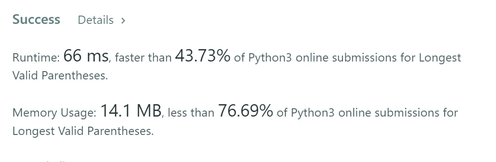

# Leetcode Hard:最长有效括号，O(N)时间，O(1)空间解

> 原文：<https://medium.com/geekculture/leetcode-hard-longest-valid-parentheses-o-n-time-o-1-space-solution-99855a1bd647?source=collection_archive---------21----------------------->

给定一个只包含字符`'('`和`')'`的字符串，找出最长的有效(格式良好)括号子字符串的长度。