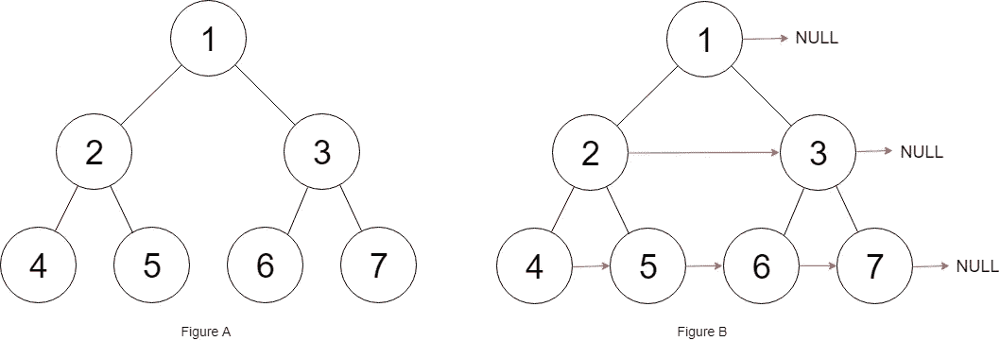

# LeetCode —在每个节点中填充右下指针

> 原文：<https://medium.com/geekculture/leetcode-populating-next-right-pointers-in-each-node-740457935fe2?source=collection_archive---------10----------------------->

# 问题陈述

我们有一棵**完美的二叉树**，其中所有的叶子都在同一层，每个父母都有两个孩子。二叉树具有以下定义:

```
struct Node {
  int val;
  Node *left;
  Node *right;
  Node *next;
}
```

填充每个下一个指针以指向它的下一个右节点。如果没有下一个右节点，下一个指针应该设置为空。

最初，所有后续指针都被设置为空。

问题陈述摘自:[https://leet code . com/problems/populating-next-right-pointers-in-each-node](https://leetcode.com/problems/populating-next-right-pointers-in-each-node)

**例一:**



```
Input: root = [1, 2, 3, 4, 5, 6, 7]
Output: [1, #, 2, 3, #, 4, 5, 6, 7, #]
Explanation: Given the above perfect binary tree (Figure A), our function should populate each next pointer to point to its next right node, just like in Figure B. The serialized output is in level order as connected by the next pointers, with '#' signifying the end of each level.
```

**例 2:**

```
Input: root = []
Output: []
```

**约束:**

```
- The number of nodes in the tree is in the range [0, 212 - 1].
- -1000 <= Node.val <= 1000
```

**跟进:**

```
- We may only use constant extra space.
- The recursive approach is fine. We may assume implicit stack space does not count as extra space for this problem.
```

# 说明

如果我们看到问题陈述，树是一棵**完美二叉树**。我们在示例中看到，每个节点的下一个右指针位于一个级别。我们可以做一个层次顺序遍历(按照这篇博客[的帖子](https://alkeshghorpade.me/post/leetcode-binary-tree-level-order-traversal))并为每个节点更新下一个右指针。

我们来检查一下算法。

```
- if root == NULL
  - return root

- initialize queue<Node*> q

- q.push(root)

- initialize Node* node
  initialize i, size

- loop while !q.empty()
  - set size = q.size()

  - loop for i = 0; i < size; i++
    - set node = q.front()

    - if node->left
      - q.push(node->left)

    - if node->right
      - q.push(node->right)

    - q.pop()

    - if i < size - 1
      - node->next = q.front()

- return root
```

## C++解决方案

```
class Solution {
public:
    Node* connect(Node* root) {
        if(root == NULL)
            return root;

        queue<Node*> q;
        q.push(root);

        Node* node;
        int i, size;

        while(!q.empty()){
            size = q.size();

            for(i = 0; i < size; i++){
                node = q.front();
                if(node->left)
                    q.push(node->left);

                if(node->right)
                    q.push(node->right);

                q.pop();
                if(i < size - 1){
                    node->next = q.front();
                }
            }
        }

        return root;
    }
};
```

## 戈朗溶液

```
func connect(root *Node) *Node {
    if root == nil {
        return root
    }

    queue := []*Node{root}

    for len(queue) != 0 {
        tmp := []int{}
        size := len(queue)

        for i := 0; i < size; i++ {
            node := queue[0]

            if queue[0] != nil {
                tmp = append(tmp, queue[0].Val)
                queue = append(queue, queue[0].Left)
                queue = append(queue, queue[0].Right)
            }

            queue = queue[1:]

            if i < size - 1 && queue[0] != nil {
                node.Next = queue[0]
            }
        }
    }

    return root
}
```

## Javascript 解决方案

```
var connect = function(root) {
    let queue = [];

    if(root)
        queue.push(root);

    while(queue.length > 0) {
        tmp = [];
        let len = queue.length;

        for (let i = 0; i < len; i++) {
            let node = queue.shift();
            tmp.push(node.val);

            if(node.left) {
                queue.push(node.left);
            }

            if(node.right) {
                queue.push(node.right);
            }

            if( i < len - 1 ) {
               node.next = queue[0];
            }
        }
    }

    return root;
};
```

让我们试运行一下我们的算法，看看解决方案是如何工作的。

```
Input: root = [1, 2, 3, 4, 5, 6, 7]

Step 1: vector<vector<int>> result
        int size, i

Step 2: queue<Node*> q
        q.push(root)
        q = [1]

Step 3: Node* node
        int i, size

Step 4: loop while !q.empty()
        q = [1]
        q.empty() = false
        !false = true

        vector<int> tmp
        size = q.size()
             = 1

        for(i = 0; i < 1; i++)
          - 0 < 1
          - true

          node = q.front()
          node = 1

          if node->left
            - node->left = 2
            - q.push(node->left)
            - q = [1, 2]

          if node->right
            - node->right = 3
            - q.push(node->right)
            - q = [1, 2, 3]

          q.pop()
          q = [2, 3]

          if i < size - 1
            - 0 < 1 - 1
            - 0 < 0
            - false

               1
             /   \
            /     \
           2       3
          / \     / \
         /   \   /   \
        4     5  6   7

Step 5: loop while !q.empty()
        q = [2, 3]
        q.empty() = false
        !false = true

        vector<int> tmp
        size = q.size()
             = 2

        for(i = 0; i < 2; i++)
          - 0 < 2
          - true

          node = q.front()
          node = 2

          if node->left
            - node->left = 4
            - q.push(node->left)
            - q = [2, 3, 4]

          if node->right
            - node->right = 5
            - q.push(node->right)
            - q = [2, 3, 4, 5]

          q.pop()
          q = [3, 4, 5]

          if i < size - 1
            - 0 < 2 - 1
            - 0 < 1
            - true

            - node.next = q.front()
              node = 2
              q.front = 3

               1
             /   \
            /     \
           2-------3
          / \     / \
         /   \   /   \
        4     5  6    7

          i++
          i = 1

        for(i < 2)
          - 1 < 2
          - true

          node = q.front()
          node = 3

          if node->left
            - node->left = 6
            - q.push(node->left)
            - q = [3, 4, 5, 6]

          if node->right
            - node->right = 7
            - q.push(node->right)
            - q = [3, 4, 5, 6, 7]

          q.pop()
          q = [4, 5, 6, 7]

          if i < size - 1
            - 1 < 2 - 1
            - 1 < 1
            - false

               1
             /   \
            /     \
           2-------3
          / \     / \
         /   \   /   \
        4     5  6    7

        for(i < 2)
          - 2 < 2
          - false

Step 6: loop while !q.empty()
        q = [4, 5, 6, 7]
        q.empty() = false
        !false = true

        vector<int> tmp
        size = q.size()
             = 4

        for(i = 0; i < 4; i++)
          - 0 < 4
          - true

          node = q.front()
          node = 4

          if node->left
             node->left is nil so false

          if node->right
             node->right is nil so false

          q.pop()
          q = [5, 6, 7]

          if i < size - 1
            - 0 < 4 - 1
            - 0 < 3
            - true
            - node->next = q.front()
              node = 4
              q.front() = 5

               1
             /   \
            /     \
           2-------3
          / \     / \
         /   \   /   \
        4-----5  6    7

        i++
        i = 1

        for(i < 4)
          - 1 < 4
          - true

          node = q.front()
          node = 5

          if node->left
             node->left is nil so false

          if node->right
             node->right is nil so false

          q.pop()
          q = [6, 7]

          if i < size - 1
            - 1 < 4 - 1
            - 1 < 3
            - true
            - node->next = q.front()
              node = 5
              q.front() = 6

               1
             /   \
            /     \
           2-------3
          / \     / \
         /   \   /   \
        4-----5-6     7

        i++
        i = 2

        for(i < 4)
          - 2 < 4
          - true

          node = q.front()
          node = 6

          if node->left
             node->left is nil so false

          if node->right
             node->right is nil so false

          q.pop()
          q = [7]

          if i < size - 1
            - 2 < 4 - 1
            - 2 < 3
            - true
            - node->next = q.front()
              node = 6
              q.front() = 7

               1
             /   \
            /     \
           2-------3
          / \     / \
         /   \   /   \
        4-----5-6-----7

        i++
        i = 3

        for(i < 4)
          - 3 < 4
          - true

          node = q.front()
          node = 7

          if node->left
             node->left is nil so false

          if node->right
             node->right is nil so false

          q.pop()
          q = []

          if i < size - 1
            - 3 < 4 - 1
            - 3 < 3
            - false

               1
             /   \
            /     \
           2-------3
          / \     / \
         /   \   /   \
        4-----5-6-----7

        i++
        i = 4

        for(i < 4)
          - 4 < 4
          - false

Step 7: return root

So we return the answer as

               1
             /   \
            /     \
           2-------3
          / \     / \
         /   \   /   \
        4-----5-6-----7

[1, #, 2, 3, #, 4, 5, 6, 7, #]
```

*最初发布于*[*https://alkeshghorpade . me*](https://alkeshghorpade.me/post/leetcode-populating-next-right-pointers-in-each-node)*。*