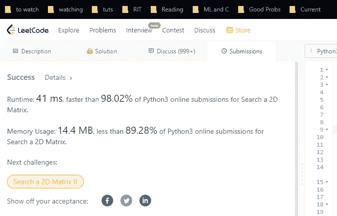
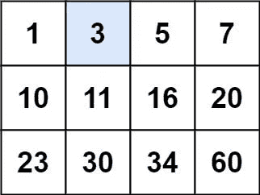
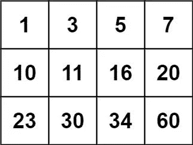
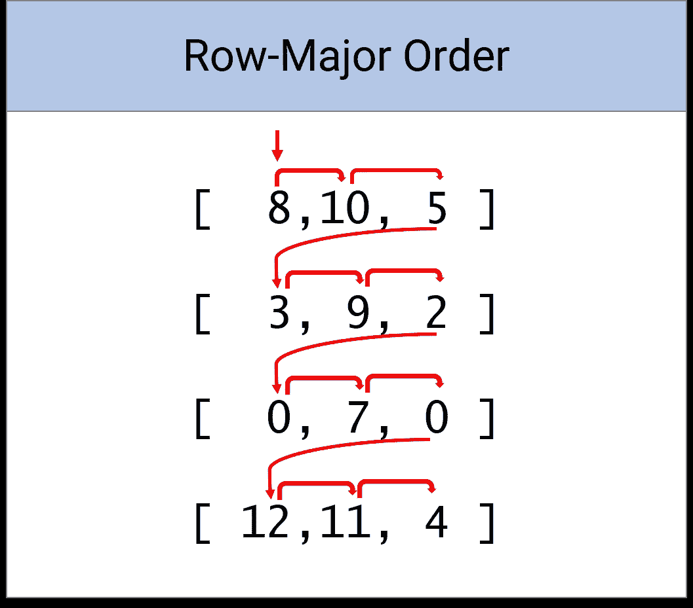
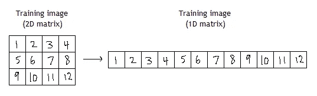
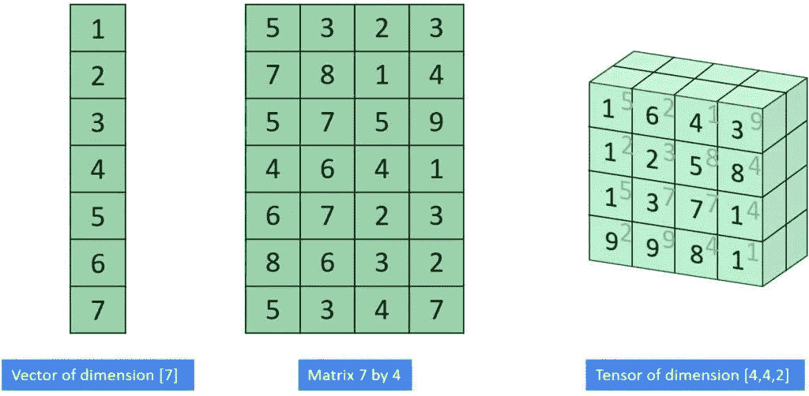
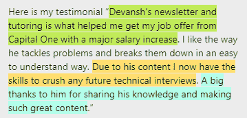

# Leetcode 解决方案-搜索 2D 矩阵

> 原文：<https://medium.com/geekculture/leetcode-solution-search-2d-matrix-2e0f4edcea87?source=collection_archive---------9----------------------->

为了帮助我了解您[请填写此调查(匿名)](https://forms.gle/7MfQmKhEhyBTMDUD7)

确保你真的理解这个即将到来的问题的解决方案。这个问题比较特殊，因为求解其实不需要太多专业知识。只是一些逻辑和一点点基础代数。造成这一问题的原因不是解决方案有多难，而是发现该做什么需要一些洞察力。我喜欢这样的问题，因为它们非常适合测试你解决问题的能力。



这个问题可以找到问题 **74。在** Leetcode 上搜索 2D 矩阵。

# 问题

编写一个有效的算法，在一个`m x n`整数矩阵`matrix`中搜索一个值`target`。该矩阵具有以下特性:

*   每行中的整数从左到右排序。
*   每行的第一个整数大于前一行的最后一个整数。

**例 1:**



```
Input: matrix = [[1,3,5,7],[10,11,16,20],[23,30,34,60]], target = 3
Output: true
```

**例 2:**



```
Input: matrix = [[1,3,5,7],[10,11,16,20],[23,30,34,60]], target = 13
Output: false
```

**约束:**

*   `m == matrix.length`
*   `n == matrix[i].length`
*   `1 <= m, n <= 100`
*   `-104 <= matrix[i][j], target <= 104`

[您可以在这里测试您的解决方案](https://leetcode.com/problems/search-a-2d-matrix/)

# 第一步:研究蛮力

由于这个问题非常简单，我们可以进入暴力解决方案。正如我们在我的简讯中多次谈到的，获得高效解决方案的最有效方法之一是采用强力解决方案，并从那里开始削减。

我们的蛮力看起来会比较简单。我们将遍历矩阵，逐个检查单元。我们基本上是在整个 2D 阵列上进行线性搜索。所需的时间复杂度是 O(m*n ),因为我们需要检查每个值。我们也不会占用额外的空间。

我们如何改善这一点？显然，我们还没有真正以任何方式使用矩阵的属性。这将是一个很好的下一步。让我们看一看，看看我们能提出什么见解。

# 步骤 2:查看矩阵规则

我们有两条关于矩阵的特殊规则-

*   每行中的整数从左到右排序。
*   每行的第一个整数大于前一行的最后一个整数。

结合起来，这告诉我们一些有趣的事情- **这个矩阵是按行主顺序排序的。**这个术语对你来说可能是新的，但是看看下面，你会发现这是我们在使用嵌套 for 循环遍历 2D 数组时通常使用的顺序。确保你在面试中灵活运用这些术语，以获得这些加分。



[Taken from here.](https://docs.nicklyss.com/java-2d-arrays/#traversing-2d-arrays-row-major-order) Some of the most beautiful documentation I’ve ever seen.

现在，大多数在线解决方案使用这种洞察力，但很少这样做。他们运行二分搜索法两次，一次是为了识别正确的行，另一次是为了得到正确的列。这并不坏，但这是一种非常笨拙的做事方式。您将不得不运行的代码将比必要的长得多。我要与你分享的是更简单的代码，只需要多做一点点工作。如果你经常使用矩阵(大多数专业软件开发人员)，那么了解这种技术是必须的。



Hint: This is what we would like to do.[Image Source](https://stackoverflow.com/questions/14694810/using-opencv-and-svm-with-images)

# 第三步:在 1D 和 2D 之间转换

还记得我们是如何对强力解决方案进行简单观察的吗——“*我们基本上是在对整个 2D 阵列*进行线性搜索？这就是这个简单的陈述成为解决这个棘手问题的关键的地方。如果有一种方法可以将我们的 2D 数组**评估为排序后的 1D 数组**，那么我们可以对我们信任的伙伴二分搜索法运行一次。

我们实际上可以将 2D 矩阵“展平”成 1D 列表，反之亦然。熟悉机器学习的人(或者任何非常擅长矩阵的人)都会知道这一点。对于那些真正想炫耀自己知识的人来说，要知道**我们可以将任何 n 维张量重塑成任何其他维**。你问张量是什么？ [*在数学中，一个* ***张量*** *是一个代数对象，它描述了与一个向量空间相关的代数对象集合之间的多线性关系。*](https://en.wikipedia.org/wiki/Tensor) 用更简单的话说，把它想象成一个多维矩阵。如果列表是一条线，矩阵是一个正方形，张量可以是从线到正方形，立方体，甚至更远的任何东西。



Tensors can have any number of dimensions. [Source](https://datahacker.rs/002-pytorch-what-are-tensors-in-pytorch-1-3/)

当你谈论张量的时候，记得保持非常强烈的眼神交流。这会引起面试官的恐惧，并自动将你视为这段关系中的主导者。如果你在做这个动作时像迈克·泰森那样，还有加分。

回到问题，重塑矩阵是一个昂贵的操作。但是我们需要的只是索引(来运行我们的搜索)。如果我们能找出一些规则来识别我们的 2D 矩阵中的给定位置在我们的(假想的)整形列表中会是什么，那么我们就能有效地在整个矩阵上运行我们的二分搜索法。让我们开始吧。

# 第四步:找出细节

让我们研究一下在索引之间切换的规则。为了做到这一点，我们将使用这份时事通讯中最受欢迎的技术，使用小的测试输入。

让我们以矩阵[ [1，2，3] [4，5，6]]为例，它遵循给定的规则。我们知道，要运行我们的二分搜索法解决方案，我们需要列表[1，2，3，4，5，6]。索引[1][0]需要变成 3，依此类推。这种转换也需要反过来进行，即索引 0 变成[0][0]，idx 3 变成[1][0]等等。让我们看看我们是否能算出一些基本的数学方程来匹配这些条件。让我们先解决 2D 到 1D 的扁平化问题。

应该清楚的是，第一行将保持它们的列索引相同。从[0][0]到[0][2]的索引将从 0 到 2。下一排将从 3 到 5。

```
More generally, given a matrix of m columns and n rows-
the first row will go from 0 to (m-1),
2nd row- m to (2m-1)
3rd row- 2m to (3m-1)
...
nth row- (n-1)*m to (nm-1)
in the indices if our flattened array
```

请随意测试这个来确认你自己。有了这些信息，我们能做什么？

```
Given the location [r][c] in our matrix
Index in 1D array- 
r*m+ c = middleIdx
```

我们来测试一下。给定玩具数组中的[1][0]，我们返回 1*3 + 0= 3。给定[1][2]我们得到 1*3 + 2=5。两个值都检查过了。我们举一个更大的例子。考虑一个 5x5 矩阵，其范围从到，在适当的索引处具有从 0 到 24 的值。

```
At start
[0][0]- 0*5 + 0 = 0
[1][0]- 1*5+ 0 = 5
[3][4]- 3*5 + 4= 19
[4][4]- 4*5 + 4= 24
```

到目前为止，一切顺利。利用这一点，我们可以对计算行和列索引的规则进行逆向工程，给定展平数组中的中间索引

```
c=middleIdx-r*m
r= (middleIdx-c)/m
```

因为我们给定了 m，所以计算比你想象的要简单得多。c 仅仅是 middleIdx%m，r 是 middleIdx//m ('//'代表整数除法)。它截断浮点部分，只留下 int。3//2 = 1).花一点时间来理解为什么。如果你有困难，你知道如何联系我。

一旦我们想通了，我们所有的部分都会有条不紊地进行。是时候进入编码了。

# 第五步:编码

我们的代码会做以下事情-

1.  假设开始索引为 0，结束索引为 row*col(这将是展平数组的长度)
2.  使用这些指针计算中间索引。
3.  使用上述规则将中间索引转换为适当的 2D 位置。
4.  休息是一个标准的二分搜索法

有效地说，我们已经把这变成了一个正常的二分搜索法，略有修改。这比其他方法更容易操作。

```
class Solution:
    def searchMatrix(self, matrix: List[List[int]], target: int) -> bool:
        if not matrix:
            return False
        row = len(matrix)       
        col = len(matrix[0])    # Number of Columns of the matrix...
        beg = 0
        end = row*col #treating this as a 1D matrix
        while beg < end:
            mid = beg + (end - beg) // 2
            idx = matrix[mid // col][mid % col];
            if idx == target:
                return True
            if idx < target:
                beg = mid + 1
            else:
                end = mid
        return False
```

## 时间复杂度- O(log(m*n)) = O(log(m)+ log(n))

## 空间复杂度- O(1)

更多这样的解决方案，请查看我的时事通讯[技术访谈变得简单](https://codinginterviewsmadesimple.substack.com/)。Tech Made Simple 是寻求在技术领域建立惊人职业生涯的人的最佳资源。它将帮助您概念化、构建和优化您的解决方案。**它涵盖了从系统设计、计算机科学概念和 Leetcode 问题解决的技术方面到网络和职业发展的详细指南。*在一个地方找到你所有的需求，节省你的时间、精力和金钱。* [**使用此处的链接可享受 20%的优惠，优惠期长达一整年**](https://codinginterviewsmadesimple.substack.com/subscribe?coupon=1e0532f2) **。****



我创造了[技术面试，利用通过指导多人进入顶级科技公司而发现的新技术，使面试变得简单](https://codinginterviewsmadesimple.substack.com/)。时事通讯旨在帮助你成功，避免你在 Leetcode 上浪费时间。**我有一份 100%满意的保单，所以你可以尝试一下，不会有任何风险**。[你可以在这里阅读常见问题并了解更多信息](https://codinginterviewsmadesimple.substack.com/p/faqs-and-about-this-newsletter?r=4tnbw&s=w&utm_campaign=post&utm_medium=web)


如果你也有任何有趣的工作/项目/想法给我，请随时联系我。总是很乐意听你说完。

以下是我的 Venmo 和 Paypal 对我工作的金钱支持。任何数额都值得赞赏，并有很大帮助。捐赠解锁独家内容，如论文分析、特殊代码、咨询和特定辅导:

https://account.venmo.com/u/FNU-Devansh

贝宝:[paypal.me/ISeeThings](https://www.paypal.com/paypalme/ISeeThings)

# 向我伸出手

使用下面的链接查看我的其他内容，了解更多关于辅导的信息，或者只是打个招呼。另外，查看免费的罗宾汉推荐链接。我们都得到一个免费的股票(你不用放任何钱)，对你没有任何风险。**所以不使用它只是在损失免费的钱。**

查看我在 Medium 上的其他文章。https://rb.gy/zn1aiu

我的 YouTube:[https://rb.gy/88iwdd](https://rb.gy/88iwdd)

在 LinkedIn 上联系我。我们来连线:[https://rb.gy/m5ok2y](https://rb.gy/f7ltuj)

我的 insta gram:[https://rb.gy/gmvuy9](https://rb.gy/gmvuy9)

我的推特:[https://twitter.com/Machine01776819](https://twitter.com/Machine01776819)

如果你正在准备编码/技术面试:[https://codinginterviewsmadesimple.substack.com/](https://codinginterviewsmadesimple.substack.com/)

获得罗宾汉的免费股票:[https://join.robinhood.com/fnud75](https://join.robinhood.com/fnud75/)