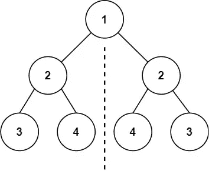
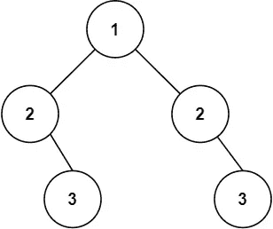

# LeetCode —对称树

> 原文：<https://medium.com/geekculture/leetcode-symmetric-tree-b977d2970806?source=collection_archive---------17----------------------->

# 问题陈述

给定二叉树的*根*，*检查它是否是自身*的镜像(即围绕其中心对称)。

问题陈述摘自:【https://leetcode.com/problems/symmetric-tree 

**例 1:**



```
Input: root = [1, 2, 2, 3, 4, 4, 3] 
Output: true
```

**例 2:**



```
Input: root = [1, 2, 2, null, 3, null, 3] 
Output: false
```

**约束条件**

```
- The number of nodes in the tree is in the range [1, 1000]. 
- -100 <= Node.val <= 100
```

# 说明

## 递归函数

在解决与树相关的问题时，递归是最佳选择。如果不是递归，迭代方法将使用队列。

让我们在这篇博客中探索一个简单的递归方法。方法是使用两个指针作为指向树的根的参数。第一个指针向左移动，第二个向右移动，验证节点是否相同。

我们来检查一下算法。

```
// main function
- call recursive function areSymmetric(root, root)

// areSymmetric function(root1, root2)
- if !root1 && !root2
  - return true
- else
  - if root1 && root2
    - if root1->val == root2->val
      - return areSymmetric(root1->left, root2->right) && areSymmetric(root1->right, root2->left)

- return false
```

## C++解决方案

```
bool areSymmetric(TreeNode* root1, TreeNode* root2){
    if(!root1 && !root2){
        return true;
    } else {
        if(root1 && root2){
            if(root1->val == root2->val){
                return areSymmetric(root1->left, root2->right) &&
                    areSymmetric(root1->right, root2->left);
            }
        }
        return false;
    }
}

class Solution {
public:
    bool isSymmetric(TreeNode* root) {
        return areSymmetric(root, root);
    }
};
```

## 戈朗溶液

```
func areSymmetric(root1 *TreeNode, root2 *TreeNode) bool {
    if root1 == nil && root2 == nil {
        return true
    } else {
        if root1 != nil && root2 != nil {
            if root1.Val == root2.Val {
                return areSymmetric(root1.Left, root2.Right) && areSymmetric(root1.Right, root2.Left)
            }
        }
    }

    return false
}

func isSymmetric(root *TreeNode) bool {
    return areSymmetric(root, root)
}
```

## Javascript 解决方案

```
var areSymmetric = function(root1, root2) {
    if(!root1 && !root2) {
        return true;
    } else {
        if(root1 && root2) {
            if(root1.val == root2.val) {
               return areSymmetric(root1.left, root2.right) && areSymmetric(root1.right, root2.left);
            }
        }
    }

    return false;
}

var isSymmetric = function(root) {
    return areSymmetric(root, root);
};
```

让我们试运行一下我们的算法，看看解决方案是如何工作的。

```
Input: root = [1, 2, 2, 3, 4, 4, 3]

// in main function
Step 1: return areSymmetric(root, root)

// in areSymmetric function
Step 2: if !root1 && !root2
          - root1 != nil
            1 != nil
            true

          - root2 != nil
            1 != nil
            true

          - !true && !true
          - false

        else
          if root1 && root2
            - 1 && 1
            - true

            if root1->val == root2->val
               - 1 == 1
               - true

               return areSymmetric(root1->left, root2->right) && areSymmetric(root1->right && root2->left)
               return areSymmetric(2, 2) && areSymmetric(2, 2)

               // we will ignore the 2nd condition here, since both are same.
               // In actual recursive call it will be evaluated.

Step 3: if !root1 && !root2
          - root1 != nil
            2 != nil
            true

          - root2 != nil
            2 != nil
            true

          - !true && !true
          - false

        else
          if root1 && root2
            - 2 && 2
            - true

            if root1->val == root2->val
               - 2 == 2
               - true

            return areSymmetric(root1->left, root2->right) && areSymmetric(root1->right && root2->left)
            return areSymmetric(3, 3) && areSymmetric(4, 4)

// areSymmetric(3, 3)
Step 4: if !root1 && !root2
          - root1 != nil
            3 != nil
            true

          - root2 != nil
            3 != nil
            true

          - !true && !true
          - false

        else
          if root1 && root2
            - 3 && 3
            - true

            if root1->val == root2->val
               - 3 == 3
               - true

            return areSymmetric(root1->left, root2->right) && areSymmetric(root1->right && root2->left)
            return areSymmetric(nil, nil) && areSymmetric(nil, nil)

// areSymmetric(nil, nil)
Step 5: if !root1 && !root2
          - root1 != nil
            nil != nil
            false

          - root2 != nil
            nil != nil
            false

          - !false && !false
          - true

// areSymmetric(4, 4)
Step 6: if !root1 && !root2
          - root1 != nil
            4 != nil
            true

          - root2 != nil
            4 != nil
            true

          - !true && !true
          - false

        else
          if root1 && root2
            - 4 && 4
            - true

            if root1->val == root2->val
               - 4 == 4
               - true

            return areSymmetric(root1->left, root2->right) && areSymmetric(root1->right && root2->left)
            return areSymmetric(nil, nil) && areSymmetric(nil, nil)

            // areSymmetric(nil, nil) returns true
            // so we move back from step 6 to step 5 till step 2 and evaluate

            return areSymmetric(root1->left, root2->right) && areSymmetric(root1->right && root2->left)

            // which is true

So the answer we return is true.
```

*原发布于*[*https://alkeshghorpade . me*](https://alkeshghorpade.me/post/leetcode-symmetric-tree)*。*