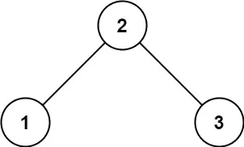
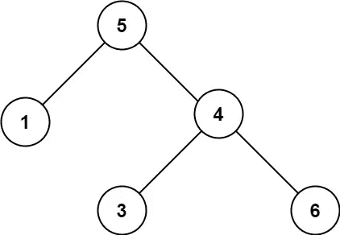
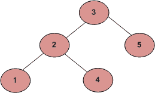

# LeetCode —验证二叉查找树

> 原文：<https://medium.com/geekculture/leetcode-validate-binary-search-tree-88f911efd8b3?source=collection_archive---------18----------------------->

# 问题陈述

给定一棵二叉树的*根*，*确定它是否是有效的二叉查找树(BST)* 。

一个**有效 BST** 定义如下:

*   节点的左子树只包含键**小于节点键**的节点。
*   节点的右边子树只包含键**大于节点键**的节点。
*   左右子树也必须是二分搜索法树。

**例 1:**



```
Input: root = [2, 1, 3] 
Output: true
```

**例 2:**



```
Input: root = [5, 1, 4, null, null, 3, 6] 
Output: false 
Explanation: The root node's value is 5, but its right child's value is 4.
```

**约束**

```
- The number of nodes in the tree is in the range [1, 10^4].
- -2^31 <= Node.val <= 2^31 - 1
```

# 说明

## 不正确的方法

我们大多数人会想到的第一个天真的方法是检查每个节点，左边的孩子应该较小，右边的孩子应该较大。

但是下面的树不是有效的 BST，因为值为 4 的节点位于值为 3 的节点的左子树中。



## 正确的方法

上面的方法暗示我们需要跟踪左右子树中任何节点的最大值和最小值。

我们来检查一下算法。

```
// isValidBST function
- if root == NULL
  - return true

- return checkValidBST(root, LONG_MIN, LONG_MAX)

// checkValidBST(root, min, max) function
- if root == NULL
  - return true

- if root->val <= min || root->val >= max
  - return false

- return checkValidBST(root->left, min, root->val) && checkValidBST(root->right, root->val, max)
```

## C++解决方案

```
class Solution {
public:
    bool isValidBST(TreeNode* root) {
        if(root == NULL) {
            return true;
        }

        return checkValidBST(root, LONG_MIN, LONG_MAX);
    }

    bool checkValidBST(TreeNode* root, long min, long max){
        if(root == NULL) {
            return true;
        }

        if(root->val <= min || root->val >= max) {
            return false;
        }

        return checkValidBST(root->left, min, root->val) && checkValidBST(root->right, root->val, max);
    }
};
```

## 戈朗溶液

```
func isValidBST(root *TreeNode) bool {
    if root == nil {
        return true
    }

    return checkValidBST(root, math.MinInt32, math.MaxInt32)
}

func checkValidBST(root *TreeNode, min, max int) bool {
    if root == nil {
        return true
    }

    if root.Val <= min || root.Val >= max {
        return false
    }

    return checkValidBST(root.Left, min, root.Val) && checkValidBST(root.Right, root.Val, max)
}
```

## Javascript 解决方案

```
var isValidBST = function(root) {
    if( !root ) {
        return true;
    }

    return checkValidBST(root);
};

var checkValidBST = function(root, min = -Infinity, max = +Infinity) {
    if (!root) {
        return true;
    }

    if (root.val <= min || root.val >= max) {
        return false;
    }

    return checkValidBST(root.left, min, root.val) && checkValidBST(root.right, root.val, max);
}
```

让我们试运行一下我们的算法，看看解决方案是如何工作的。

```
Input: root = [2, 1, 3]

// in isValidBST function
Step 1: if root == NULL
           false

Step 2: return checkValidBST(root, LONG_MIN, LONG_MAX)

// in checkValidBST function
Step 3: if root == NULL
           false

Step 4: if root->val <= min || root->val >= max
           2 <= LONG_MIN || 2 >= LONG_MAX
           false || false
           false

Step 5: return checkValidBST(root->left, min, root->val) && checkValidBST(root->right, root->val, max)
        return checkValidBST(1, LONG_MIN, 2) && checkValidBST(3, 2, LONG_MAX)

// checkValidBST(1, LONG_MIN, 2)
Step 6: if root == NULL
           false

Step 7: if root->val <= min || root->val >= max
           1 <= LONG_MIN || 1 >= 2
           false || false
           false

Step 8: return checkValidBST(root->left, min, root->val) && checkValidBST(root->right, root->val, max)
        return checkValidBST(null, LONG_MIN, 1) && checkValidBST(null, 1, LONG_MAX)

// checkValidBST(3, 2, LONG_MAX)
Step 9: if root == NULL
           false

Step 10: if root->val <= min || root->val >= max
            2 <= LONG_MIN || 2 >= LONG_MAX
            false || false
            false

Step 11: return checkValidBST(root->left, min, root->val) && checkValidBST(root->right, root->val, max)
         return checkValidBST(null, LONG_MIN, 3) && checkValidBST(null, 3, LONG_MAX)

Now for all the conditions
Step 7: checkValidBST(null, LONG_MIN, 1) && checkValidBST(null, 1, LONG_MAX)
Step 11: checkValidBST(null, LONG_MIN, 3) && checkValidBST(null, 3, LONG_MAX)

the first parameter root is null

So it returns true.

Hence the final answer we return is true.
```

*最初发布于*[*https://alkeshghorpade . me*](https://alkeshghorpade.me/post/leetcode-validate-binary-search-tree)*。*