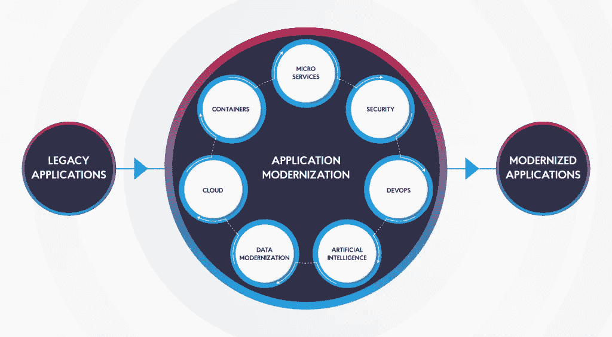
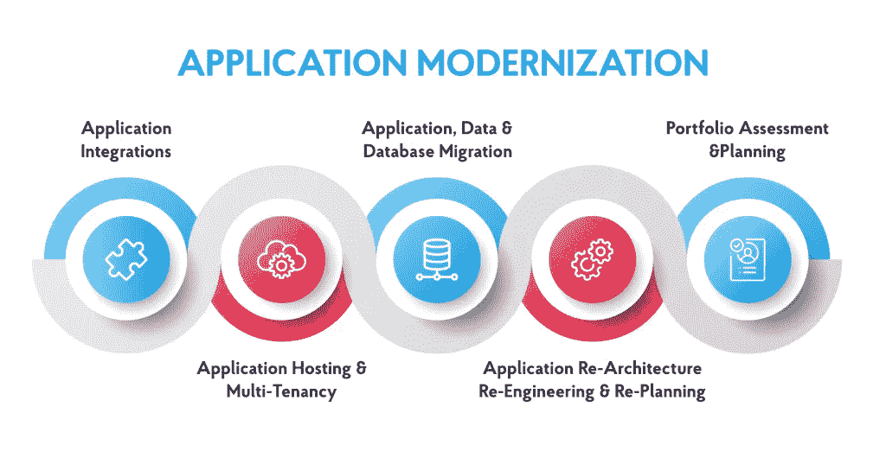

# 传统应用程序现代化:最有效的策略— NIX United

> 原文：<https://medium.com/geekculture/legacy-application-modernization-most-effective-strategies-nix-united-b6cb606c54b2?source=collection_archive---------25----------------------->

你有没有注意到如今尖端发明变得过时的速度有多快？就在几十年前，新的设备和技术将伴随我们一生。在第三个千年的早期，人类活动所有领域的发展速度都大大加快，几乎每周都有一些突破性的创新被引入，取代了仅仅几年前还风靡一时的创新。

IT 行业是这种过程中的一个悲惨的教训，这种过程的飞速发展对普通用户来说是一个奇迹，但对企业主来说往往是一个挑战。后者必须采用新颖的解决方案，不仅要在激烈竞争的环境中岌岌可危，还要在利基市场中获得强大的竞争优势，不辜负客户的期望，将挑战转化为成功的故事。

然而，许多小心翼翼的企业家坚持旧的好软件，部分是因为他们的态度，部分是因为他们意识到传统软件的现代化可能是多么的麻烦[。系统越复杂，覆盖的业务越多，就越难对其进行现代化改造和转移到新技术上。](https://nix-united.com/blog/what-is-a-legacy-system-and-legacy-software/?utm_source=medium&utm_medium=referral&utm_campaign=legacy_app)

然而，不管不愿转向最先进技术和产品的借口是什么，这种转变已经迫在眉睫。拖延只会让转变更加痛苦。在[定制移动应用开发](https://medium.com/r?url=https%3A%2F%2Fnix-united.com%2Fservices%2Fmobile-app-development%2F&utm_source=medium&utm_medium=referral&utm_campaign=legacy_app)方面拥有四分之一个世纪的经验，我们 NIX 已经意识到这个简单的真理适用于任何硬件或软件，遗留应用也不例外。

# 什么是遗留应用程序？

在开始遗留应用程序现代化之旅之前，有必要深入了解基础知识，并解决关键问题“什么是遗留应用程序？”

原型定义会将所有旧的解决方案视为遗留解决方案。但是这个诊断在两点上是错误的。首先，对“旧”的理解是模糊的，因为一些应用程序保持相关并有效地执行任务多年，同时仍然被认为是活跃的。其次，解决方案在发布几个月后可能会变得过时，以防突破性的替代方案显得过时。

显然，将一个软件标记为遗留应用程序还有其他因素。

*   用一种死语言写的。当然，这不是拉丁语或阿拉姆语。但是编程语言也可能不再被使用(像 Cobol 或 Natural ),所以它们的支持变得不存在。因此，遗留应用程序没有更新的机会，这可能导致系统漏洞增加，无法修复 bug，以及实现新的市场需求功能。
*   没有专家来维护它们。技术和语言一样会老化。如今，寻找使用 Python 2 或其他过时技术的人可能是一个挑战。此外，缺乏高质量的专家导致他们的服务价格高得多。
*   基于短生命周期技术。不仅衣服可以新潮。有时，整个 IT 社区都痴迷于数字领域的一些最新时尚(如 Elm)，这些时尚后来被证明是划算的。一旦炒作结束，开发人员将注意力转向其他技术，您将面对遗留应用程序并面临挑战，如上所述。
*   成为一个匆忙的产品。在短时间内创建的软件可能基于非最佳的技术堆栈和方法，因为最适合特定情况且最具成本效益的软件可能需要比企业更多的时间。此外，这变成了解决方案更新和功能可伸缩性的障碍。它还可能导致上述三个因素之一，使解决方案成为遗留问题。

你在你的商务应用中认识到这些特性了吗？那么您将面对一个遗留应用程序。

# 遗留系统的问题

当您推迟遗留应用程序现代化并继续使用您的旧应用程序 Oz 时，等待您的陷阱和瓶颈是什么？

# 1.操作的逐渐恶化

周围的每个人都在乘坐超音速喷气式飞机旅行，但你却在自己珍爱的蒸汽机上不停地喘着气。最终，你会到达你的目的地，但那时你的竞争对手已经领先你好几英里了。这意味着企业将无法适应和满足客户的需求，并可能导致客户流失。此外，您的应用程序会反复暴露新的问题和故障，这些问题和故障在没有传统现代化实施的情况下无法解决。

# 2.安全性受损

网络罪犯一直在寻找安全盔甲上的漏洞。随着时间的推移，它的力量将变得越来越脆弱，没有机会修复它。没有遗留应用程序的现代化，安全防御崩溃只是一个时间问题，使应用程序变得脆弱。

# 3.接近零的整合潜力

应用程序很少独立运行。通常，他们通过各种第三方工具、库和平台(例如，社交媒体和支付系统)来为客户和员工提供令人满意的 UX。通常，遗留应用程序无法利用内部基础设施之外的服务来扩展功能。作为一种解决方案，它只能以大量的定制代码编写为代价来实现，这使得这种解决方案在经济上和时间上都不合适。

# 4.笨重和僵化的结构

通常，传统应用依赖于整体架构，这种架构以单块软件为前提，所有模块都基于通用代码。这样一个系统是非常不灵活的，因为在不重新散列整个应用程序的情况下，对各种模块逐个进行修改是不可能的。

# 5.缺乏支持和维护

这个问题有两个层面——技术层面和人的层面。

从技术上讲，所有相关的问题都源于开发人员缺乏支持和更新。基于这些技术的软件就这样被它们的创造者抛弃了，你只能抵挡一段时间，但无法最终避免。

人员短缺是技术支持逐渐减少的结果。新一代专家认为，学习如何处理过去的遗留问题毫无意义，而老专家就更难找到了。你的搜寻和招聘过程变成了一场令人厌倦的马拉松——当你遇到有能力的专家时，他们会对他们的服务收取高得离谱的费用。

旧的解决方案通常不实用(尤其是如果它们的父母很多的话)。其中的每个小问题都需要亿万年来识别和解决。如果没有描述遗留应用程序架构或列出其特性的文档，情况会变得更糟。

结果，支持遗留解决方案变得在黑暗中摸索，专家需要更多的时间来理解它是如何工作的，以及如何实现改变而不破坏系统的稳定性和可使用性。

# 6.过高的开支

上面提到的这些缺点都增加了 app 的维护成本。这些成本包括雇佣一家招聘机构来发掘古代技术方面的专家，为他们独特的技能和专业知识付费，在比传统应用程序现代化后更频繁地使用维护服务上挥霍金钱，以及在尝试修补旧系统时不可避免地要支付几十笔较小的费用。

# 7.阻碍了商业机会

在应用程序内部运行的情况下，使用过时的软件对你的工作流程是一个严重的障碍。如果它是为了解决客户的问题…那么，它更有可能导致新的问题，而不是处理现有的问题。

这“宏伟的七”是最好的证明，与传统应用程序呆在一起不是有远大抱负的公司的选择。但是，也许开发一个新的应用程序而不是更新你正在使用的旧应用程序是有意义的？

# 重新构建与改造遗留应用程序:选择什么？

一般来说，当人们的一些物品出问题时，他们会采取两种策略中的一种。他们中的一些人试图修补任何破损的东西，以继续享受他们已经习惯的东西。其他人更喜欢扔掉它，买一个全新的东西。但是当涉及到商业软件时，你不能根据个人喜好来选择任何一种操作方式。

什么时候完全放弃一个有问题的应用程序并开发一个新的有意义？

*   遗留应用程序现代化将变得不切实际——要么是因为它的成本过高，要么是因为它太耗费精力。
*   遗留应用程序的现代化是不可实现的——因为构建旧应用程序的技术已经过时，没有办法实现遗留应用程序的现代化:技术差距是不可逾越的。

什么时候应该选择遗留应用程序现代化？

*   当代应用市场没有现成的产品可以完全满足组织的业务需求。
*   该应用对公司的运营至关重要(就像它包含在其产品组合中一样)。
*   现有的应用程序最适合当前的安全法规。

我们已经为不同的行业开发了几十个应用——从[汽车](https://nix-united.com/blog/how-to-create-a-taxi-app-better-than-uber/?utm_source=medium&utm_medium=referral&utm_campaign=legacy_app)到[电子商务](https://medium.com/r?url=https%3A%2F%2Fnix-united.com%2Fsuccess_stories%2Fspartan-camera-e-commerce-website-for-wildlife-research%2F&utm_source=medium&utm_medium=referral&utm_campaign=legacy_app)——我们在 NIX 知道最后三个驱动因素是最常见的，说服了大部分公司接受传统应用现代化。

# 传统现代化选项

有三种基本的遗留系统现代化方法供您选择

# 1.云水合作用

这种方法意味着将应用程序重新部署到云中，并对其结构进行最小的更改。通常，这种转换归结为修改程序和数据库之间的交互方式，以便可以利用云提供的升级和自动化机会。这种方法是获取云原生服务和功能的经济高效的机制。

# 2.走向无服务器

通过这种方法，您可以留在本地或迁移到云(后者在今天更常见)，但该应用程序不需要内部服务器软件和硬件。通过选择这种传统应用程序现代化模式，组织可以专注于其基本的业务流程，而不是将注意力分散在基础架构管理例程(容量和集群配置、修补、操作系统维护等)上。).无服务器架构的另一个好处是它提供的独有的扩展灵活性。

# 3.集装箱化

这种方法的前提是将所有的软件组件打包成一个对象，以便进一步方便地移动到您喜欢的任何地方。最受欢迎的容器是微服务部署，它支持一致的操作和增强的应用程序开发，同时大幅削减开销。

当您选择了一个遗留应用程序现代化策略时，您应该仔细规划修改路线。

# 要遵循的应用程序现代化算法

要将应用程序现代化变成一个成功的故事，必须采取以下步骤。

# 第一步。定义目标

在技术特征、预期性能指标和业务目标方面，您应该清楚地认识到通过更新您的遗留应用程序，您想要实现什么。

# 第二步。盘点你所拥有的

您的遗留应用程序应该进行彻底的分析，以评估其业务适合性和价值，以及与三个主要元素相关的当前技术前景:数据、业务逻辑和 UI。通过这样做，您将知道 it 的哪些组件需要升级，哪些组件目前运行良好。

# 第三步。选择现代化深度

这种选择应该针对每个元素和功能分别进行。每下一级都更加复杂和费力，因此成本也更高。

*   封装。数据和函数打包在一起，通过 API 作为服务提供对它们的访问。
*   主机更换。应用程序元素被移动到另一个基础架构中，没有对它们进行任何更改。
*   重新平台化。保持其代码结构、功能和特性不变，该应用程序被迁移到一个新的平台，只涉及轻微的代码调整。
*   重构。通过优化代码消除技术债务，增加非功能属性。
*   重组。修改代码是为了将其重新定位到新的应用程序中。
*   重建。它完全重写了应用程序的组件，同时保留了它的规范和范围。
*   更换。在这里，你去掉组件，用新的组件取而代之。

# 第四步。了解你的预算

尽管应用程序现代化并不像从头开始构建一个应用程序那样耗资巨大(这也是它受到青睐的主要原因)，但它仍然不是一个廉价的问题。因此，在开始之前，你应该确保你的企业能够在当前进行这项投资。

# 第五步。确定技术堆栈

正确选择有助于应用程序现代化的工具、语言、库和其他软件对于该过程的最终成功至关重要。

# 第六步。概述现代化计划

整个过程应该用要升级的组件的记录列表、现代化阶段的顺序以及每个阶段的时间表来规划。

# 第七步。任命团队

你应该联系一个经验丰富的软件开发伙伴，万一你的公司没有内部专家，他会做所有的工作。

# 第八步。实现现代化

当一切都准备好了，每个人都准备好了，请严格按照图表中的场景执行程序。

# 第九步。测试现代化的应用

确保升级后的产品功能符合您的期望和要求。

如您所见，传统应用程序现代化是一项严肃的工作，需要考虑许多因素并一丝不苟地完成。当面临这样的考验时，DIY 方法不是以结果为导向的企业家的选择。这就是为什么选择一家经验丰富的 it 公司的服务是明智的，该公司拥有足够的专业知识来交付一流的结果。 [NIX](https://nix-united.com/services/enterprise-mobility-solutions/) United 在此类项目中拥有丰富的经验，可以保证最终产品的出色 UX、高性能和无缝运行。

# 结论

坚持使用传统的应用程序会给你公司的效率和增长前景带来严重的阻碍。通过现代化，您将能够跟上最新的技术进步，并为您的企业提供新的发展机会，降低成本，优化流程，并最终提高收入。

*原载于 2021 年 10 月 13 日*[*【https://nix-united.com】*](https://nix-united.com/blog/the-main-features-of-legacy-application-modernization/)*。*