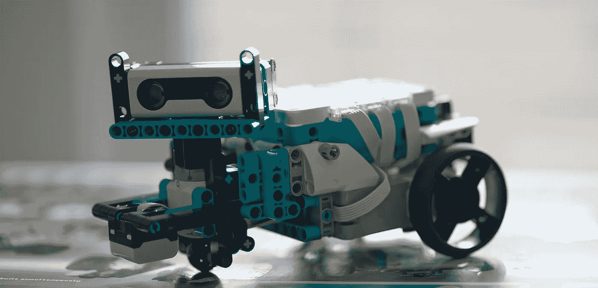

# 乐高思维风暴:通往机器人的大门

> 原文：<https://medium.com/geekculture/lego-mindstorms-gateway-to-robotics-a930cff11c84?source=collection_archive---------41----------------------->

# 背景

目前，我是一名数据科学家和软件开发人员，但我年轻时对机器人很着迷。我甚至建造了一个小型机器人，它能跟随线条并与之竞争。但后来我偏离了方向，进入了软件利基市场。由于我不太了解硬件，并认为提前了解它可能是一项重大投资，我决定购买新的乐高 Mindstorms 51515 套装。因为这似乎是回归机器人学最简单的方法之一。

Tricky 2.0, a slightly upgraded version of the original Tricky model.

# 代码

我决定从一些简单的东西开始，做一个程序，它可以绕着 Tricky(一个来自布景的基本机器人)行驶，进行碰撞检测和规避。默认情况下，Hub(机器人的大脑)既可以用 Scratch 编程，也可以用 Python 的一个变种 MicroPython 编程。

## 微丝体

由于我目前的职业，我选择了 MicroPython，我觉得它给了我更多的控制，我真的喜欢编码，所以它对我来说是一个更好的选择。但是，如果你不精通编程，或者只是喜欢视觉编码风格，你应该走 Scratch 路线，老实说，乐高为编码机器人提供的软件似乎更适合 Scratch 用户。

MicroPython 是 Python 的一个特殊版本，用 C 实现，在微控制器上运行。它基本上与 Python 3 兼容，使用体验也基本相同。但是有一些不同，最显著的是标准库。许多你可能期望或习惯使用的模块，比如 datetime，都不见了。而那些存在的已经适应了，可能会丢失一些功能或者被其他功能取代。所以你可能要比你一开始预期的多做一些谷歌搜索。

## 机器人类

让我们从类定义开始。如果你想知道，你可以写一个简单的脚本并运行它，但是我更喜欢 OOP 的编码方式。首先，我们需要初始化我们正在使用的组件。轮毂、两个电机和距离传感器。我还设置了激活碰撞规避的距离(以厘米为单位)、电机速度以及程序运行的持续时间(以秒为单位)。然后，我们设置默认的电机速度，并使用“time.ticks_ms()”启动时钟，这是我通常使用“datetime”的情况之一，但它在 MicroPython 中不可用。因为程序的持续时间是以毫秒为单位来计算的，所以这个参数需要乘以 1000。

## 冲突检出

碰撞检测本身非常简单，我们只是周期性地调用这个函数，它进行距离测量并通知我们是否比设定的距离更近。

## 避免碰撞

当特里克接近长城时，我们想让他走另一条路。我选择了 180 度大转弯，赔率 1:3。否则他会随机左转或右转 90 度。请注意，当我们转弯时，驱动马达的开关中断了，我们必须重新启动它。

## 整个代码

这是我为 Tricky 写的整个程序。请随意使用它并尝试一下。它对上面显示的代码做了一些补充，但没有什么太花哨的，就像我说过的，这只是这个旅程的开始。

# 后续步骤

到目前为止，Tricky 还不知道如何做任何有趣的事情，也不知道除了在距离传感器前放置一些东西之外，可以以任何方式进行交互。所以我们必须升级机器人和它运行的软件。

## 决定朝哪个方向走

我发现当前实现的一个问题是陷入了困境。当狡猾靠近一堵墙时，他会随机转向。嗯，如果他进入一个角落，有 1/3 的机会，他会变成另一面墙。没有撞上墙可以通过增加碰撞规避距离来缓解，但 Tricky 仍然会经常撞上墙。我将尝试的一个简单的解决方案是在距离传感器下面安装一个马达，并在决定向哪个方向转弯之前左右为难地看一下。

## 基于颜色的控件

另一种提高机器人可玩性的方法是增加更多与之互动的方式。这台电视机配有一个颜色传感器。它可以用来增加一种控制机器人的方法。一些例子将是，如果红色被发现棘手停止驾驶，黄色增加额外的 10 秒钟，等等。

# 结束语

总的来说，51515 系列是一个进入机器人和编程的好方法。组装不同的机器人是一件轻而易举的事，而且它们出门就很有趣。升级大多数基本型号非常简单。然而，作为一名程序员，编写一些移动和影响物理世界的代码是一种很棒的感觉。至少在我的工作中这是很少发生的。我会向任何考虑进入机器人或编程领域的人推荐这种体验，这是一种很有趣的方式，进入门槛很低。我希望我能进一步探索这个系统，并就这个话题写几篇博文。这个项目和其他项目的所有代码将在这里提供:[这里](https://github.com/LukaAndrojna/LEGO_Mindstorms_51515)。

谢谢你看我的帖子。如果你有任何意见、想法或反馈，我很乐意在下面的评论中看到。