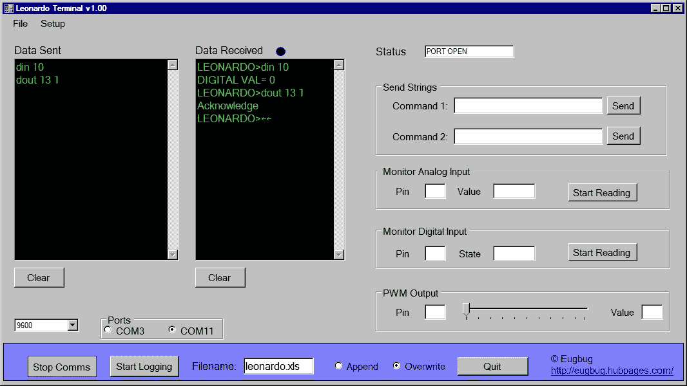

# 莱昂纳多终端:一个 Arduino 命令解释器

> 原文：<https://medium.com/geekculture/leonardo-terminal-an-arduino-command-interpreter-8a6ccfba3363?source=collection_archive---------13----------------------->

# 我的第一个 Arduino 项目！

这是我在 2013 年开始的第一个也是最后一个(在其他事情介入之前)Arduino 项目。我的目的是让一个基本的系统启动并运行，并与 PC 建立基本的通信。我有为数据记录器编写 Zilog Z8 微控制器的背景，所以掌握 Atmel 处理器是一个…