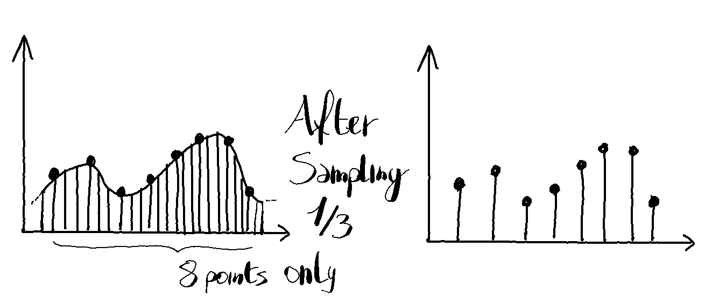
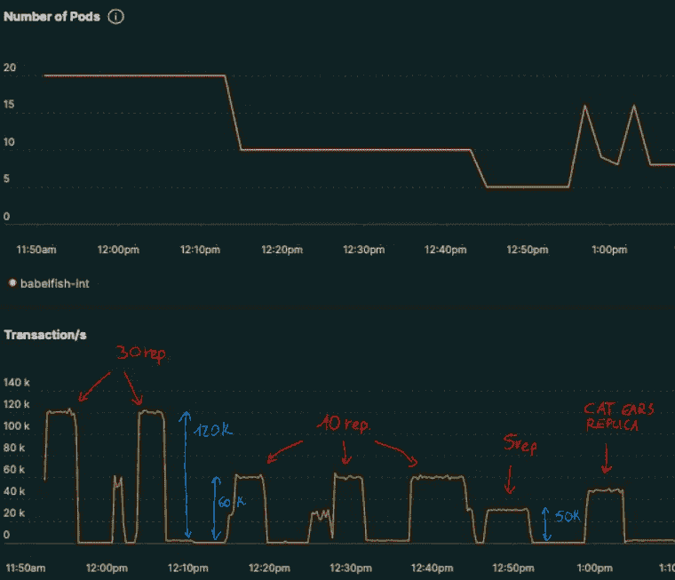
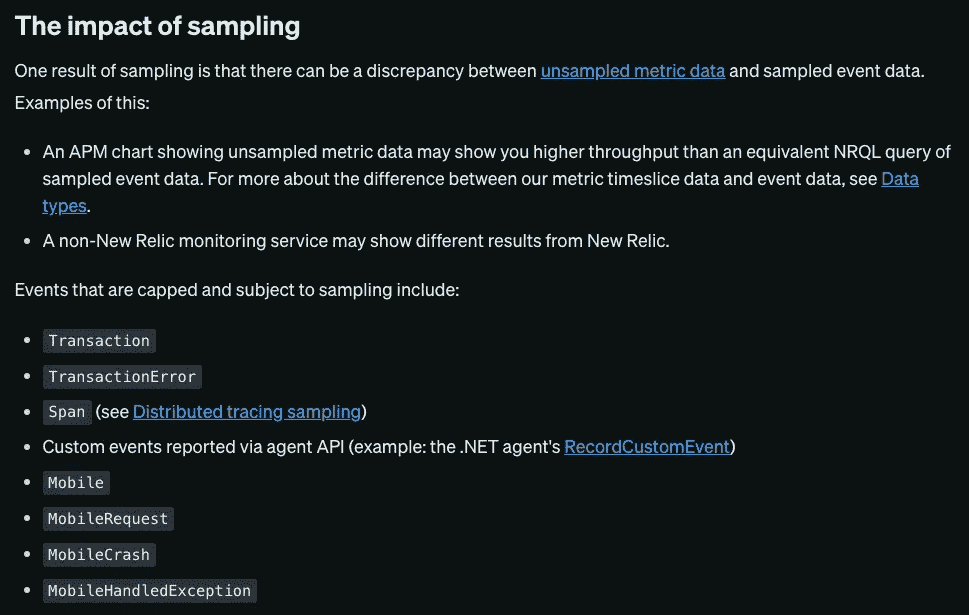

# 吸取的教训:取样对监测的影响

> 原文：<https://medium.com/geekculture/lesson-learned-the-sampling-impact-on-monitoring-cb454deeda88?source=collection_archive---------10----------------------->



今天，我想介绍一下您在日常监控图表中使用的指标可能会对您产生的影响。

如果你喜欢这个故事，记得鼓掌并订阅，我真的很感激！

本文中使用的技术:

*   库伯内特斯
*   新遗迹(类似普罗米修斯或数据狗)

我的目标是找到满足特定工作负载所需的适当数量的副本/资源(内存和 cpu)。我不会讨论如何调优 pod 或 HPA/VPA，因为没有神奇的方法来微调您的工作负载。

现在，我们将重点关注三个指标，它们会在您受到采样影响时突出显示:

*   输入流量—在我的测试中保持不变
*   副本数量
*   交易数量



从这张图中可以看出，有四个阶段:

*   20 个副本，12 万个事务
*   10 个副本，6 万个事务
*   5 个副本，3 万个事务
*   猫耳朵复制品[🐈](https://emojipedia.org/cat/)

这种行为完全没有意义，因为输入流量在存在时基本上是恒定的。

因此，仔细观察绘制的指标:

```
Select rate(count(*), 1 second) from Transaction where containerName = 'pod-under-test' FACET containerName  TIMESERIES MAX LIMIT MAX
```

浏览文档几分钟后，我终于发现了是怎么回事:



[https://docs.newrelic.com/docs/data-apis/understand-data/event-data/new-relic-event-limits-sampling/#impact](https://docs.newrelic.com/docs/data-apis/understand-data/event-data/new-relic-event-limits-sampling/#impact)

> 有上限且需要抽样事件包括:
> -交易

🎉 🎉 🎉 🎉 🎉
在高流量的情况下，每个 pod 发送的样本数量都达到了 New Relic APM 代理中默认配置的最大数量。

所以，这种行为是由于意外的采样和具有意外含义的图形。

# 吸取的教训:

*   始终验证您正在使用的指标。
*   不要绘制抽样指标，以避免错误的结论。

我希望你能从这篇博文中得到一些帮助，并支持我。你可以在接下来的几周内获得更多信息！


> [关注我](https://pie-r.medium.com/)和[订阅](https://pie-r.medium.com/subscribe)来获取这个系列和下一个系列的更新！


Photo by [River Fx](https://unsplash.com/@musicfox?utm_source=medium&utm_medium=referral) on [Unsplash](https://unsplash.com?utm_source=medium&utm_medium=referral)