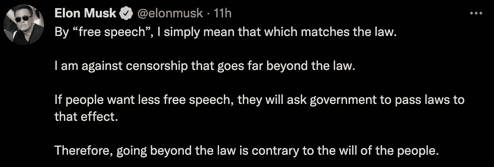
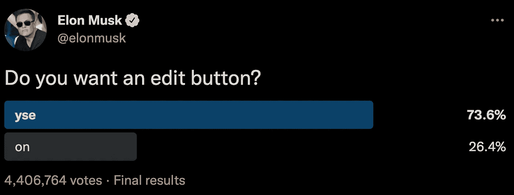

# 让免费的推特鸟发推特。

> 原文：<https://medium.com/geekculture/let-the-free-twitter-bird-tweet-83d60fe99afd?source=collection_archive---------13----------------------->

## 令人兴奋的更新提醒埃隆·马斯克以 440 亿美元收购 Twitter。

Twitter 我们自己的信息来源将被埃隆·马斯克占据，他是 Paypal、特斯拉、SpaceX、Neuralink 和 Boring company 等品牌的背后人物。如果你不知道这个事实，埃隆·马斯克曾经濒临破产，从那时起，他成功地取得了现在的成功和明星地位。在经历了所有这些疯狂的发展之后，他现在已经声名远扬，成为了亿万富翁。


Photo by [Edgar Moran](https://unsplash.com/@ymoran?utm_source=medium&utm_medium=referral) on [Unsplash](https://unsplash.com?utm_source=medium&utm_medium=referral)

像其他成功人士一样，埃隆·马斯克的故事值得每个骗子去了解。无论在哪个行业，每个人都尽自己的努力去获得成功。学习这样的故事将会拉近普通人和成功者之间的距离。

但主要是，这篇文章主要关注 Twitter，而不是 Elon Musk，当然，我们可以期待 Elon Musk 将带来的一些变化。我们将详细讨论一切。

在开始之前，Twitter 屏蔽的一个著名账户是美国第 45 任总统唐纳德·特朗普的账户。希望 Twitter 将他的账户列入白名单，但唐纳德·特朗普发表声明称，即使埃隆·马斯克接管 Twitter，他也不会回到 Twitter。他计划坚持自己的平台，即 Truth Social。


Photo by [History in HD](https://unsplash.com/@historyhd?utm_source=medium&utm_medium=referral) on [Unsplash](https://unsplash.com?utm_source=medium&utm_medium=referral)

现在，废话不多说，让我们来讨论一下我们所钟爱的 Twitter 的新特性。

```
**Table of content
 **  ∘ [Enhanced Product](#2c18)
  ∘ [Spam Control](#eda4)
  ∘ [Free Speech](#fc8a)
  ∘ [Twitter Edit Button](#dfa0)
  ∘ [Tweet Character Count.](#c693)
  ∘ [Open Source](#08c3)
· [Final Thoughts](#54d7)
· [About The Author](#d922)
```

## 增强型产品

任何产品，不仅仅是 Twitter，总会有增长的预期。但是新领导下的 Twitter 正计划将其算法开源，这将使产品获得用户的更多信任。尽管社会上可能有不良分子会利用它来获得不正当的优惠。但这是我们需要关注的事情，不能这么早预测。

## 垃圾邮件控制

它的另一个议程是光荣地与 spambots 战斗，像战士一样打败他们。所以会有真实可信的用户处理账号。其中一种情况是到处都是虚假的追随者。许多公司都有这样的商业模式，一旦我们给他们丰厚的报酬，就会增加我们的追随者。

这不仅仅是 Twitter 的问题，而是任何一个通过展示粉丝数量来展示用户优势的平台。我的建议是，为什么不去掉显示一个帐户有多少追随者的标志，让互动成为判断真实性的实际参数，因为 gaol 只是为了与世界分享你的知识。

但这不会发生，因为许多大机构都是按照这种商业模式来运作他们的产品。基于这些因素销售实际产品的各种营销公司和组织将受到严重影响。

## 言论自由

正如埃隆·马斯克所说，“言论自由是民主的基石，Twitter 是一个数字城市广场，在这里人们可以讨论对人类未来至关重要的问题。言论自由一直被认为是每个人都拥有的一项重要权利。甚至埃隆·马斯克也在推特上解释了言论自由的背景。



Screenshot from Twitter.com

就我个人而言，我有点怀疑他在这条推文中提到的言论自由的定义。当然，在讲台上应该有礼仪，在说任何话的时候都应该遵守法律。但是，如果政府是某种独裁者，只希望其公民以特定的语气说话，那该怎么办呢？

这是否扼杀了言论自由的目的？但希望用户一旦发言反对执政党就不会被屏蔽。审查制度将会存在，但畅所欲言的自由将会落实到算法中。

## Twitter 编辑按钮

我们可以在推特上发布我们的想法、想法、信息等。任何人都可以分享、转发、分享和喜欢这条推文。这几乎就是 Twitter 的功能。

一旦我们发布了任何消息、图像或任何相关的东西，我们就没有权力编辑我们的推文。Twitter 的创始人杰克曾经问过他，为什么 Twitter 上没有编辑按钮，因为作为一名软件开发人员，这个功能很容易实现。

实际上，不仅仅是提供功能，它还与 Twitter 的发展政策有关。正如我们不能否认的事实，Twitter 被认为是各种真相的来源。当一个重要的人发微博时，这条微博被认为是新闻。人们可以转发实际的推文来传播信息。

考虑到当前状态是真实的，任何其他用户转发该信息，但是如果实际信息稍后被编辑，会发生什么呢？转发信息的人也会被认为是他们没有出售的信息的传播者。

但根据埃隆·马斯克的调查，4406764 名参与者中有近 73.6%的人投票支持该功能。因此，我们当然可以期待这方面的一些变化。



Elon Must Poll about Twiter Edit Button Feature.

## 推特字数。

我们都知道，Twitter 是一个门户网站，不是用来写文章、文章或博客的。但主要是一个平台，分享你的想法在简洁的瘸子字限制。
虽然不像早期，一条推文的字符限制是 140 个左右，但现在已经增加到 280 个字符。

虽然即使在字符数增加后，它也引入了可以启动的线程。现在，用一根线就可以纠正 Twitter 上的一篇小文章。那么为什么不增加推文的字符长度呢？这次升级并没有大肆宣传，但看起来仍然是一个可能的选择。

## 开放源码

由于 Twitter 是一家公司，当然这是不可行的，他们将公开其源代码，因为这将是一个很大的安全问题。但是算法是他们声称要开源的东西。社区成员中的每个人现在都可以访问该算法。据称，这将提高用户之间的信任度。

将算法开源将是 Twitter 的一个关注点，因为任何理解算法的人都可以创建新版本的 Twitter。尽管要获得 Twitter 已经拥有的用户群并不容易，但一个更新的 Twitter 2.0 仍然可以在市场上看到。

从政治上来说，分享算法也令人担忧，但埃隆·马斯克在这方面肯定有更大的计划。他总是以做不寻常的事情而闻名。

# 最后的想法

Twitter 现在是一只自由的鸟，但受到一位以做开创性工作而闻名的企业家的影响。我们可以期待这个人有非凡的表现。

最近几年，有很多关于 Twitter 将要发生的变化的炒作。看到不同社交媒体巨头之间的战争，我们一定都很兴奋。脸书(现在是 meta)的创始人马克·扎克伯格在与他的新来者竞争时会面临一点困难。

如果你对你所期待的新的更新的 Twitter 有所了解，请在评论中分享它们，我很乐意听到它们。

# 关于作者

Apoorv Tomar 是一名软件开发人员，也是 Mindroast 的一员。你可以在[推特](https://twitter.com/apoorvtomar_)、 [Linkedin](https://www.linkedin.com/in/apoorvtomar/) 、[电报](https://t.me/ApoorvTomar)和 [Instagram](https://www.instagram.com/apoorvsinghtomar/) 上和他联系。订阅[简讯](https://www.mindroast.com/newsletter)获取最新策划内容。不要犹豫在任何平台上说“你好”,只需说明你在哪里找到我的资料