# 让水像瀑布一样流淌。

> 原文：<https://medium.com/geekculture/let-the-water-flow-like-a-waterfall-e8f8a10c7e7?source=collection_archive---------23----------------------->

## 目的:介绍 unity 中的 ***动画磁贴。***

拥有一个移动的世界可以让一个世界比到处都是静止的图像更有活力，它可能很微妙，但通过一些恰当的动画，它可以让一个场景变得生动。微弱的闪光或火焰，洞穴中的瀑布，甚至是随风摇曳的草。

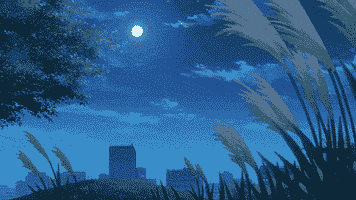

有了这个，我们将需要一些来自 unity 外包下载的帮助，谷歌“unity 2d tilemap extras”并打开 Github 链接下载代码，或者只需点击[这里](https://github.com/Unity-Technologies/2d-extras)。这是一个 unity 技术 Github，所以它应该可以安全下载。

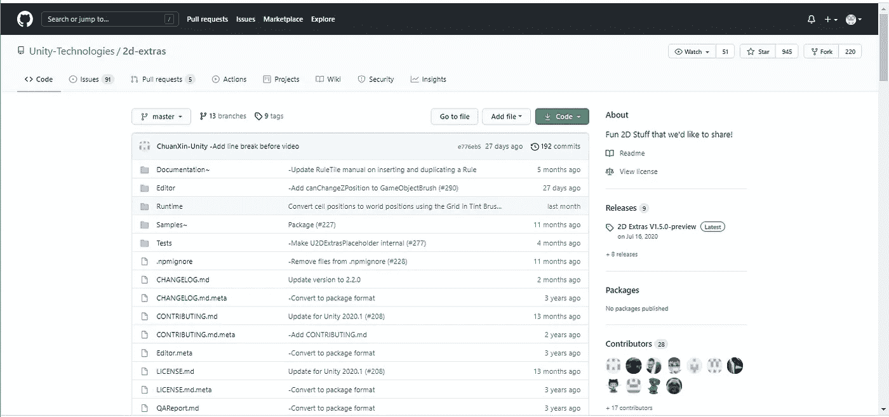

The web page should look something like this.

你可能需要查看分支才能获得在你的 unity 版本上工作的正确版本，我使用的是 2019.2.12f1，不得不下载 2019.4 版本，因为主版本在我的版本上不工作。

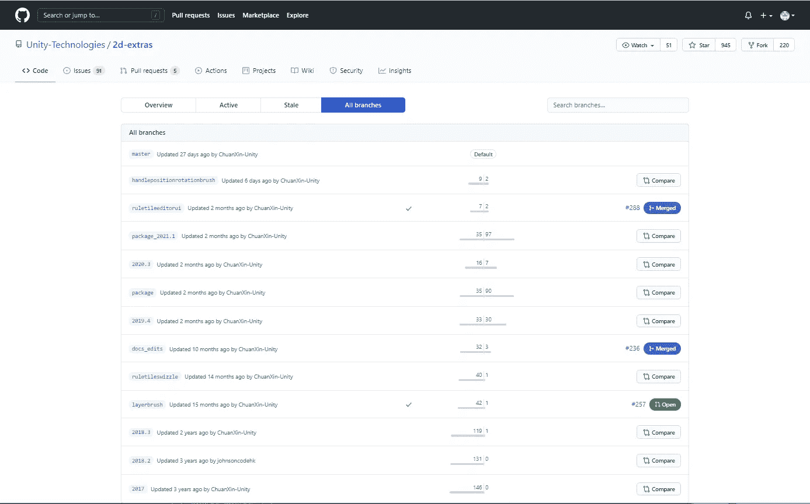

To get to this page, click the branches which is between “Master” and “Tags”

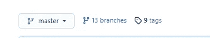

下载后，将文件夹移动到资产文件夹中。

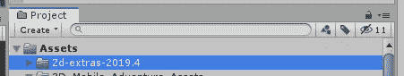

现在，当我们右键单击并选择创建，我们应该得到选项添加 2D >瓷砖>动画瓷砖。根据您下载的版本，它可能位于创建>平铺>动画平铺下

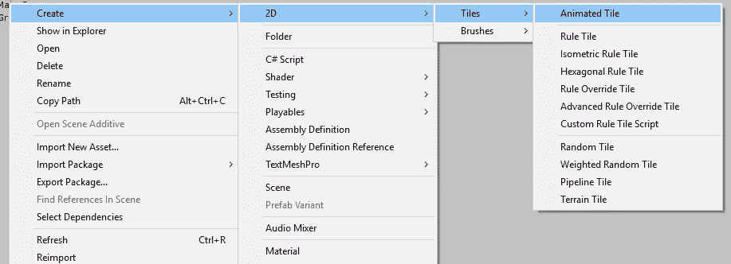

完成所有这些工作后，我们就可以开始制作将要放入 tilemap 的 tile 了。首先，创建一个动画单幅图块，并将其与其他单幅图块一起保存在名为瀑布的新文件夹中。

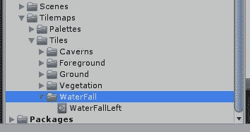

This animation is made up of 3 parts.

现在我们可以添加精灵。点击我们刚刚制作的动画精灵，你应该在检查器中看到这个。

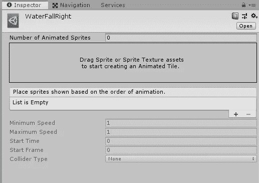

如果你有一个旧版本，你可能看不到拖动精灵框，这只是意味着它将需要一点时间。

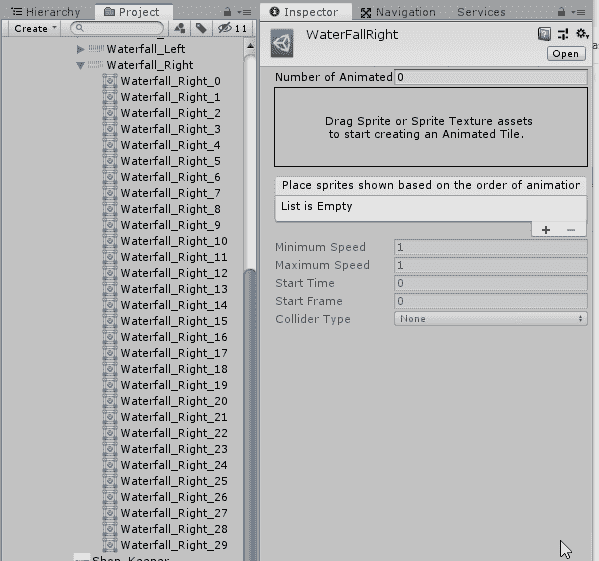

## 旧版本:

这里你需要为动画设置精灵的数量，并一个接一个地把它们拖到打开的地方。

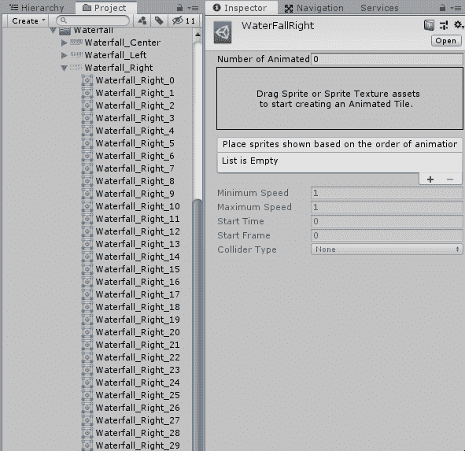

## 较新版本:

这个简单多了，你可以选择所有的精灵并把它们都拖进来。只要记住锁定检查器，这样当你选择要添加的精灵时，它就不会关闭动画精灵。

瓷砖做好之后，我们现在可以开始制作调色板来存放瓷砖了。正如我们在上一篇文章中所做的，单击 create New Palette，并将其命名为瀑布。

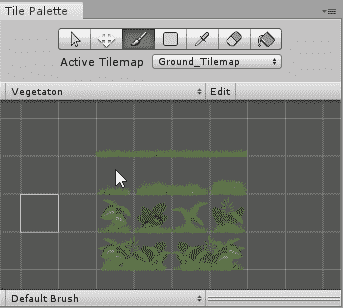

接下来拖动我们刚刚制作的动画瓷砖。

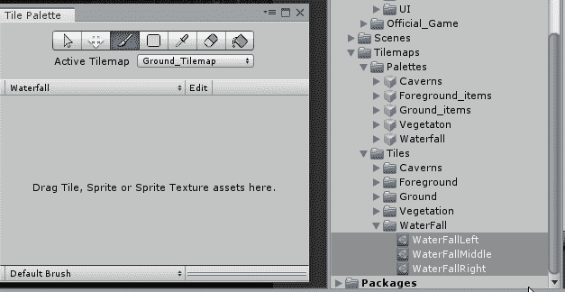

现在我们可以像绘制其他瓷砖一样将它们绘制到场景中。

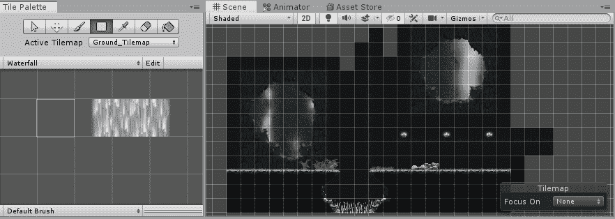

要让它们有动画效果，你必须进入播放模式。

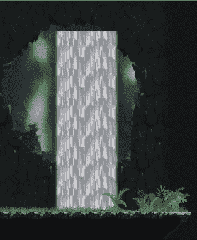

但是正如你所看到的，它移动得非常慢…我们可以通过返回到我们制作的动画瓷砖并更改它们的选项来解决这个问题。向下滚动到底部，直到你看到一个“最小速度”的选项，并将其设置为 30。完成后，带它去试运行。

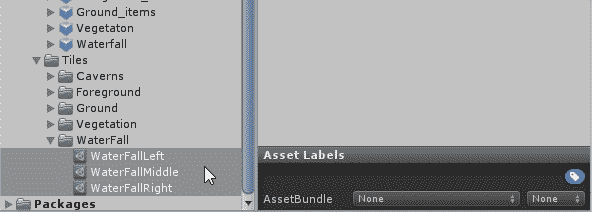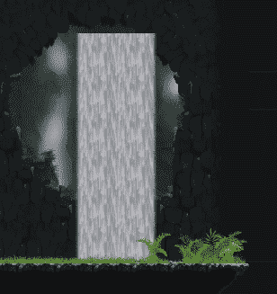

Speed-wise it’s better :)

制作瀑布的精灵中间有一部分看起来像一滴眼泪。我将不得不进入精灵，并做一些改变来修复它，但除此之外，它看起来不错。

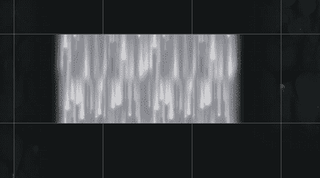

Right in the middle, top and bottom join perfectly though!

虽然精灵确实需要一些调整，但这是向 tilemap 添加动画精灵的基础。