# 快速构建和部署机器学习应用

> 原文：<https://medium.com/geekculture/lets-build-and-deploy-your-first-machine-learning-app-fa350ec6b5cf?source=collection_archive---------10----------------------->

## 使用 Python、Streamlit 和 Heroku 构建和部署机器学习模型的分步指南


Photo by [Andrea De Santis](https://unsplash.com/@santesson89?utm_source=medium&utm_medium=referral) on [Unsplash](https://unsplash.com?utm_source=medium&utm_medium=referral)

这是一个美好的日子，你现在已经准备好构建和部署你的第一个机器学习应用了。

但你对此表示怀疑。

别担心，今天我们将一起从头开始构建一个机器学习应用程序，并将其部署在云平台上。

本文将帮助你使用 Streamlit 快速构建一个机器学习 app，并将其部署在 Heroku 平台上。这将有助于增强你用自己独特和创新的想法构建更多机器学习应用程序的信心。

让我们开始吧。

请注意，本文将分为 3 个部分:

第 1 部分:从头开始构建模型

第 2 部分:为模型创建应用程序

第 3 部分:部署模型

# 第 1 部分:从头开始构建模型

我们将使用 Scikit learn library 中的经典鸢尾花数据集来创建我们的鸢尾花预测应用程序。

在你们的朱庇特笔记本上。

我们先导入一些库。

如果您的系统中没有安装这些库，您可以执行以下任一操作来获取它们:

在 jupyter 笔记本中创建一个新单元格，然后键入

```
!pip install “libraryname”
```

(提到库名时不要使用双引号)

例如，如果您想安装 pandas，请键入

```
!pip install pandas
```

从下载并保存项目文件的项目目录中打开系统终端/命令提示符，并键入

```
pip install -r requirements.txt
```

你可以在 https://github.com/Retinpkumar/Iris-flower[找到这篇文章的文件](https://github.com/Retinpkumar/Iris-flower)

完成后，让我们继续导入创建应用程序所需的库。

```
# data manipulation
import numpy as np
import pandas as pd

# data transfer
import joblib

# raw dataset
from sklearn.datasets import load_iris
```

现在，让我们加载数据集并查看与之对应的键。

```
iris = load_iris()
iris.keys()
```

我们发现数据集以字典的形式存储在 Sklearn datasets 模块中。让我们访问几个键来获取我们需要的数据。

DESCR' key 给出了数据集的详细描述。但是为了以正确的格式查看它，让我们根据换行符来拆分字符串。

```
iris.DESCR.split("\n")
```

哇哦。信息量很大。

当你有时间的时候，请随意浏览它。这同样适用于 Sklearn 包中的所有数据集。

现在，让我们通过访问“数据”变量来创建要素的数据框

```
# creating dataframe
data = pd.DataFrame(iris.data, columns=iris.feature_names)# printing observations
print(f"The data has {data.shape[1]} features and {data.shape[0]} observations.")# checking first 5 observations
data.head()
```

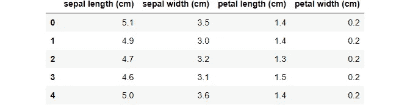

Iris dataset (image by [author](/@retinpkumar))

我们的数据列看起来有点复杂。让我们通过创建一个字典映射来简化它。

```
data = data.rename(columns={
    'sepal length (cm)':'sepal_length', 
    'sepal width (cm)':'sepal_width', 
    'petal length (cm)':'petal_length',
    'petal width (cm)':'petal_width'
})
data.head()
```

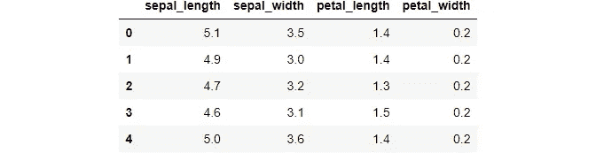

Mapped columns (image by [author](/@retinpkumar))

现在，我们的数据框看起来很棒。我们可以保存它以供进一步参考，但这不是必需的。

```
# save data if needed
data.to_csv('data.csv', index=False)
```

现在我们已经有了输入特性，让我们来研究一下目标特性。

```
# explore target
iris.target
```

似乎我们有 3 种不同类型的目标类(这是显而易见的)。

所以，

0 表示“鸢尾-Setosa”，

1 代表“鸢尾-杂色”，以及

2 代表“鸢尾-海滨”。

```
# add target to dataframe
data['Target'] = iris.target
data.head()
```

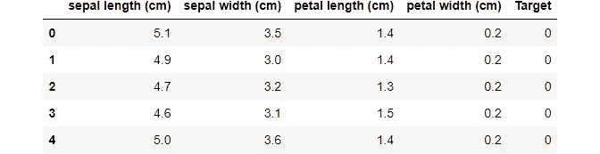

Datset with target (image by [author](/@retinpkumar))

让我们检查一下目标成分

```
# check target composition
data['Target'].value_counts()0    50
1    50
2    50
Name: Target, dtype: int64
```

看起来不错。在我们的目标特性中，所有的类都有相同的代表性。

让我们快速检查一下我们的数据中是否缺少任何值。

```
# check missing values
data.isnull().any()sepal_length    False
sepal_width     False
petal_length    False
petal_width     False
Target          False
dtype: bool
```

伟大的...我们的数据集中没有任何缺失值。

我们现在将数据集分为目标要素‘y’和输入要素‘X’。

```
# split data
y = data['Target']
X = data.drop(columns=['Target'], axis=1)
```

现在，我们将把数据分成训练数据集和测试数据集。

我们将创建一个几乎占总数据大小 25%的测试集。

```
# create train and test sets
from sklearn.model_selection import train_test_split
train_X, test_X, train_y, test_y = train_test_split(X, y, test_size=0.25, random_state=7)

print(train_X.shape, test_X.shape, train_y.shape, test_y.shape)(112, 4) (38, 4) (112,) (38,)
```

我们将使用逻辑回归模型来进行分类预测，因此我们将缩放输入要素，以使算法更容易进行预测。

我们将首先通过调用 fit_transfer 方法来缩放我们的训练数据，以便 fit 方法将从训练数据中捕获参数，用于转换测试数据。

我们甚至可以对测试数据使用 fit_transform 方法，但是如果测试数据只有一行输入，那么 fit 方法将无法从测试数据中捕获参数。

因此，我们使用来自训练数据的参数来缩放测试数据。

请确保在缩放训练数据后保存标量文件，并使用它来转换测试数据。

```
from sklearn.preprocessing import StandardScaler
scaler = StandardScaler()

train_X_scaled = scaler.fit_transform(train_X) # scaling training data

#save scaler
joblib.dump(scaler, 'standard_scaler.sav')

test_X_scaled = scaler.transform(test_X) # scaling testing data['standard_scaler.sav']
```

现在让我们从 Sklearn 库中导入一个逻辑回归模型，并创建一个模型对象。

```
from sklearn.linear_model import LogisticRegression

model = LogisticRegression()
```

我们正在处理一个多类分类问题，其中我们的目标特征有三个不同的类。

默认情况下，Sklearn 库中的逻辑回归模型被启用来处理多类分类任务，参数 **multi_class** 被设置为**“自动”**，默认情况下将使用**“多项式”**方法进行多类分类。

因此，现在我们将继续用逻辑回归的基本模型来解决我们的问题。

如需进一步参考，您可以访问下面的[链接](https://scikit-learn.org/stable/modules/generated/sklearn.linear_model.LogisticRegression.html#:~:text=%E2%80%98auto%E2%80%99%20selects%20%E2%80%98ovr%E2%80%99%20if%20the%20data%20is%20binary%2C%20or%20if%20solver%3D%E2%80%99liblinear%E2%80%99%2C%20and%20otherwise%20selects%20%E2%80%98multinomial%E2%80%99.)

现在让我们来拟合我们的模型并进行预测

```
# fitting model
model.fit(train_X_scaled, train_y)LogisticRegression()# Making predictions using test data
y_pred = model.predict(test_X_scaled)
```

现在，我们已经使用测试数据集进行了预测，我们现在将计算准确性指标，以查看我们的模型是否足够好。

因为我们的目标只是创建一个模型并部署它，所以我们不会继续提高我们的准确性或任何其他分类指标。

```
# calculating accuracy
from sklearn.metrics import accuracy_score

accuracy = accuracy_score(test_y, y_pred)
accuracy0.8947368421052632
```

我们的模型运行得很好。

因此，我们现在将保存我们的模型文件，以便我们可以导入该文件来创建我们的应用程序进行部署。

```
# save model
joblib.dump(model, 'model.sav')['model.sav']
```

# 第 2 部分:为模型创建应用程序

你知道我是如何在项目目录中创建和排列项目文件的吗阅读这篇关于[**如何组织你的数据科学项目文件**](/geekculture/how-to-organize-a-data-science-project-directory-aa4d7c9f6156)

在本节中，我们将重点创建三个主要的应用程序文件:

1.  **app.py**
2.  **model.py**
3.  **scalar.py**

让我们从 **"model.py"** 开始

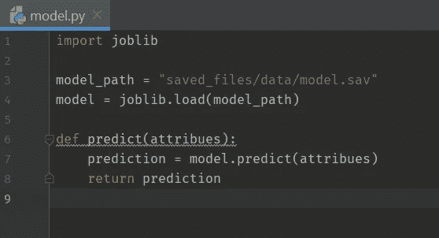

Creating model file (image by [author](/@retinpkumar))

该文件将用于使用来自用户的输入数据进行预测。

因此，我们将创建一个函数，它将用户输入作为其参数，并在我们保存的模型的帮助下返回一个预测值。

现在，我们将创建我们的 **"scalar.py"**

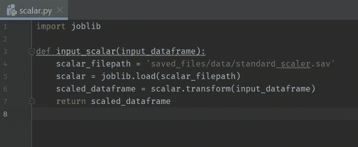

Creating scaler file (image by [author](/@retinpkumar))

该文件将输入数据帧作为其参数，并使用我们保存的标量对象返回缩放的输入数据帧。

最后，是时候创建我们的“app.py”了

我们将使用 Streamlit 库制作我们的应用程序。

因为我们提供了一个数据帧作为创建标量对象的输入，所以我们必须导入 pandas 库来创建用户输入的数据帧。这个数据帧必须被提供给我们的标量对象，以生成用户输入的缩放版本，从而进行最终预测。

因此，我们将在**“app . py”**中导入 Streamlit 和 Pandas 以及我们的模型文件

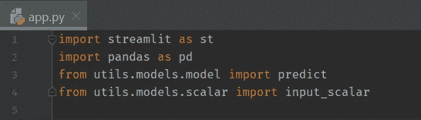

Importing libraries (image by [author](/@retinpkumar))

我们将使用 streamlit 库中的 st. **set_page_config** 方法设置我们的应用程序显示页面设置。

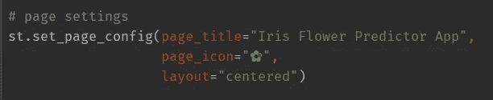

Setting app page configuration (image by [author](/@retinpkumar))

使用 **st.title** 为应用程序表单设置标题文本。

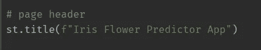

Giving app title (image by [author](/@retinpkumar))

现在，我们将使用 **st.form** 创建我们的用户输入表单。

在表单内部，我们将使用 **st.header** 创建一个表单标题，并使用 **st.number_input** 和 **st.slider** 创建输入元素。

使用输入文本字段或滑块对象完全是你的选择。我实现这两个只是为了演示。

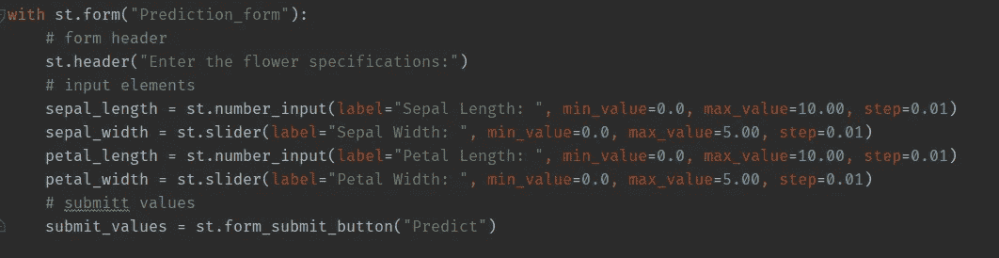

Creating app form (image by [author](/@retinpkumar))

现在我们已经准备好了表单，让我们继续处理输入并进行预测。

这应该是不言自明的，除了 **st.balloons** 方法，它只不过是我们成功预测的一个很酷的图形说明。

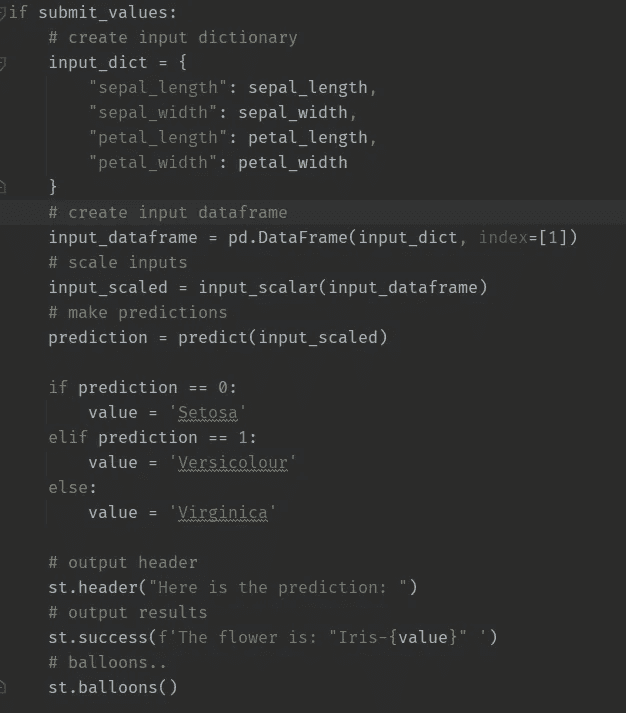

Complete app (image by [author](/@retinpkumar))

如果你已经走了这么远，拍拍自己的背。

现在，您已经成功地创建了第一个用于预测鸢尾花类的机器学习模型。耶…

现在，要检查您的应用程序是否正在工作，请在项目目录中打开终端/命令提示符，或者在 IDE 中使用 CLI 并键入

```
streamlit run app.py
```

万岁…现在你可以在默认浏览器中与你的应用程序进行交互，并做出预测。

现在，我们将进入第 3 部分，我们将在云平台上部署我们的应用程序。为此，我们将利用 GitHub 和 Heroku。

但在此之前，您还需要一些其他文件。

## 从 **"requirements.txt"** 文件开始安装库。

为了创建“requirements.txt”文件，在您的项目目录中打开终端并键入

```
pip install pipreqs
```

安装 [**pipreqs**](https://pypi.org/project/pipreqs/) 库。安装完成后，在终端中输入

```
pipreqs --encoding=utf8  --debug  "path/to/project"
```

确保在**“路径/到/项目”**处输入您的项目目录的实际路径。

这将自动为您的项目创建 **"requirements.txt"** 。

## 其他 3 个重要文件

现在，在您拥有 **"app.py"** 和 **"requirements.txt"** 文件的目录中，再创建 3 个名为 **Procfile、runtime.txt** 和 **setup.sh** 的文件

在 **"setup.sh"** 中，键入以下内容并保存:

```
mkdir -p ~/.streamlit/
echo "\
[general]\n\
email = \"your-email@domain.com\"\n\
" > ~/.streamlit/credentials.toml
echo "\
[server]\n\
headless = true\n\
enableCORS=false\n\
port = $PORT\n\
" > ~/.streamlit/config.toml
```

现在，打开您的**“Procfile”**，输入并保存:

```
web: sh setup.sh && streamlit run app.py
```

然后打开你的**“runtime . txt”**，输入你的 Python 版本如下:

```
python-3.8.8
```

如果您不确定您的 python 版本，请打开您的终端并键入:

```
python --version
```

复制文本并粘贴。就这么简单。

现在转到在云平台上部署我们的模型。

# 第 3 部分:部署模型

我将跳过创建 GitHub repo 的部分，因为我假设您知道如何创建 GitHub 存储库。

因此，假设您已经创建了 GitHub repo，并将所有项目文件从本地 git 上传到项目 repo，现在访问[https://dashboard.heroku.com/apps](https://dashboard.heroku.com/apps)并创建一个**“新应用”**，如下所示:

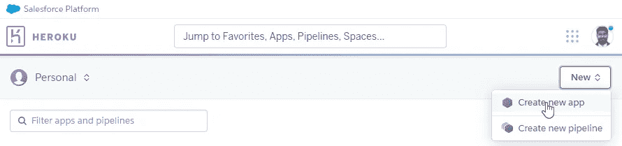

Creating new app in Heroku (image by [author](/@retinpkumar))

给你的应用命名，点击**创建应用**

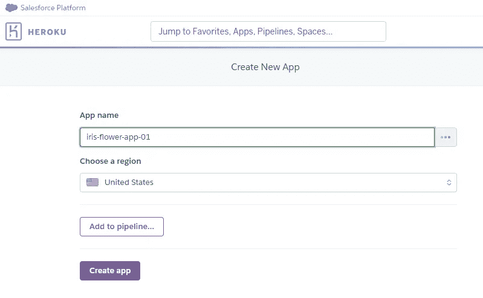

Giving app name (image by [author](/@retinpkumar))

现在，您将转到一个如下所示的页面

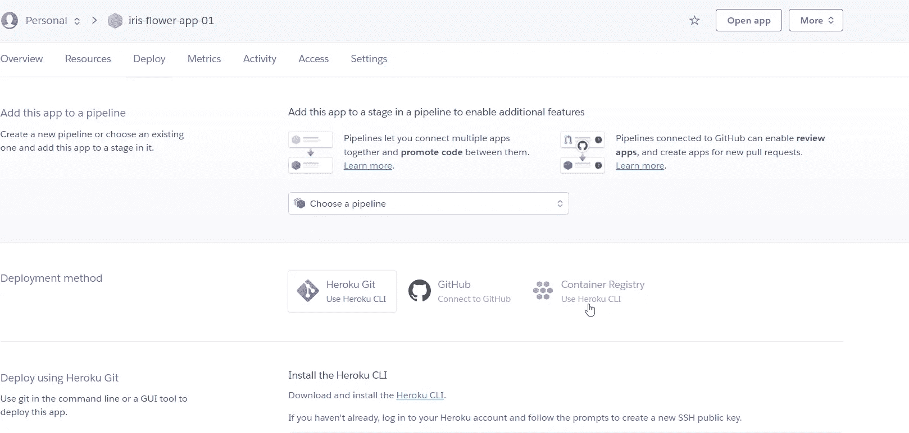

Selecting deployment pipeline (image by [author](/@retinpkumar))

单击 GitHub 图标，在搜索字段中输入您 GitHub repo 名称，然后单击“搜索”。然后按“连接”。

现在，您将看到几个如下所示的选项:

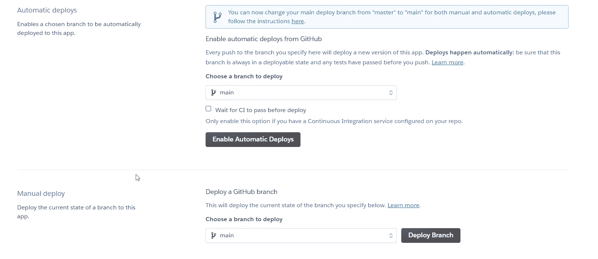

Enabling automatic deploy (image by [author](/@retinpkumar))

点击**“启用自动部署”**，因为当您在 GitHub repo 中修改与应用程序相关的文件时，这将对您的应用程序进行更改。

然后点击**“部署分支”**，等待一段时间。

与此同时，您可以通过该窗口享受观看应用部署的乐趣。

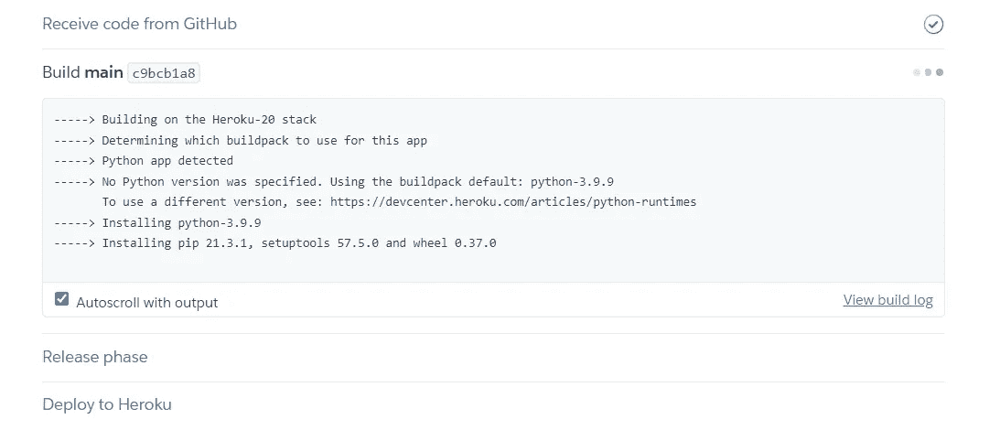

Deploying the app (image by [author](/@retinpkumar))

成功部署后，您将看到类似这样的内容:

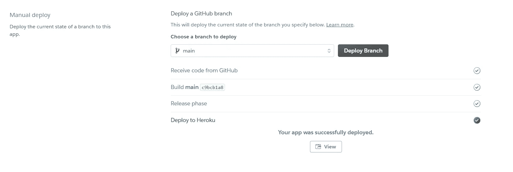

App successfully deployed (image by [author](/@retinpkumar))

耶…

不，等等...

大多数情况下，您会收到一条错误消息，并被重定向到此页面:

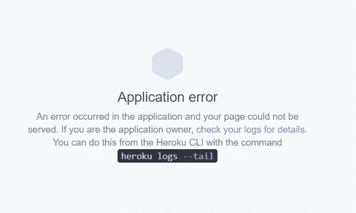

Deployment error (image by [author](/@retinpkumar))

但是不用担心。

这只是一个**错误:503** 这意味着 Heroku 服务器还没有准备好托管你的应用。所以，给它一些时间，稍后再回来检查。肯定会部署的。

出于个人原因，我不会部署我的应用程序，但你可以在我的 GitHub repo [这里](https://github.com/Retinpkumar/Iris-flower)获得代码。

如果你能成功地部署它，没有任何错误，那么干杯！！！…

成功部署后，应用程序现在应该如下所示:

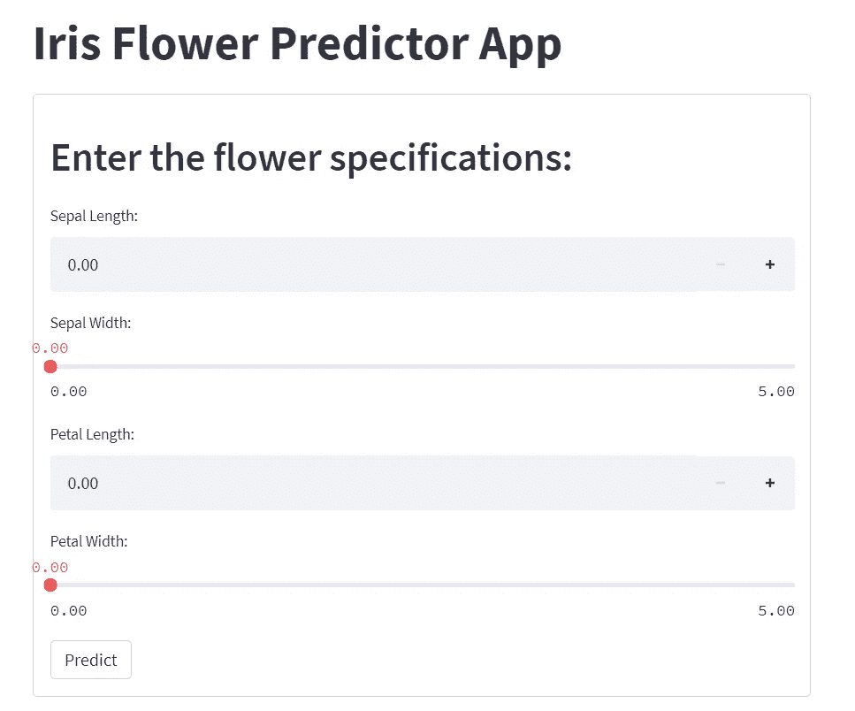

Final app (image by [author](/@retinpkumar))

恭喜你。！现在，您已经成功地从头构建了一个模型，并将其部署在云平台上。

我希望你喜欢这篇文章。关注我以获得更多可操作的内容，并随时发布您的评论和宝贵反馈