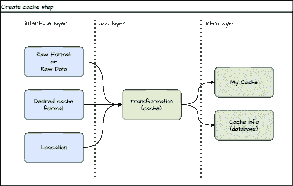
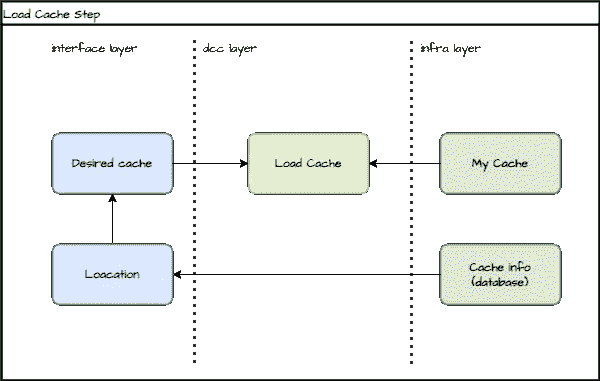
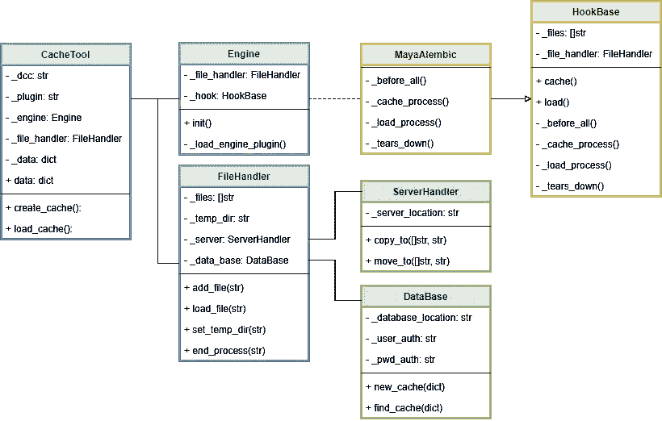

# 让我们编写一个缓存工具

> 原文：<https://medium.com/geekculture/lets-code-a-cache-tool-1232d324404c?source=collection_archive---------18----------------------->

好的，我想你现在在这里是因为有人让你做一个 *Alembic* 缓存或 *Yeti* 缓存，而你根本不知道如何按照软件工程和软件架构最佳实践来做。如果你知道或者找到了不同的方法，或者只是不同意这个故事的某些部分，请告诉我！

有时候写很多缓存函数很无聊，很难做维护，不是吗？。如果你从一开始就没有正确地做这件事，你的余生都将与它一起工作，修补和修复缓存错误。

也许所有更大的动画工作室都有一些导出和导入缓存的工具，但是，我这篇文章的想法是创建一个可靠的架构，给你一个启动或改变缓存工具的方法。

## 为什么我需要创建缓存，我们可以把缓存看作什么？

也许你已经面对了一个完全破碎的场景。许多几何体具有许多变形历史、着色器，并且由于某些您不知道的原因，几何体开始随机行为。

大概在某个时候，你需要整合软件，就像玛雅和胡迪尼。把一些数据从一个带到另一个。

这些需求以及许多类似的需求由来已久，许多人已经面临着这些需求。许多这种情况的解决方案是创建一种“更干净”的中间格式——只交换必要的数据。

所以我考虑缓存所有的东西，你会把它保存在某个地方，以便以后给你的场景带来安全。举几个最著名的例子:

*   **着色器缓存:** MaterialX，MayaASCII，Maya Binary。
*   毛皮/头发贮藏处:雪人(。皮草，。grm)、XGen、Ornatrix。
*   **几何缓存:**OBJ FBX 阿莱姆比克，美元。
*   **代理几何体:**每个渲染器都有自己的代理格式，像 VRProxy 和 VRScene (VRay)这样，这取决于你的工作室有哪种渲染器。
*   **着色器缓存:**materilx，MayaASCII，Maya 二进制。
*   **毛皮/毛发贮藏处:**雪人(。皮草，。grm)、XGen、Ornatrix。

## 代码抽象——为什么它很重要？

在谷歌上搜索代码抽象，我发现了 [DZone](https://dzone.com/articles/why-abstraction-really#:~:text=Abstraction%20is%20one%20of%20the,It%20helps%20decouple%20software%20elements.&text=When%20developing%20with%20higher%20level,behavior%20and%20less%20the%20implementation.) 的这个帖子，他们在开头写道:

> 抽象是优秀软件设计的关键要素之一。它有助于封装行为。它有助于分离软件元素。这有助于拥有更多自包含模块。还有更多。
> 
> 抽象使得应用程序更容易扩展。这使得重构变得更加容易。当用更高的抽象级别开发时，你交流的是行为而不是实现。

除此之外，想想下面这个案例。您已经编写了一个 Maya alembic 导出器，它将数据保存在本地数据库中。现在，根据特定的项目需求，您需要编写一个 Alembic Blender 导出程序和一个与 Maya Alembic 导入程序的连接，并且您需要尽快完成，因为该项目有一个截止日期。如果你的应用程序依赖 Maya，你将需要重新编码所有的东西，或者只是做很多的“*变通方法*”来快速完成。在项目结束时，您将赋予一个小小的“*代码怪物*生命，它将在您所做的每个“*工作区*中成长。

在这个例子中，你可以扩展到许多其他情况。例如，现在你需要使用渲染农场导出；现在您有了一个不需要任何 DCC 就能工作的资产管理器；现在你需要把这个数据和这个缓存保存在云上；诸如此类。

请不要做变通(我知道有时这是必要的，但不要基于它创建所有的管道)。不要给小代码怪物生命。抓住缰绳，努力正确地构建它，并意识到整体。

## 缓存抽象

创建缓存是插件 API 的责任(例如，Alembic、XGen、Ornatrix、Yeti ),它密切依赖于 DCC API。

例如，在 Maya 上编写 Alembic 缓存与 Houdini 完全不同，但是这两个函数在同一个 [*有界上下文*](https://medium.com/r?url=https%3A%2F%2Fen.wikipedia.org%2Fwiki%2FDomain-driven_design) 上，结果本身也是一样的。abc 文件格式)。因此，如果您单独编写这些代码，将会重复许多不必要的代码，并且将依赖复杂的 DCC 环境来导出和读取这些数据。

所以我认为，如果我们创建一个缓存抽象 API，将使它更容易扩展。

思考该工具的[用例](https://en.wikipedia.org/wiki/Use_case)。我们可以将它分为两种用例:第一种是当美工想要将您的作业导出为另一种格式时，第二种是当美工想要导入导出的缓存时。

该应用程序可以分为三层:

**1-接口层:**抽象层，它不依赖于 DCC、插件库和您的操作系统，并提供了访问我们工具的通用方法。

**2- DCC 层:**DCC 和插件实现。

**3-基础层:**基础集成。例如，如果您需要在缓存之前在云上保存或在用户 temp 上保存/复制文件。所有你需要在这一层编码的东西。

在第一步中，我们需要为我们的工具提供一些东西来制作缓存，如网格选择、顶点数据等，所以我只是在第一个蓝框中概括了所有这些信息，调用 Raw format 或 Raw Data(见下一张图，“第一个用例”)。因为这一层是抽象的，它不知道你想要哪种缓存，所以你将需要告诉它。最后，您需要提供一个将被保存的位置。

DCC 层将获得所有这些信息，加载必要的插件，并导出缓存。例如，底层将获得缓存的文件，并将它们传输到您的服务器。稍后您将需要获得这些信息，因此您需要将其保存在数据库中。如果你有项目经理的话，你也可以在这里与他进行整合…市场上有很多选择，比如散弹枪和 FTrack。如果您有一个数据库，但没有本地数据库，将它与您的项目经理集成是一个好主意。

First use case

我们已经导出了缓存，现在我们想把它放到另一个场景中。为此，我们需要提供我们想要的缓存，以及您各自的位置。DCC 将使用基础类将它们加载到场景中。很简单，不是吗？

Second use case

## 开始前的一些考虑

*   **基础设施层** 假设你只使用 windows，你所有的文件都在你的服务器上。需要一个应用层来处理它吗？可能不会，但你不知道什么时候会需要它。例如，冠状病毒使我们在家里工作，它带来了许多基础设施的挑战。我们需要从本地缓存导出改为云渲染场导出。使用不同的环境，如个人艺术家工作站等。
    如果你的缓存文件保存在你的本地服务器上，你不需要很多代码来管理它，但是把带来和放入你的服务器的代码分开会更安全。同样，通过上下文分离代码是创建良好代码设计的一种方式。
    我把数据库放在底层，因为这些数据在财务上是存在的。但是它包含的访问这些数据的 API 太简单(在某些情况下太复杂)。如果你喜欢 DDD(领域驱动设计)和微服务，你可能会建议为服务创建一个数据库，或者为每个管道工具创建一个数据库。我在这个例子中这样做了，但是我知道这并不总是可能的。大多数时候，您有一个数据库用于您的管道，或者您使用散弹枪数据库或 FTrack 数据库。如果您有一个用于许多工具的数据库，您将需要构建您的数据库以最小化依赖性，并且，无论如何，您将需要创建一个层来访问这些数据并更安全地操作它。
*   **接口层** 知道哪些数据将被转换的责任是另一个工具。可能是您发布工具或资产管理器。因此，该工具只接收一个数据集合(图中的“原始数据”)，其中包含 DCC 层需要的所有信息。
    location 类或 File Handler 类将是一个特殊的类，需要传递到 DCC 层来处理有关缓存过程的所有信息。这个类将告诉 DCC 进程缓存将保存在哪里，以及是否将首先保存在临时文件夹中。例如，它会告诉你的数据库有多少文件被导出或导入。我想在接下来的图表中会有更多的解释。
    有一件事是不必要的，但我认为是一个好主意，就是先导出到本地(在一个用户临时文件夹中)，然后将这些文件复制或移动到你的本地数据库或你的云 FTP 服务器上。服务器上的缓存会消耗您的网络速度，如果您想到许多人在同一台服务器上工作，并且您的工具同时导出，您可能会遇到零星的错误或延迟。这个类将负责告诉 DCC 首先导出到哪里，然后，它将负责告诉您的基础结构层将这些文件复制或移动到服务器。

## 类图

基于我们的第一个和第二个用例，我创建了下面的类图:

CacheTool 类是该工具的前端，负责提供一种方法让用户放置数据并调用方法 create_cache()或 load_cache()(分别是第一个和第二个用例)。

引擎类负责通过私有方法 _load_engine_plugin()自动动态加载所需的缓存类。

所有导出和导入都将实现 HookBase 类，该类将证明您具有相同的功能和相同的实现。

## 履行

抱歉，伙计，还没有代码实现。我正在努力做其他的事情，我会尽快编辑这个部分并发布一个 Github 链接到这个项目。现在，你可以自由地尝试和实现自己，也可以自由地对你的经历发表评论。如果这些能帮到你，我会很高兴的。