# 让我们用 Python 在 Google Sheets 上创建一个加密货币股票数据库

> 原文：<https://medium.com/geekculture/lets-create-a-crypto-ticker-database-on-google-sheets-with-python-a5a961e91332?source=collection_archive---------0----------------------->

在这个数据就是金钱的世界里，数据库无异于银行。然而，他们的伟大之处在于他们的多样性。它们有如此多的类型和如此多的选择，以至于像我们这样的数据工程师都被它们宠坏了。今天我们来谈谈其中一个更好的免费软件——T2 谷歌表单

Google Sheet 以其类似电子表格的功能和更多功能而闻名。然而，没有多少人意识到，凭借其基于云的数据存储方法、更大的行限制(500 万，而 MS Excel 为 110 万)以及每个文件 200 张工作表，一张 google 工作表可以容纳惊人的 10 亿条记录！不错吧？所以，让我们进入我们的情况。


Photo by [André François McKenzie](https://unsplash.com/@silverhousehd?utm_source=medium&utm_medium=referral) on [Unsplash](https://unsplash.com?utm_source=medium&utm_medium=referral)

我们的任务分为几个步骤。我会用相关的截图，链接，当然还有 Github 链接来解释每一步。所以，我们开始吧:

*   激活 Google Drive 和 Sheets API
*   生成认证凭证并将它们链接到相关的表
*   启动我们的 python 代码，让数据流动起来！

# ***先决条件***

在进入这些步骤之前，让我们先来看看实现这一点需要做些什么:

*   一个谷歌账户
*   Python 的基础知识
*   爱情！

好的，现在让我们从步骤开始…

# **激活 Google Drive & Sheets API**

首先要做的是激活 Google APIs，这样我们就可以在发送数据的同时与它们对话。以下是步骤:

**激活**

*   如果没有项目，请转到[https://console.cloud.google.com/](https://console.cloud.google.com/)创建一个项目。你需要一个谷歌账户。
*   接下来，去[https://console.cloud.google.com/apis/dashboard](https://console.cloud.google.com/apis/library)搜索 Google Drive 和 Google Sheets API。
*   转到 API 的每个页面并激活它

# 生成认证凭证并将它们链接到相关的表

这是一个棘手的部分。在这里，我们希望通过创建相关凭证，然后将它们链接到我们的 Google sheet，来确保我们能够访问我们的 API

**生成凭证**

要创建凭据，请执行以下步骤:

*   转到[https://console.cloud.google.com/apis/credentials](https://console.cloud.google.com/apis/credentials)，点击“创建凭证”并选择服务帐户
*   在表格中输入详细信息，然后按“完成”

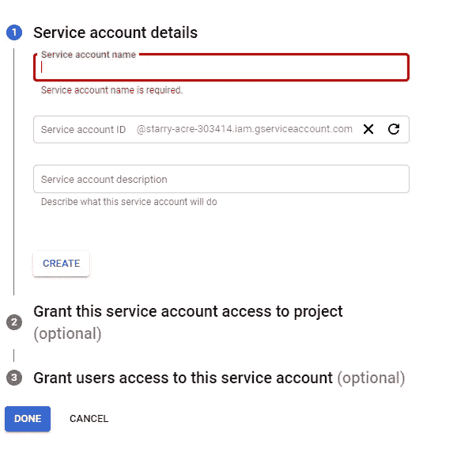

Form to create a service account

*   接下来，返回到第一步中提供的链接，并从 service accounts 下选择您刚刚创建的服务帐户

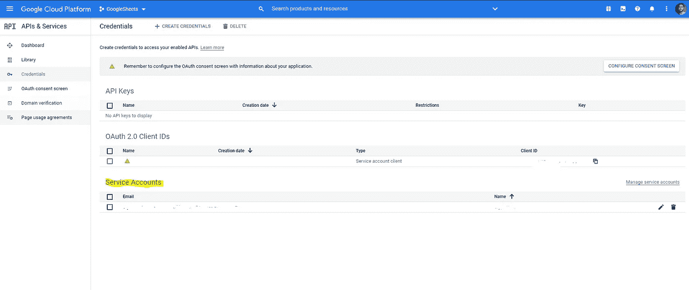

Click on the email under a service account

*   接下来，当新页面打开时，在“密钥”下，选择“添加密钥”，然后选择“创建新密钥”。最后，在对话框中，选择 format as JSON 并单击 Create

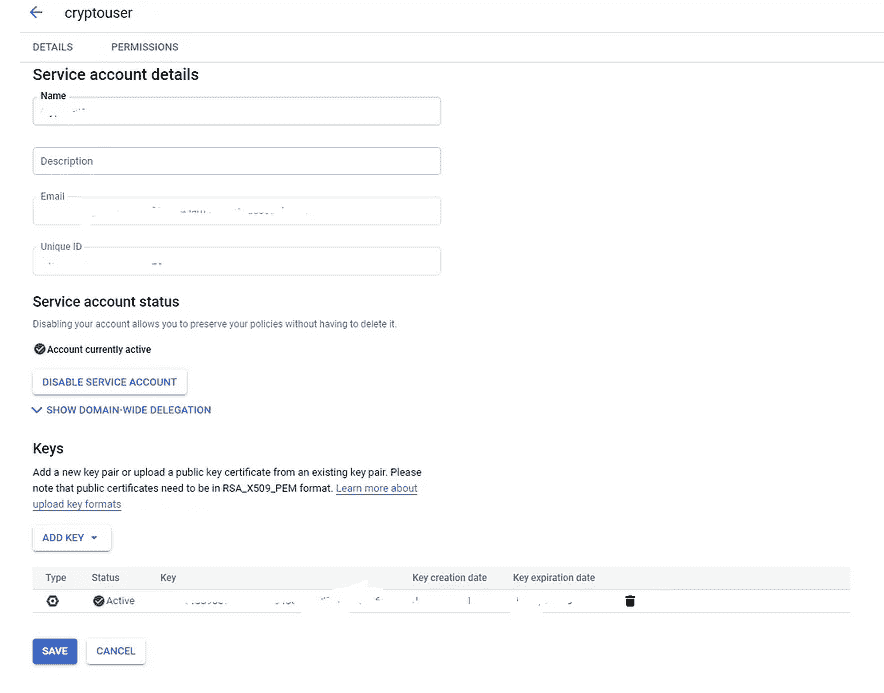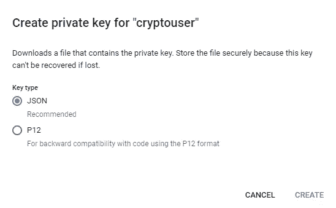

*   单击创建后，将创建一个新的 JSON 凭据文件。下载并妥善保管。这对接下来的步骤很重要

**提供许可**

*   对于这一步，在您的 google drive 上创建一个工作簿
*   接下来，将其与您生成的服务帐户电子邮件共享
*   搞定了。

如果第一步和第二步令人困惑，这里有一些来自谷歌官方文档的链接

*   https://developers.google.com/drive/api/v3/enable-drive-api
*   [https://developers . Google . com/identity/protocols/oauth 2/service-account](https://developers.google.com/identity/protocols/oauth2/service-account)

# **代码！**

开始之前，我先分享一下 GitHub 链接。

> [https://github.com/abhikchakraborty92/VCP.git](https://github.com/abhikchakraborty92/VCP.git)

现在让我们来看看这些步骤:

**认证步骤**

*   还记得我们下载的 JSON 文件吗？我在 Github 的 config 文件夹中保存了一个样本。用来验证我们的请求。下面是相同的截图

```
{  
"type": "service_account",  
"project_id": "some id",  
"private_key_id": "some long key",  
"private_key": "very very very long key",  
"client_email": "email id for which access has to be provided to your google sheet",  
"client_id": "client unique id",  
"auth_uri": "auth url",  
"token_uri": "token url",  
"auth_provider_x509_cert_url": "authentication provider certification url",  
"client_x509_cert_url": "client certification url"
}
```

*   接下来，我们必须下载几个库。使用 **requirements.txt** 文件将它们发送到您的系统中！
*   下载完库之后，我们将使用 **src** 文件夹中的 **googleauthenticate.py** 脚本进行身份验证。图书馆 **gspread 和 oauth2client** 会帮助我们。该脚本包含完成它的所有步骤。唯一需要的是凭证文件和在 **config.json** 配置文件中的一些更改，我们将在下面看到。使用 **googleworkbook** 函数，我们连接工作簿

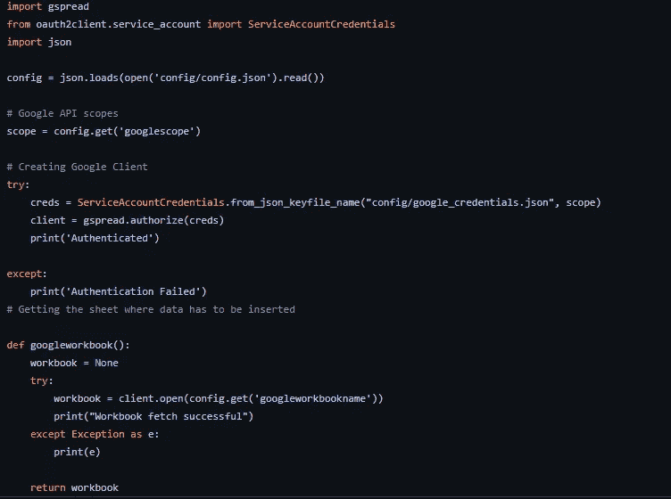

googleauthenticate.py

**配置**

*   接下来，让我们看看配置文件。我已经在配置文件夹下发布了相同的内容。该文件分为几个部分。让我们先浏览一下谷歌部分

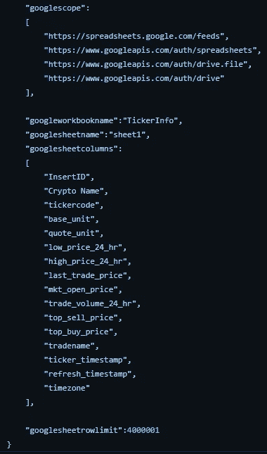

1.  这里， **googlescope** 变量存储认证所需的范围。您可以看到我在 **googleauthenticate.py** 脚本中的**范围**变量内读取了相同的内容
2.  **googleworkbookname** 和 **googlesheetname** 是它们所建议的——工作簿和存储数据的工作表的名称
3.  **googlesheetcolumns** 是 ticker 提要的列标题。每当我们想在我们的谷歌工作簿上创建一个新的工作表时，这是必需的
4.  最后， **googlesheetrowlimit** 是我们可以在谷歌工作簿的一个工作表中存储的最大行数。我已经为标题增加了超过 400 万的额外 1。每张纸的价值最高可达 500 万英镑。一旦达到此限制，代码将在工作簿中创建一个新的工作表

*   接下来，我们看看配置中的 ticker 设置

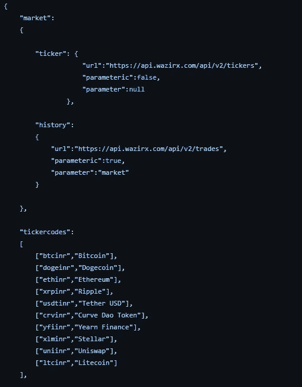

1.  在这里，**市场**中的**报价器**字典变量由我们将要点击的链接组成。为此，我使用了令人敬畏的 [**WAZIRX**](http://www.wazirx.com) API。其他变量是针对一些超出本文范围的其他功能的。
2.  接下来， **tickercodes，**是不同加密货币的标识符以及它们在[ticker，name]格式中的名称。我争取 10 种加密货币。这里可以添加任意数量的代码

**最终代码**

在最后的代码中，我们执行以下操作:

*   阅读整个股票信息并筛选出我们需要的股票信息

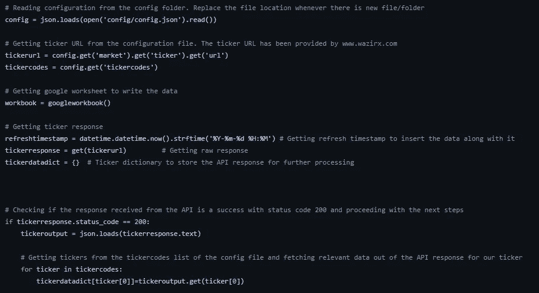

这里的 **getgoogleworkbook** 函数被用于从 **googleauthenticate.py** 脚本获取我们的工作簿。其他步骤已经编写了相关的注释。

*   将每个跑马灯的提要转换成一个列表，并将所有列表附加到最终列表中

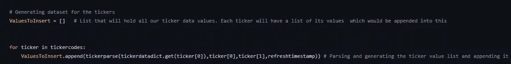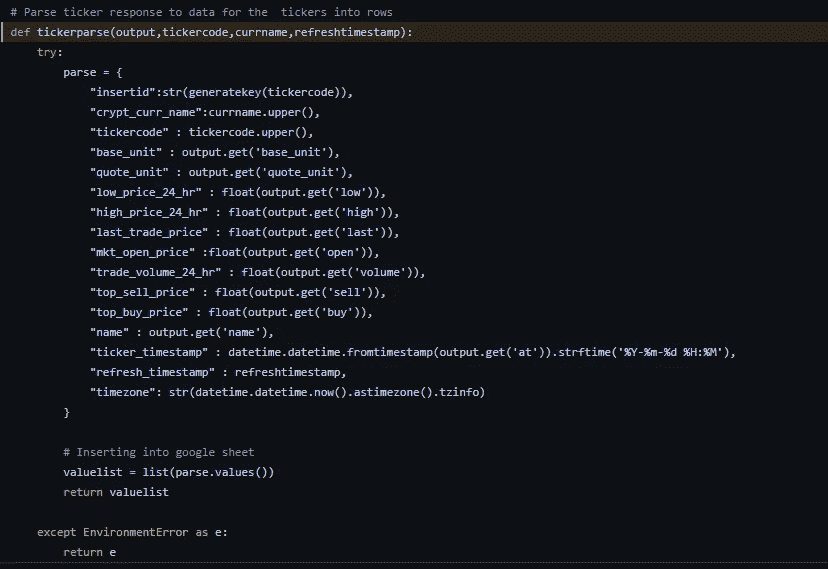

上面两张截图显示了使用 **tickerparse** 函数获取解析数据行的过程，该函数存在于 **helperfunctions.py** 文件中。 **valuelist** 变量是给定滚动条的解析值列表。

*   每次写入前检查行数和限制，如有必要，创建一个新表

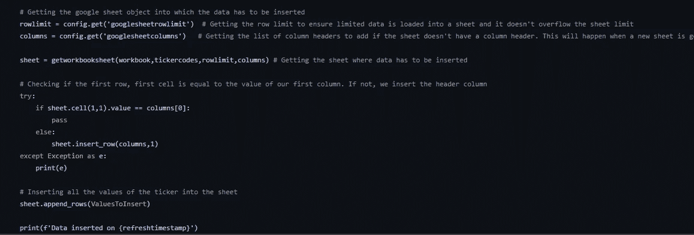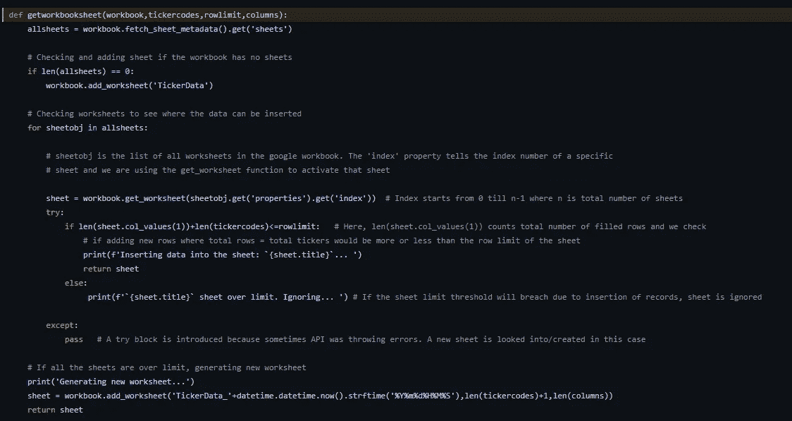

在这里， **getworkbooksheet** 函数帮助运行逻辑来获取适当的工作表以写入数据

*   写这些行

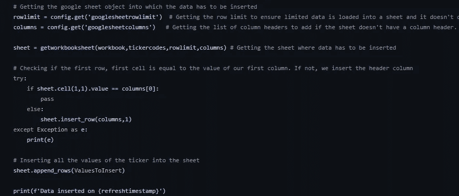

这一部分很简单。对于工作表，代码检查第一个单元格是否是第一个标题列，如果不是，则插入。标题列是使用配置文件选择的。最后，使用 gspread 库的 **append_rows** 函数，我们将 rows **ValuesToInsert** 变量添加到工作表中

# 输出

这是我们一直在等待的时刻。让我们先来看看我创建的 **TickerInfo** 工作簿。我已经添加了列作为标题，并将行数限制设置为 21，而不是 4，000，001。

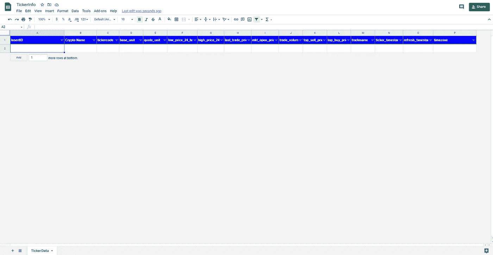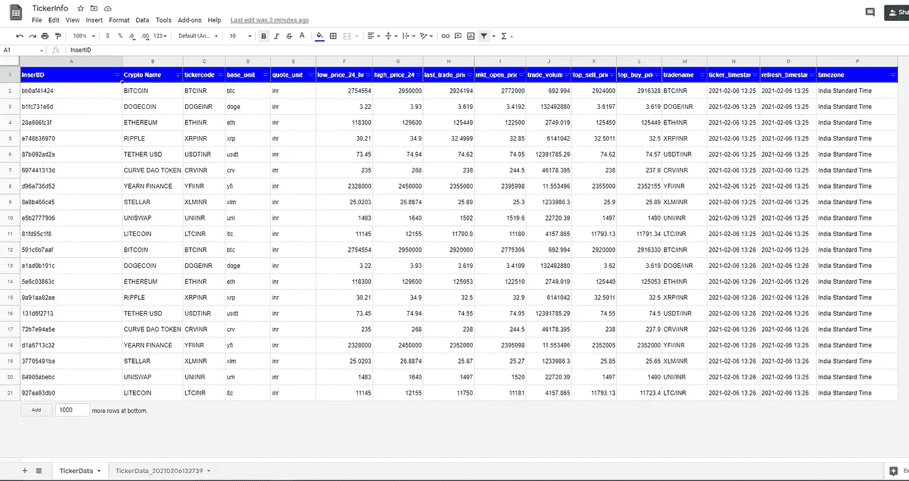

Before and After

请注意，在 21 行之后创建了一个新的工作表。此外，由于我们已经将标题放在了 **TickerData** 表中，代码避免了再次插入标题行

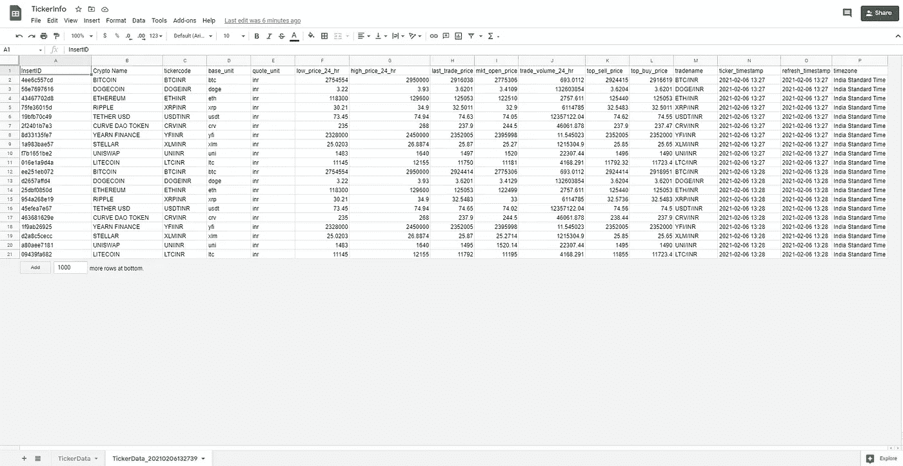

在下一个工作表中，添加了标题行，但没有任何格式。但是，这也有 21 行，因为这是最大限制。

# 最后的想法

对于任何分析师或数据工程师来说，Google sheets 都是一个非常强大和有用的工具。凭借其巨大的数据存储能力和基于云的存储概念，我们应该更多地将它用作商业智能和数据服务