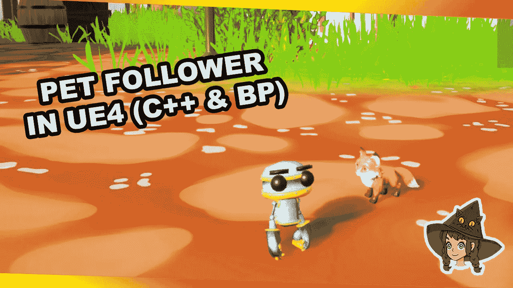

# 让我们在 UE4 中创建一个宠物追随者

> 原文：<https://medium.com/geekculture/lets-create-a-pet-follower-in-in-ue4-b9ae6b68721a?source=collection_archive---------24----------------------->

使用 C++而不使用 navmesh 的小宠物

谁不喜欢有一个可爱的小东西在你冒险的时候跟着你呢？这就是我们正在做的！

虚幻引擎 4 有一个神奇的工具，可以使用导航来实现这一点，但今天我会告诉你如何使用简单的数学来代替！