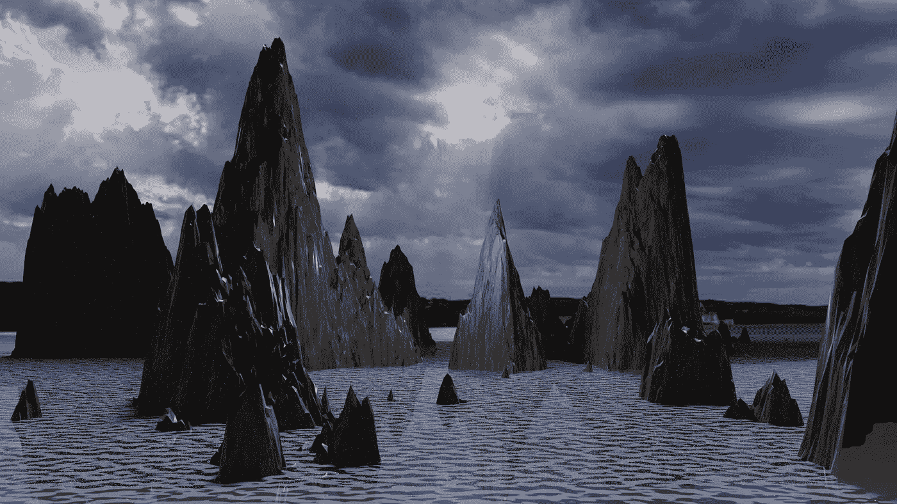

# 让我们在 Blender 中创建一个程序景观

> 原文：<https://medium.com/geekculture/lets-create-a-procedural-landscape-in-blender-ba55f9e31ea1?source=collection_archive---------3----------------------->

无限的世界在等待着！

让我们在 Blender 中创建一个程序景观

无限的世界在等待着！

谁不想创造自己的世界？有了 Blender，我们可以创造一百万个世界。无论你的梦想是在沙漠中建造一个峡谷，一个北极海滩，还是一个郁郁葱葱的森林，Blender 都能让你梦想成真。