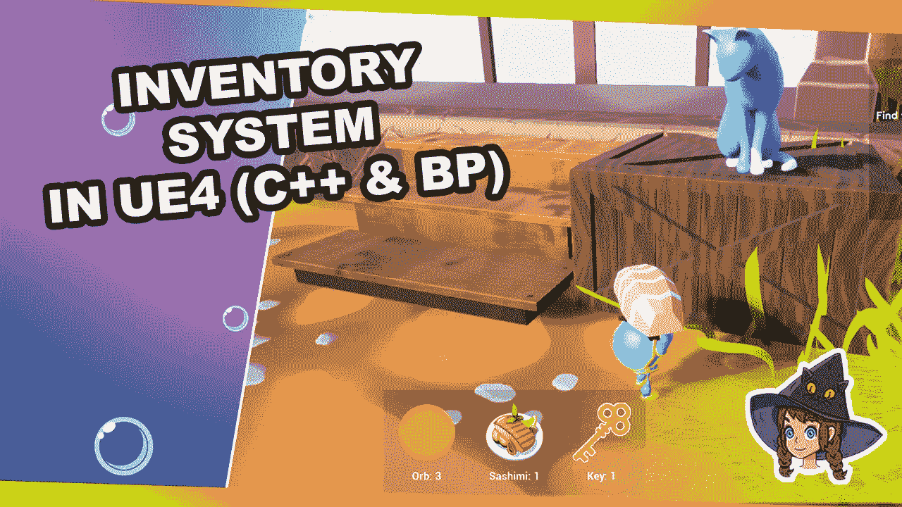

# 让我们在 UE4 中创建一个设备清单

> 原文：<https://medium.com/geekculture/lets-create-an-equipment-inventory-in-ue4-456c79aa1247?source=collection_archive---------2----------------------->

装备和不装备玩家可以使用蓝图和 C++在地图上抓取的物品

在今天的教程中，我们讨论的是库存！

几乎任何类型的游戏都包括物品的管理。游戏的种类并不重要。你可能会有一些简单的东西，如硬币收藏品或不同的物品，你可以装备，甚至不同的…