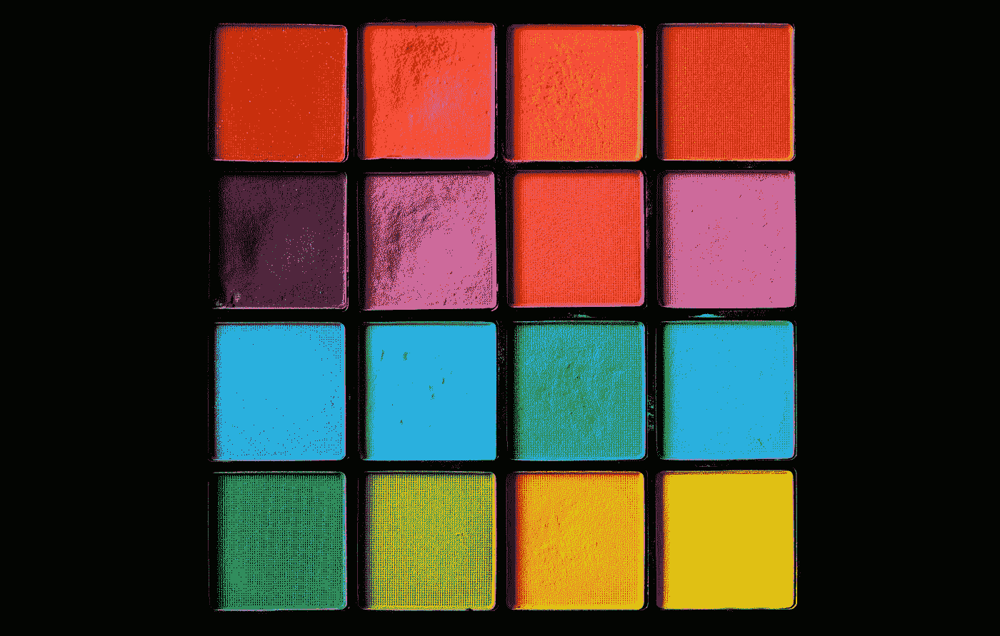

# 让我们创建类似 NumPy 数组的张量

> 原文：<https://medium.com/geekculture/lets-create-tensors-like-numpy-arrays-90a4cf32144?source=collection_archive---------15----------------------->

## 张量只不过是多维数组的矩阵表示

Photo by [Sharon McCutcheon](https://unsplash.com/@sharonmccutcheon?utm_source=unsplash&utm_medium=referral&utm_content=creditCopyText) on [Unsplash](https://unsplash.com/?utm_source=unsplash&utm_medium=referral&utm_content=creditCopyText)

每一个漫长的旅程都从简单的一步开始。就像那样，这是漫长旅程的第一步——*深度学习和神经网络*。Google 开发的 TensorFlow 是一个专门为深度学习任务打造的深度学习库。但不仅限于深…