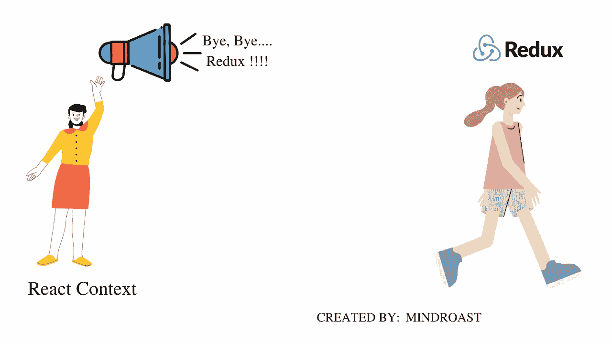
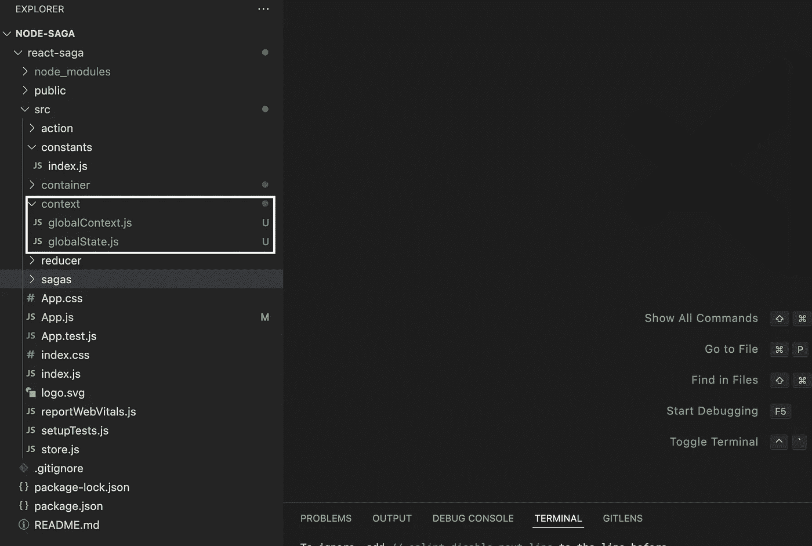
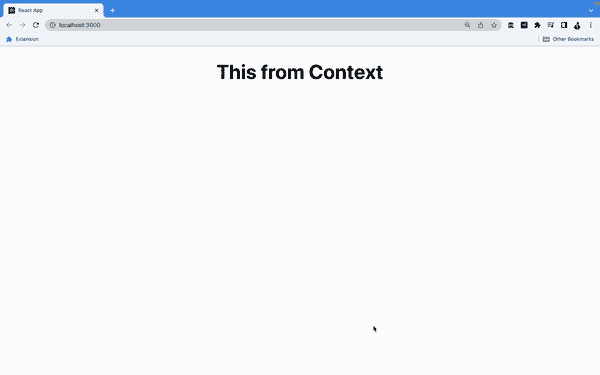
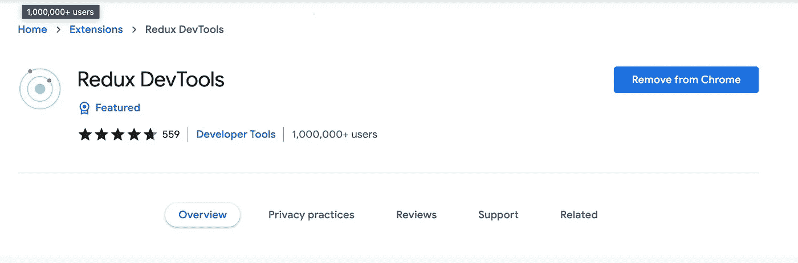

# 我们来决定 React-Redux 是不是 React Context API 之后的过去式。

> 原文：<https://medium.com/geekculture/lets-decide-if-react-redux-is-a-thing-of-the-past-after-react-context-api-182409a762bf?source=collection_archive---------6----------------------->

## 对于所有的 react-redux，让我们来理解 react 提供的上下文钩子。严格来说是一篇技术文章。

React-Redux 现在已经成为前端开发的恐龙了。大多数为他们的前端开发者使用 React JS 库的应用程序/组织都使用 Redux 进行状态管理。在引入上下文挂钩之前，如果我们在不使用任何状态管理工具的情况下向任何人询问复杂 React 应用程序的开发人员，这将是一个有趣的妙语。


Photo by [Nicole Wolf](https://unsplash.com/@joeel56?utm_source=medium&utm_medium=referral) on [Unsplash](https://unsplash.com?utm_source=medium&utm_medium=referral)

```
**Table of content** · [Basic Introduction](#cab1)
· [Let's create the counterpart using useContext.](#9b29)
  ∘ [1\. Create a Basic folder structure.](#5090)
  ∘ [2\. Adding createContext.](#13bd)
  ∘ [3\. Adding React Context Provider](#9433)
  ∘ [4\. Wrapping the child components](#6332)
  ∘ [5\. Creating Consumer.](#f01b)
  ∘ [6\. Expected Result](#2f6a)
  ∘ [7\. Start the application](#4085)
· [React Context Provider vs Consumer](#ad24)
· [Redux vs Context API](#b73c)
· [Closing Thoughts.](#ff55)
· [About The Author](#0e44)
```

# 基本介绍

Redux 可以说是状态管理用的最多的库了。现在，为了将 Redux 与 React JS 应用程序连接起来，我们必须使用一些中间件，如 React saga 或 React thunk。这个中间件帮助实现业务逻辑、API 调用，并根据条件更新缩减器。

因此，对于那些没有使用过 redux 的人来说，它只是一个全球商店，被认为是事实的唯一来源。总是有一个过程来更新状态，即从组件分派一个动作。此外，我们必须使用另一个模块，即 react-redux 来连接 ReactJS 组件和 redux 存储。

所有这些都增加了 React JS 应用程序的包大小。包的大小是我们一直试图减少的。考虑一个场景，我们不必使用所有这些库。总括来说，我们将取消大约 3 个主要模块，如 redux、react-redux、react-thunk 等。

这些模块/库是重载的，不是你的常规库。因此，让系统在不使用所有这些东西的情况下工作似乎是另一种选择。React 团队引入了上下文作为将值从父传递给子的替代方式。我们将通过存储当前状态的上下文直接传递数据，而不是通过道具钻取将道具传递给嵌套的孩子。

让我们更新之前使用 react-redux 编写的示例应用程序，并尝试使用 useContext 转换它。我们不会在本教程中讨论 react-redux 部分，因为这超出了本教程的范围。

但是如果你有兴趣探索用 redux 设置的 react saga，你可以参考这个系列教程，它会帮助你理解相同的东西。[点击这里。](https://www.mindroast.com/post/redux-saga-tutorial-setup-with-react-redux)

# 让我们使用 useContext 来创建副本。

## 1.创建一个基本的文件夹结构。

首先，我们将创建一个名为 context 的文件夹，其中包含所有与我们将要创建的不同类型的上下文相关的代码。



React Context vs Redux

在该文件夹中，我们将创建两个名为 globalContext.js 和 globalState.js 的文件。这两个文件都将是我们的全局上下文的包装。我们将从每个想要直接共享数据的组件导入全局上下文。



The folder structure of React createContext.

## 2.正在添加创建上下文。

让我们深入研究一下 global context.js 文件。以下是代码，可以随意复制试试。

```
**// context/globalContext.js**import {createContext} from 'react';const GlobalContext = createContext();export default GlobalContext;
```

这个文件只是创建了一个名为全局上下文的上下文。这将提供子组件的值。

## 3.添加 React 上下文提供程序

另一个文件是我们的 provider 文件，它将保存将在其他组件中共享的上下文的状态。

```
**// context/globalState.js**import { useState } from "react";
import GlobalContext from "./globalContext";const GlobalState = (props)=>{const [title, setTitle] = useState('This from Context')return(
        <GlobalContext.Provider value={{title, setTitle}}>
            {props.children}
        </GlobalContext.Provider>
);
}export default GlobalState;
```

在全局状态文件中，我们使用了 globalContext 提供程序，并将值向下传递。

我们还使用了 useState 钩子，它的初始值是“This from context”。和 setTitle 方法，该方法将用于更新子组件的状态。就像普通的父子函数通过 props 来更新父组件的值一样。

## 4.包装子组件

现在需要将值向下传递，所以我们需要将子组件放在全局状态组件下。

这将在我们的 App.js 文件中完成。

```
**// App.js**import './App.css';./container/FunctionBasedComponent';import FunctionBasedContextComponent from './container/FunctionBasedContextComponent';import GlobalState from './context/globalState';function App() {
return (
    <div className="App">
        <GlobalState>
            <FunctionBasedContextComponent />
        </GlobalState>
    </div>
 );
}export default App;
```

因此，我们导入了全局状态，并包装了所有可能需要数据的子组件。因为我们已经将它创建为一个全局上下文，所以我们已经将所有组件包装在状态下，但是我们也可以在粒度级别上这样做。

因此，这是由你来决定，什么最适合你的应用。

## 5.创造消费者。

最后一步是创建一个组件，它将使用这个全局状态，就像我们在任何 react redux 应用程序中所做的那样。对于 redux，我们通常使用 react-redux 库提供的 connect 方法，但是这里我们将使用 react 上下文 API 提供的消费者 API。

```
**// container/FunctionBasedContextComponent.js**import React, { useEffect, useContext } from 'react';import GlobalContext from '../context/globalContext';function FunctionBasedContextComponent(props) {
const {title, setTitle} = useContext(GlobalContext);useEffect(() => {
    setTimeout(() => {
        setTitle('Title updated after 4 Seconds of timeout.')
    }, 4000);
}, []);return <h1>{title}</h1>;
}export default FunctionBasedContextComponent;
```

在这个功能组件中，我们没有做什么特别的事情，而是使用 useContext 钩子来导入全局上下文提供的值。

我们可以析构这个值，这里的标题是 out 状态，setTitle 是可以用来更新标题状态值的方法。

## 6.预期结果

此外，我们还使用了一个 useEffect 挂钩，它会在 4 秒钟后将标题的值更新为“4 秒钟超时后标题更新”。来自“这来自上下文”。

## 7.启动应用程序

现在，我们可以开始实现并运行代码了。只需遵循以下命令。

```
> npm install.
> npm start 
```

我们可以看到类似下面的屏幕。



Final application rendering using react context API

# 对上下文提供者和消费者做出反应

此外，上下文提供者是向上下文提供状态的一种方式。它存储的值可用于将值下钻到所需的组件。无论何时任何组件被包装在提供者中，我们都可以使用这个范围。

另一方面，顾名思义，消费者是用来消费上下文的。提供者提供的值可以在嵌套的子组件中使用，无需任何钻取。

通常有两种方法来使用上下文。使用 useContext 的方法之一，我们在上面的教程中已经讨论过了。useContext 通常在有多个消费者需要消费时使用。

```
const {title, setTitle} = useContext(GlobalContext);
```

但是另一方面，下面的方法通常在类内组件中使用，因为我们在基于类的组件中不使用钩子。这两种方法在最终结果中几乎是相似的，但是如果我们订阅了各种上下文，使用 useContext 会使您的代码更整洁一些。休息永远是开发者的选择。

```
<GlobalContext.Consumer>
    {value => { }}
</GlobalContext.Consumer>
```

# Redux vs 上下文 API

Redux 被业界广泛接受，因为许多组织已经在使用它。Redux 应用程序的代码结构非常简洁。你把所有具体的东西都放在正确的位置上。例如，你有动作，异步动作，减速器等。

但恰恰相反，上下文 API 的依赖性非常小。您不必依赖外部包来运行您的应用程序。如果你能够用 Context API 破解完美架构的代码，我会称之为双赢。因为包的大小将会减小，因为我们不必像 Redux 那样创建设置。

除此之外，使用其中任何一种方法都没有什么做不到的。此外，上下文 API 没有像 Redux 这样的浏览器扩展，因为这在调试解决方案时非常有用。



Screenshot of Redux DevTool

# 关闭思路。

React 上下文 API 是 React 生态系统的新成员。他们已经习惯了这个系统，但是和两个 Redux 相比，还没有那么普遍。

尽管 redux 需要一点复杂的实现，但是一旦基本的设置完成，这个项目就会变得很顺利。之后我们没有太多的重构。只要加上条件，它就会继续下去。Redux 非常适合大型复杂的应用程序。

Context API 可以称为开箱即用的解决方案，Redux 可以定义为一个强大的状态管理工具。

# 关于作者

Apoorv Tomar 是一名软件开发人员，也是 Mindroast 的一员。你可以在[推特](https://twitter.com/apoorvtomar_)、 [Linkedin](https://www.linkedin.com/in/apoorvtomar/) 、[电报](https://t.me/ApoorvTomar)和 [Instagram](https://www.instagram.com/apoorvsinghtomar/) 上和他联系。订阅[简讯](https://www.mindroast.com/newsletter)获取最新策划内容。不要犹豫在任何平台上说“你好”,只需说明你在哪里找到我的资料