# 让我们深入研究逻辑回归

> 原文：<https://medium.com/geekculture/lets-deep-dive-into-logistic-regression-91fc0806e54b?source=collection_archive---------16----------------------->

> 逻辑回归是一种机器学习分类算法，用于预测分类因变量的概率**。这是分类问题的线性回归模型的扩展。与输出连续数值的线性回归不同，逻辑回归使用**逻辑 sigmoid** 函数转换其输出，以返回**一个概率值**，该概率值可以映射到两个或更多个**离散类。****

在本节中，我们将尝试了解更多信息:

1.  **逻辑回归系数**
2.  **逻辑回归的最大似然**

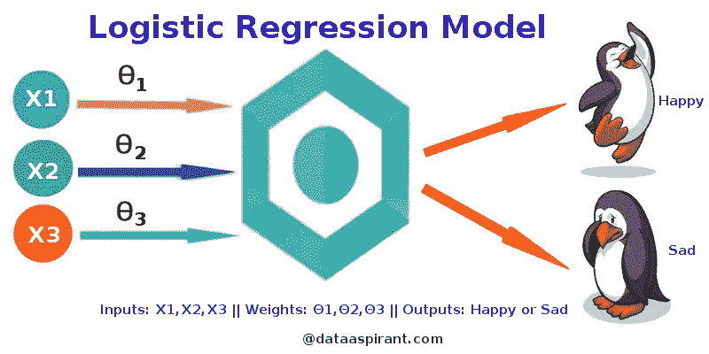

## **逻辑回归和线性回归的比较**

给出学习时间和考试分数的数据。线性回归和逻辑回归可以预测不同的事情:

*   线性回归可以帮助我们在 0-100 的范围内预测学生的考试成绩。线性回归预测是连续的(一个范围内的数字)。在线性回归中，**我们使用“最小二乘法”拟合直线。我们找到最小化残差平方和的线。**
*   逻辑回归分析可以帮助我们预测学生是通过还是失败。逻辑回归预测是离散的。我们还可以查看模型分类下的概率得分。

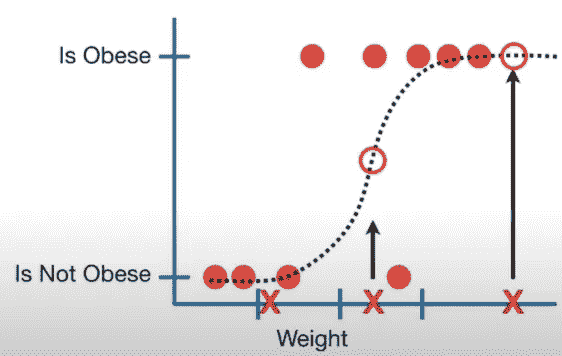

*   逻辑回归预测某事物是 ***真*** 还是 ***假***而不是预测某事物连续像 ***大小*。**
*   此外，逻辑回归拟合的不是数据的直线，而是“S”形的“逻辑函数”。曲线从 0 到 1，这意味着，曲线告诉我们**上图中的物体根据其重量肥胖与否的概率**。
*   虽然逻辑回归告诉一个对象是否肥胖的概率，但它通常用于分类。举个例子，如果一个物体的概率> 50%，那么我们就把它归类为肥胖，否则我们就把它归类为“不肥胖”。

**逻辑回归的步骤**

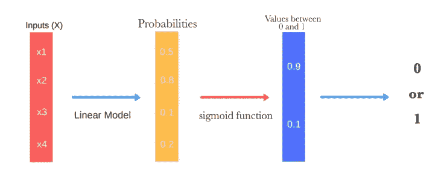

# **1。逻辑回归:系数(连续变量)**

第 1 部分，当我们使用一个**连续变量**(如体重)预测肥胖时，我们将从谈论**逻辑回归**开始。逻辑回归中的 y 轴限于 0 到 1 之间的概率值。逻辑回归中的 y 轴从“肥胖概率”转换为“log(肥胖几率)”，因此，就像线性回归中的 y 轴一样，它可以从**-无穷大**到**+无穷大**。

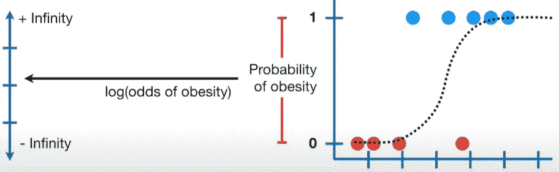

让我们将 y 轴从“肥胖概率”标度转换为“肥胖几率”标度，如下所示:

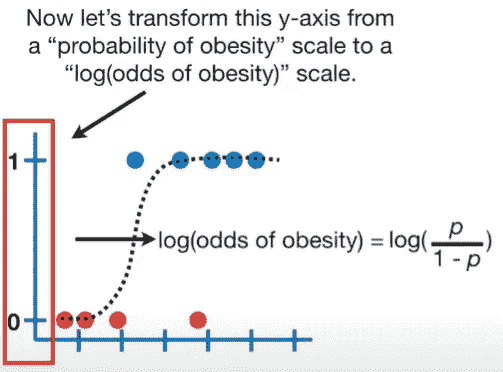

**p，**在这种情况下，是对象肥胖的概率，并且对应于旧 y 轴上 0 和 1 之间的值。

如果我们将 ***p=0.88*** 代入 logit 函数并计算，我们在新的 y 轴上得到 2。

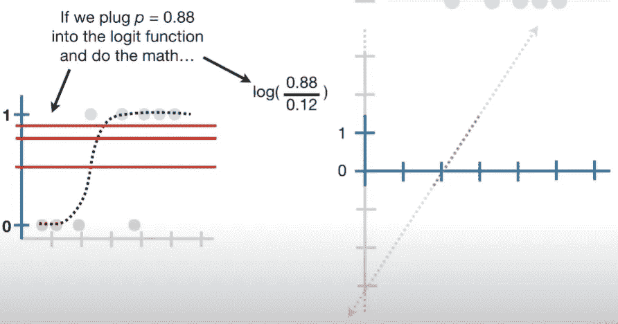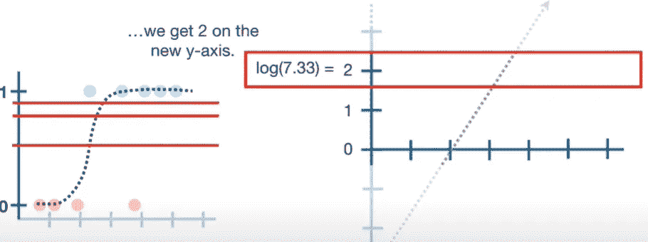

新的 y 轴将曲线转换为直线。

重要的是要知道，尽管带有**曲线**的图表是我们与逻辑回归相关联的，**系数**是以**对数(概率)图的形式呈现的。**

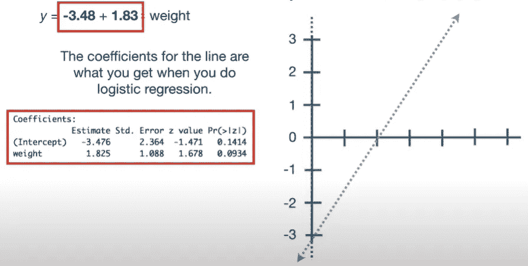

第一个系数，**估计截距= -3.48** 是体重= 0 时的 y 轴截距，它表示体重= 0 时，log(肥胖的几率)为-3.48。**估计截距的标准误差= 2.364** 。

**Z 值= -1.471** 是估计截距除以标准误差。换句话说，它是标准正态曲线上估计截距偏离 0 的标准差的数量。因为估计值离零小于两个标准偏差。我们知道这在统计上并不显著。

第二个系数是**斜率= 1.83** 。这意味着体重每增加一个单位，患肥胖症的几率增加 1.825 ~ 1.83。**斜率的标准误差= 1.088** 。

**Z 值= 1.678** 是标准正态曲线上估计值从 0 开始的标准偏差数，从该结果我们知道估计值是否小于从 0 开始的 2 个标准偏差，因此**在统计上不显著**。(样本量如此之小，这并不奇怪)。

并且这是用大的 ***p 值来证实的。***

# 2.逻辑回归:系数(离散变量)

现在，让我们在测试一个**离散变量**如“一个物体是否有突变基因”是否与肥胖有关的背景下，讨论一下**逻辑回归**系数。

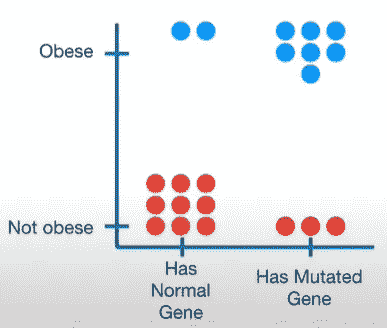

这种逻辑回归非常类似于使用线性模型进行的 t 检验。

我们做的第一件事是**将 y 轴的**从**肥胖概率**转换为**log(肥胖几率)**。现在我们用两条线来拟合数据。对于第一行，我们获取**“正常基因”**数据，并使用它来计算具有正常基因的对象的 log(肥胖几率)。

因此，第一条(橙色)线代表具有正常基因的小鼠的对数(肥胖几率)。我们姑且称之为**日志(赔率基因正常)。**

然后我们计算了带有突变基因的老鼠的 log(肥胖几率)。因此，第二条(绿色)线代表带有突变基因的对象的对数(肥胖几率)。姑且称此为**日志(赔率基因突变)。**

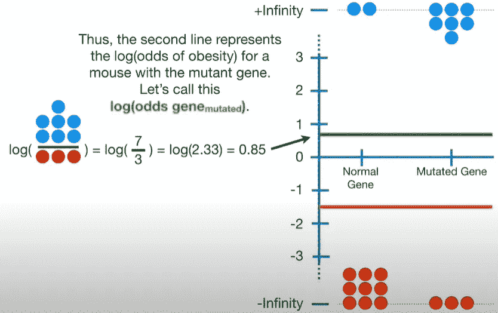

这两条线合在一起构成该等式中的系数:

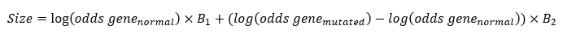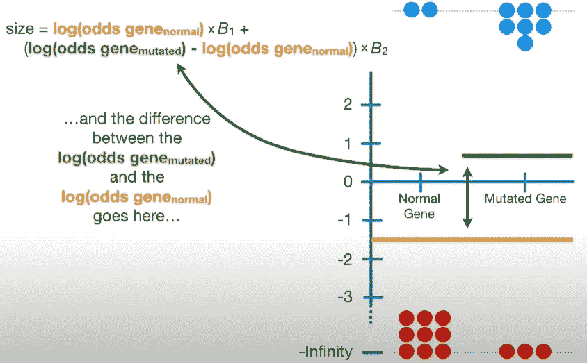

由于一个对数减去另一个对数可以转化为除法，这个术语就是**对数(比值比)。**

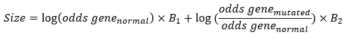

它告诉我们，在对数尺度上，突变基因增加(或减少)了一个物体肥胖的几率。让我们代入数字:

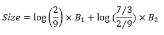

这给了我们这些系数:

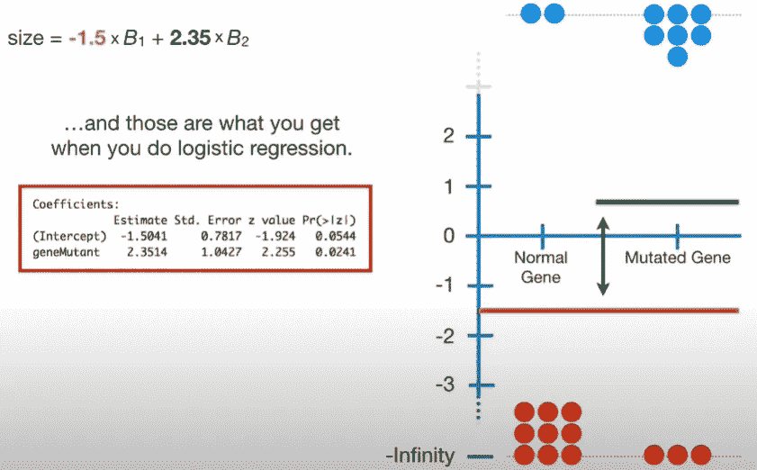

第一个系数，**估计截距= -1.50** 是**对数(正常优势基因)**和**基因突变**项 **= 2.35** 是**对数(优势比)**，它告诉你，在对数尺度上，有多少突变基因增加或减少了肥胖的几率。

估计截距的标准误差= **0.7817** ，基因突变体的标准误差= **1.0427** 。

**Z 值= -1.924** (用于估计截距)告诉我们，截距的估计值 **-1.5** 小于 0 的 2 个标准差，因此**与 0 没有显著的**差异，这由大于 0.05 的***p 值*** 所证实。

**Z 值= 2.255** (对于基因突变型)，描述具有突变基因如何增加肥胖几率的对数(比值比)大于 2，表明其具有**统计显著性**，这通过一个***p 值*** 小于**0.05 得到证实。**

# **3.逻辑回归:用最大似然拟合直线**

**我们的目标是为这些数据绘制“最佳拟合”曲线。正如我们所知，在逻辑回归中，我们将 y 轴从肥胖的概率转换为对数(肥胖的几率)，参见前面的第 1 点和第 2 点。**

**唯一的问题是，转换将原始数据推向正负无穷大，这意味着残差(从数据点到线的距离)也等于正负无穷大，这意味着**我们不能使用最小二乘法**来找到最佳拟合线。**

**相反，我们使用**最大可能性。****

**我们做的第一件事是将原始数据点投影到候选线上。然后，我们使用这个看起来很奇特的公式将候选对数(赔率)转换成候选概率。**

**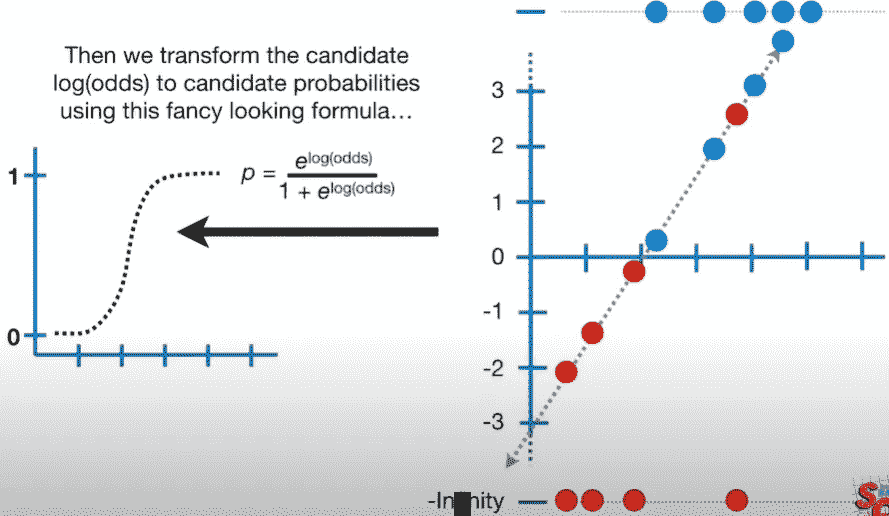**

**对于在家记账的人来说，下面是如何把以概率为输入输出 log(odds)的方程，转换成以 log(odds)为输入输出概率的方程。**

******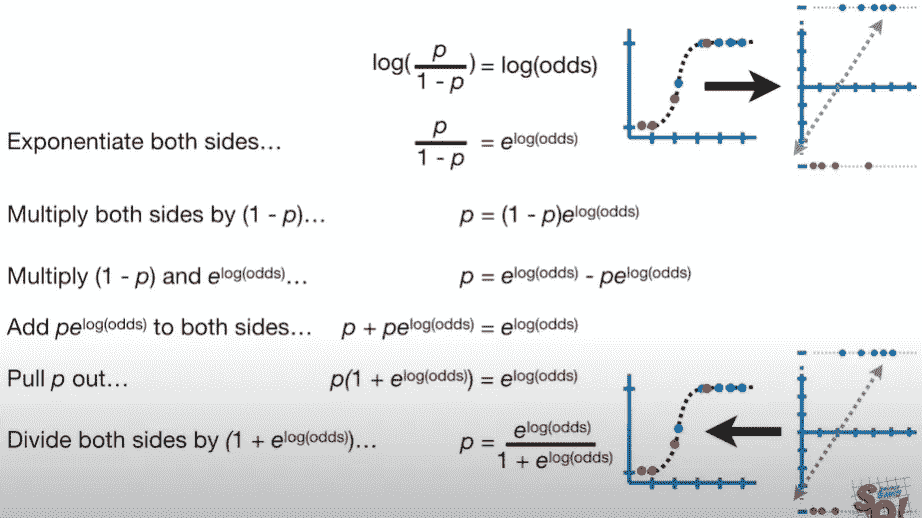**

**现在让我们来看看这个奇特的等式在起作用。例如，我们使用点= -2.1(从右侧)。我们用-2.1 代替对数(赔率)。**

**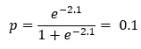**

**这给了我们曲线上的 y 坐标。**

**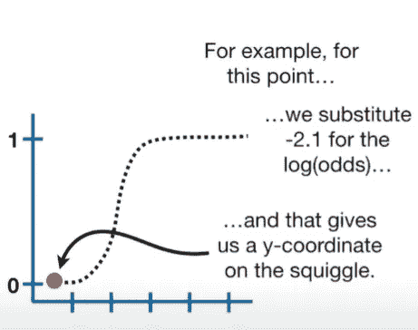**

**我们对所有的点做同样的事情。**

**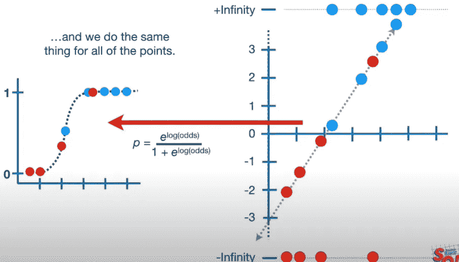**

**现在我们使用观察到的状态(肥胖或不肥胖)来计算他们的可能性，给出曲线的形状。**

**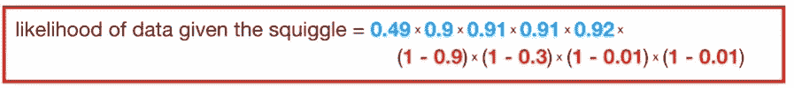**

**虽然可以将可能性计算为个体可能性的乘积，但统计学家更喜欢用**计算可能性的对数**(因为最大化可能性的曲线就是最大化可能性的对数的曲线)。**

**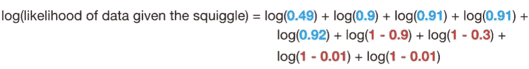****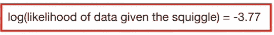**

**这意味着原始线的对数似然为 **-3.77** 。现在，我们旋转这条线，通过将数据投影到这条线上，将对数(几率)转换为概率，来计算它的对数似然性。**

**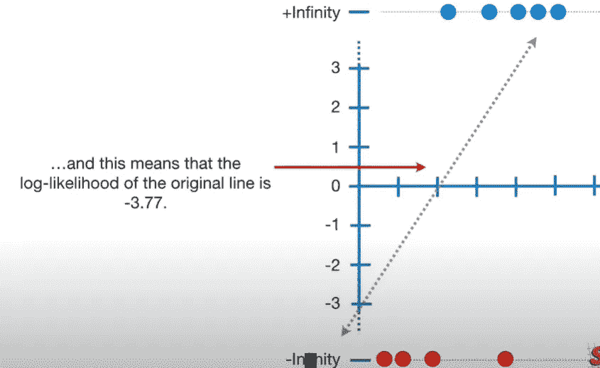**

**旋转线条:**

**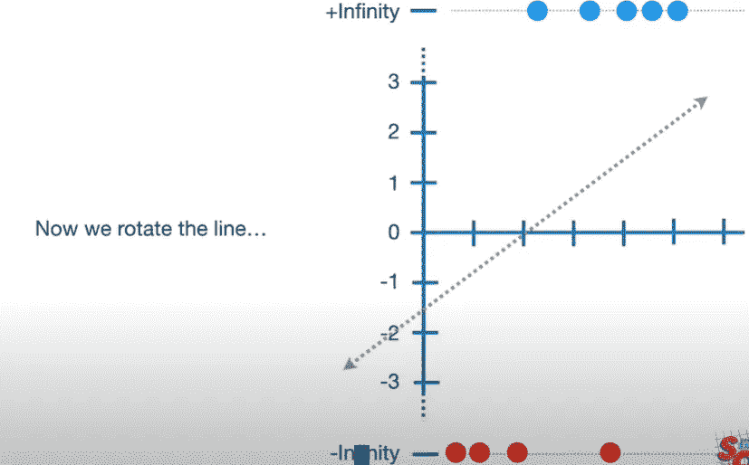**

**通过将数据投影到它上面并将对数(赔率)转换为概率来计算它的对数似然性:**

**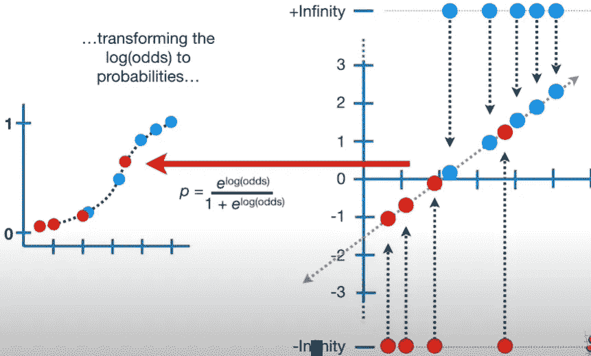**

**然后计算对数似然**

**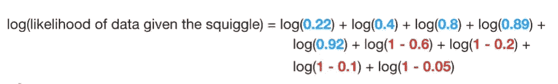****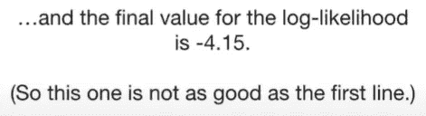**

****我们只是不断旋转对数(赔率)线，将数据投影到上面，将其转换为概率，并计算对数似然性****

**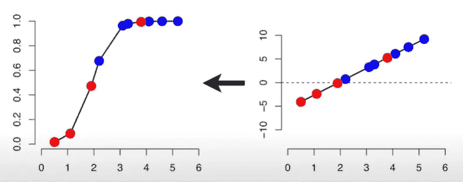**

****注意:**每次旋转线条时，寻找最大似然线的算法非常聪明，它以增加对数似然的方式这样做。因此，该算法可以在几次旋转后找到最佳拟合。**

**最终我们得到一条最大化可能性的线，这是选择的最适合的线。**

# **参考资料:**

** [## 使用 Python 建模二元逻辑回归——One Zero 博客

### 在有监督的机器学习世界中，有两种类型的算法任务经常被执行。一个叫…

onezero .博客](https://onezero.blog/modelling-binary-logistic-regression-using-python-research-oriented-modelling-and-interpretation/)  [## 逻辑回归—详细概述

### 逻辑回归在二十世纪早期被用于生物科学。它后来被用于许多社会…

towardsdatascience.com](https://towardsdatascience.com/logistic-regression-detailed-overview-46c4da4303bc)  [## 逻辑回归— ML 词汇表文档

### 假设我们得到了学生考试成绩的数据，我们的目标是基于以下因素来预测学生是否会通过考试…

ml-cheatsheet.readthedocs.io](https://ml-cheatsheet.readthedocs.io/en/latest/logistic_regression.html) 

如果您想了解更多关于逻辑回归的 R2 和 p 值的信息，可以观看此视频！**