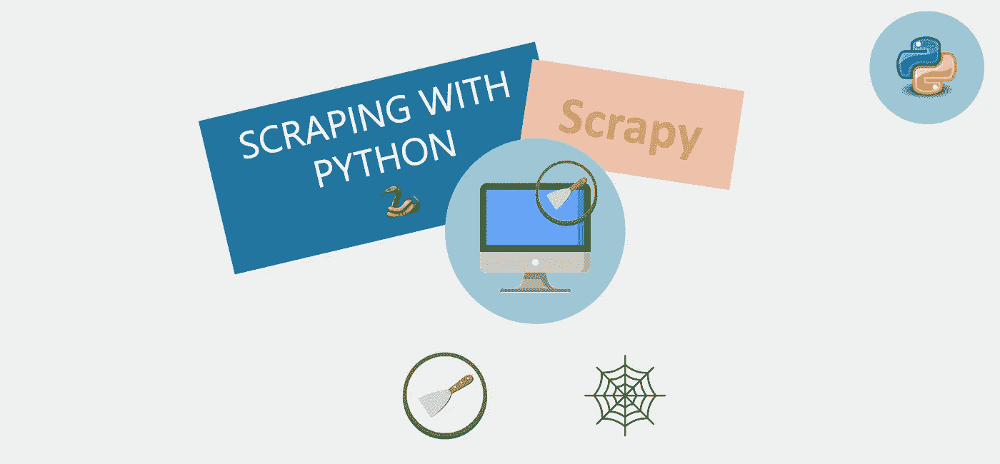

# 让我们一起探索 Scrapy | Scraping 的奇妙世界🐍

> 原文：<https://medium.com/geekculture/lets-discover-the-wonderful-world-of-scrapy-scraping-with-ac9571338e2e?source=collection_archive---------2----------------------->

Fig. 1 — The Wonderful World of Scrapy

## Scrapy 是一个从网页收集数据的 Python 框架。下面是该方法的概述以及如何进行。

> 这篇文章是系列文章**“用 Python 抓取”的一部分🐍"**我打算在这里介绍和教授从基础到最高级的刮削概念。