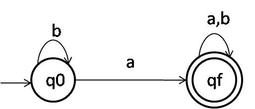
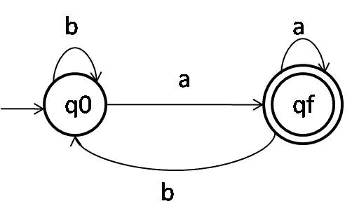
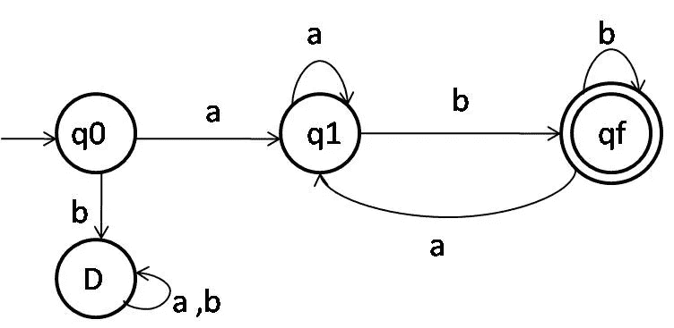
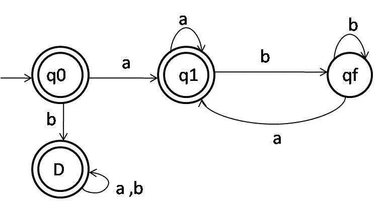
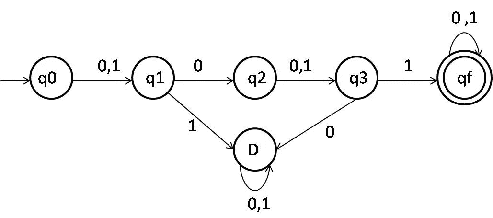
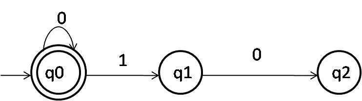
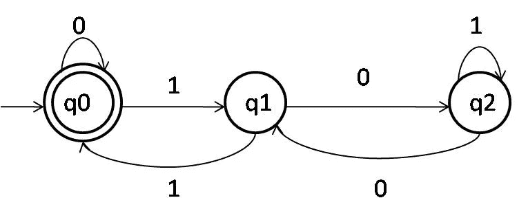

# 确定性有限自动机

> 原文：<https://medium.com/geekculture/lets-do-it-the-dfa-way-dad04d51bf3c?source=collection_archive---------0----------------------->

*什么是 DFA？*

*DFA 代表狗粮协会吗？*

😂不，一点也不。DFA 与任何狗或协会无关。事实上，它是一台非常精密的机器。

DFA 实际上是— **的确定性有限自动机的缩写。**

## 什么是确定性有限自动机？

首先，自动机是一种数学模型或抽象模型，用于确定一种语言是否接受一个字符串。

DFA 是一个自动机，它有有限的状态，通过运行几个状态来接受或拒绝给定的字符串。

*Oof！那是太多书生气的语言。*

为了让事情更简单，我们举个例子。

考虑一台机器，它接受字母 ***a*** 和 ***b*** 上的字符串，其中至少包含一个 ***a.***

这台机器可以用图解法表示为:

这里，状态 ***q0*** 是我们开始的状态， ***qf*** 是机器的最终状态，即我们理解字符串是否被接受的状态。

假设我们有一个字符串' ***ba*** '。

***b***‘是最先进入系统的第一个字母。

从上图可以看出，当 ***b*** 进入系统即初始状态 ***q0*** 时，它被***【Q0***接受并停留在那里。现在，当我们将符号 ***a*** 赋予机器时，我们可以看到，当***【Q0】***接受 ***a*** 时，它将进入 ***qf*** 状态，这是最终状态。(双圆圈表示最终状态)。

随着 ***a*** 被机器接受，由于字符串结束，我们可以断定字符串被 DFA 接受。

现在我们来考虑字符串“ ***bbb”。***

第一个 ***b*** 被字符串 ***q0 接受。***

然后是第二个**b。我们目前在 ***q0*** 处，第二个 ***b*** 再次被 ***q0*** 接受，这要感谢我们已经展示的自循环。**

因此，在字符串的末尾，我们停留在状态***【Q0】***上，没有到达最终状态。因此机器不接受字符串***【BBB】***。同样，我们设置的条件是字符串应该至少包含一个"*"。*

*所以，很明显，字符串***【BBB】***不应该被接受。*

*这是一个非常简单的例子，如果没有 DFA，人们可以很容易地预测字符串是否会被接受。但在某些情况下，一个人真的很难确定这一点。*

*形式上，使用 5 个元组来定义 DFA:*

*( ***Q，σ，𝛿，q0，F*** )*

*其中:*

*q:有限状态的集合(例如:{q0，q1，q2，…，qf})*

*σ:符号集(例如:a，b....1,0…..)*

*𝛿:转换函数(应用于字符串的函数/条件)*

*q0:初始/开始状态*

*f:最终状态的集合(这里是 qf，但是可以有多个最终状态)*

> *对于每个状态，每个输入符号都必须有一个*转换**

**现在我们来解决一些例子:**

*   *****例 1:*****

**对输入字母 ***{a，b}*** 设计一个 DFA，它接受所有以 ***a*** 结尾的字符串**

**—考虑字符串 ***{a，aa，ba，aba，BBA……}*****

**所有这些都以 a 结尾，所以它们都应该被 DFA 接受。**

**从上面的例子中，我们可以推断出在 a 之前可以有任意数量的字母。**

**考虑到这一点，我们可以将 DFA 设计为:**

****

**正如你所看到的，根据给定的问题，我们需要一台机器来接受以*结尾的字符串。因为我们的条件只涉及一个符号，我们只有一个必要的转换，因此我们有两个状态。这里，字符串可以以任何符号开始，但应该以 ***a*** 结束。因此， ***b*** 的任何出现都指向 ***q0*** ，但是 ***a 的*** 指向最终状态 ***qf。******

***用其他以 ***a*** 结尾的字符串测试一下。***

*   ******例题 2:******

***在输入字母 ***{a，b}*** 上设计一个 DFA，它接受以 ***a*** 开始并以 ***b*** 结束的所有字符串***

***如果你已经理解了这个概念，为什么不锻炼一下你的大脑呢？***

***自己试试这个，然后向下滚动查看你的答案。***

***.***

***.***

***.***

***我希望你能解决它。如果你不能别担心，你可以看看我的解决方案:***

***考虑字符串如: ***{ab，aabb，aab，abb，abab，…… }******

***DFA 应该接受这些字符串。因此，DFA 可以设计为:***

******

******D*** 是死态，接受所有不适合我们机器的字符串。***

***这里，如果字符串以 ***b*** 开头，就会进入死状态，永远达不到最终状态。***

****你做对了吗？请在评论中告诉我。****

***另一个，***

*   ******例 3:******

***在输入字母 ***{a，b}*** 上设计一个 DFA，它接受所有不以 ***a*** 开头或不以 ***b.*** 结尾的字符串***

***自己试试这个吧！***

***.***

***.***

***.***

***希望你收到了这封信！***

***这里有一个小技巧来解决这个问题。取问题陈述的补语。补充将是:***

****……………..它接受所有以 a 开头的字符串****

****为赞美设计一个 DFA。那就是:****

********

****现在，取这个 DFA 的补码。即，使最终状态为非最终状态，而非最终状态为最终状态。这将给我们:****

********

****这是我们问题陈述的解决方案。****

****考虑例子: ***{ε，a，b，ba，bbaa，aaa，aba，…..}*******

> ***ε是一个空字符串***

***这是几个不以 ***a*** 开头或者不以 ***b.*** 结尾的字符串***

***这些被上述 DFA 接受。***

***另一方面，如果你尝试类似 ***{ab，aabb，aab，abb，abab，…。}，*** 他们不会接受的。***

*   ******例 4:******

***在输入字母 ***{0，1}*** 上设计一个 DFA，其中第二个符号应该是 ***0*** ，第四个应该是 ***1。******

***.***

***.***

***.***

****得到答案了？…..用我拿到的那个查一下:****

***考虑输入字符串: ***{0011，0001，1001，1011，…}******

******

***这不是很容易吗？***

***现在让我们看看最后一个非常非常有趣的例子。***

*   ******例 5:******

***在输入字母 ***{0，1}*** 上设计一个 DFA，它应该接受所有能被 3 整除的数。***

***这是一个有点棘手的问题，但是让我们一步一步地解决它。***

***首先，如果一个数被 3 除，可能的余数是 0，1 和 2。***

***因此，我们的 DFA 将有 3 个状态。***

***这些余数的二进制等价物是:***

***0 -> 0***

***1->01***

***2->10***

***当这些组合发生时，应该导致各自的状态。***

***此外，我们希望目标字符串能被 3 整除，因此期望的余数是 0，因此最终状态是 q0。***

******

***所以，直到现在我们有了这个。***

***现在，下一步是考虑其他字符串，如:***

***3->011***

***4 ->100***

***5-> 101***

***6-> 110***

***7 ->111***

***从这些，3 和 6 给出余数 0；***

***4 加 7 得 1；5 给 2。***

***如果我们处理所有这些条件并完成我们的 DFA，我们会得到以下结果:***

******

***这是我们问题的完整解决方案。***

***例如，考虑 15 (1111)，它可以被 3 整除。因此我们应该得到 0 作为输出。让我们验证一下:***

***当我们将 1111 赋予这个 DFA 时，遵循的路径是 q0->q1->q0->q1->q0，这将我们带回最终状态 q0。因此，15 如预期的那样被接受。***

***同样，对于 21(10101)，路径为:q0->q1->q2->q2->q1->q0。***

***因此，21 也是可以接受的。***

***考虑 14(1110)，它不能被 3 整除，所以余数为 2，即应该在 q2 结束。***

***我们来验证一下。***

***得到的路径是 q0->q1->q0->q1->q2。***

***因此得到证实。***

***我希望事情现在清楚多了。我已经尽力解释了这个概念，并试图尽可能多地举一些例子。***

***如果对你有帮助，请告诉我，你也可以在下面的评论中提出你的问题。***

***祝您愉快！***