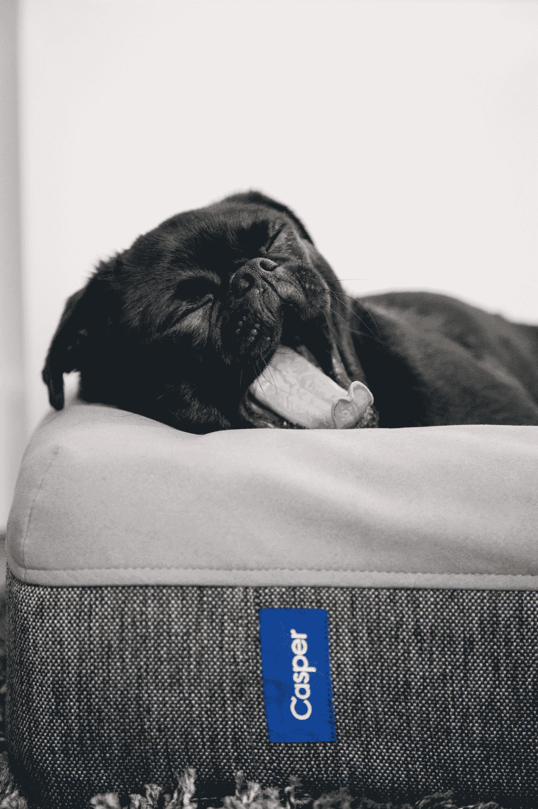

# 让我们面对现实吧，NFT 正在毁掉游戏

> 原文：<https://medium.com/geekculture/lets-face-it-nft-s-are-ruining-gaming-9f67c5f5ee30?source=collection_archive---------10----------------------->

这些游戏一点都不好玩

Photo by [Charles Deluvio](https://unsplash.com/@charlesdeluvio?utm_source=medium&utm_medium=referral) on [Unsplash](https://unsplash.com?utm_source=medium&utm_medium=referral)

老实说，我曾经喜欢 NFT 游戏的想法。现在我可以拥有我所有的皮肤和财产，而不是简单地购买一些没有价值或用途的皮肤。整个想法对我来说超级迷人，我认为它会席卷游戏世界。显然，这一切都还处于起步阶段，所以有足够的时间让这一切开花结果…